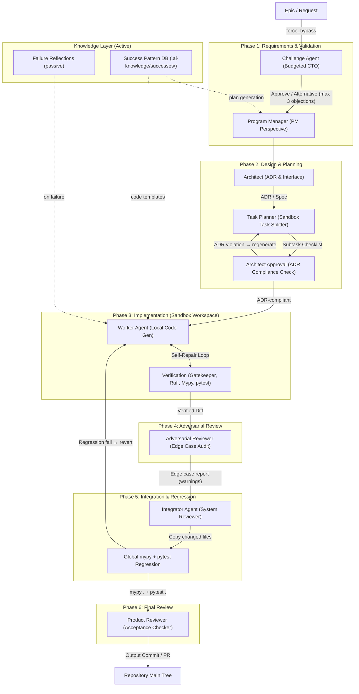
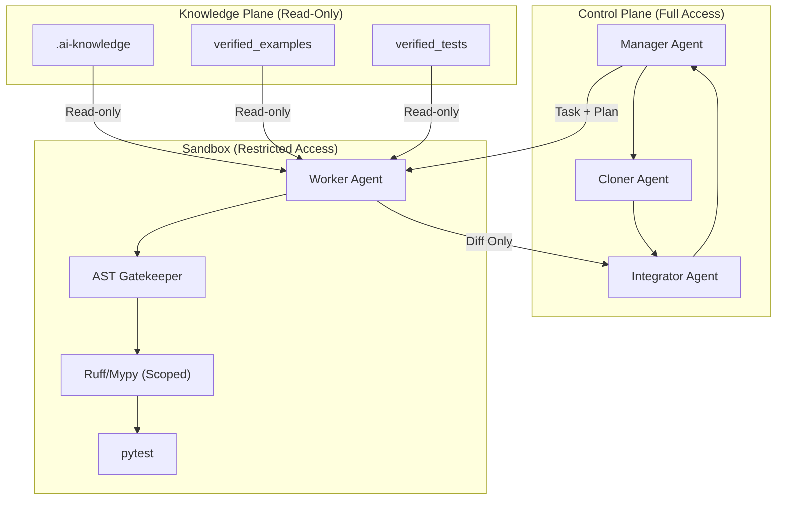

# EKP-Forge / Dependency Semantic Compiler (DSC)

**Executable Knowledge Platform** — a multi-agent orchestration framework that compiles verified, executable knowledge assets and safely delegates AI-assisted development through isolated sandbox pipelines.

[](https://www.python.org/downloads/)
[](https://github.com/astral-sh/ruff)
[](http://mypy-lang.org/)

---

## Table of Contents

1. [Overview](#1-overview)
2. [Project Structure](#2-project-structure)
3. [DSC Pipeline (Knowledge Compilation)](#3-dsc-pipeline-knowledge-compilation)
4. [EKP-Forge Multi-Agent Architecture (v4.1)](#4-ekp-forge-multi-agent-architecture-v41)
5. [Safe Factory Sandbox System](#5-safe-factory-sandbox-system)
6. [MCP Server Integration](#6-mcp-server-integration)
7. [Quick Start](#7-quick-start)
8. [Testing](#8-testing)
9. [Configuration](#9-configuration)
10. [Detailed Documentation](#10-detailed-documentation)

---

## 1. Overview

EKP-Forge is a **multi-agent orchestration framework** that safely delegates AI-assisted development through an isolated, role-based pipeline. It implements organizational-theory-based principles — division of labor, independent auditing, and principal-agent alignment — to ensure code integration safety.

The architecture addresses two fundamental problems in AI-assisted development:

1. **Unsafe Code Generation**: AI coding agents can accidentally damage repositories, overwrite configuration, or introduce hallucinated dependencies. The **Safe Factory** architecture solves this by isolating code generation inside a sandbox with strict verification gates before integration, plus an **Integrator Agent** with global regression checks and automatic rollback.

2. **No Independent Auditing**: Without separation of concerns, the same agent that writes code also verifies it, creating blind spots. EKP-Forge introduces an **Adversarial Reviewer** gate (edge-case robustness, non-blocking warnings) and an **Integrator Agent** (global `mypy .` + `pytest .` with rollback) between the Worker and the host repository.

### Core Concepts

| Concept | Description |
|---------|-------------|
| **EKP-Forge** | Multi-agent orchestration framework with 7-role pipeline for safe, verified AI-assisted development |
| **Safe Factory** | Sandbox isolation via `git worktree` (millisecond-fast) that prevents Worker agents from damaging the host repository |
| **Role-based Protocol** | 7 standard roles (RequirementReview → Planning → Architecture → **Specification** → Implementation → Verification → Integration) with capability-based agent dispatch |
| **Contract-Driven Pipeline** | Manager generates a `WorkerContract` (Pydantic schema) in the Specification phase; Worker implements only the contracted interface; Manager semantically validates compliance via DeepSeek |
| **Function Slicing** | LibCST-based `FunctionSlicer` extracts/injects individual functions for isolated Worker edits, preventing collateral damage |
| **Integrator Agent** | Independent auditor that applies Worker diffs to the host repo, runs global `mypy .` + `pytest .`, and rolls back on regression |
| **Adversarial Reviewer** | Independent gate that tests code robustness against edge cases (None, empty, boundary inputs) with non-blocking warnings |
| **AST Gatekeeper (MVG)** | Deterministic import whitelist validation using Python AST parsing |

---

## 2. Project Structure

```
ekp-forge/
├── ekp_forge/                        # EKP-Forge orchestration framework
│   ├── __init__.py                   # Package entry point
│   ├── mcp_server.py                 # MCP server exposing 5 tools for AI agent delegation
│   ├── manager.py                    # Manager Agent: triage, validation, ADR generation
│   ├── worker.py                     # Worker Agent: Aider execution + verification loop
│   ├── orchestrator.py               # Ruff/Mypy setup, lint/type-check runners
│   ├── rag_crawler.py                # Assumption RAG Crawler: TF-IDF ADR conflict detection
│   ├── task_tree.py                  # TaskTree: parallel subtask execution
│   │
│   ├── agents/                       # Agent base classes and registry
│   │   ├── base.py                   # BaseAgent abstract class
│   │   └── registry.py               # AgentRegistry + CapabilityRegistry
│   │
│   ├── engine/                       # Workflow orchestration engine
│   │   ├── workflow.py               # WorkflowEngine: central role dispatcher
│   │   ├── dispatcher.py             # Role → agent resolution (capability-first)
│   │   ├── fix_planner.py            # Fix Planner for Phase 2/4 fix loops
│   │   └── tiered_diagnostic.py      # Tiered Diagnostic (Ruff → Mypy → Pytest)
│   │
│   ├── protocol/                     # Role-based Protocol Architecture
│   │   ├── roles.py                  # 7 standard Role enum values
│   │   ├── capability.py             # Capability enum + ROLE_REQUIRED_CAPABILITIES
│   │   └── assignment.py             # RoleAssignment + OrganizationProfile + YAML loader
│   │
│   ├── sandbox/                      # Safe Factory sandbox system
│   │   ├── integrator.py             # IntegratorAgent: git apply + global mypy/pytest + rollback
│   │   ├── adversarial_reviewer.py   # AdversarialReviewer: edge-case robustness audit
│   │   ├── constraints.py            # Path allow/deny rules for sandbox copying
│   │   ├── git_worktree.py           # Fast isolated workspace via git worktree (replaces cloner + workspace)
│   │   ├── scoped_lint.py            # Git-diff-scoped linting (changed/untracked files only)
│   │   ├── architect_review.py       # Deterministic ADR compliance check (non-LLM)
│   │   ├── success_patterns.py       # Success Pattern DB: reusable verified diffs
│   │   ├── patch_validator.py        # Scope-violation detection for Worker fixes
│   │   ├── slicer.py                 # LibCST function-level isolation (extract/inject)
│   │   ├── hint_generator.py         # Deterministic error-type hints (Phase 4)
│   │   ├── introspection.py          # dir()/help() sandboxed introspection
│   │   └── verification_ir.py        # Verification IR pipeline (Ruff → Mypy → Pytest parser)
│   │
│   ├── schemas/
│   │   ├── task_schema.py            # Pydantic models: TaskSchema, HelpRequest, ErrorChunk, etc.
│   │   └── contract.py               # WorkerContract, Diagnostic, FixTask, FixTaskV2
│   │
│   └── knowledge/
│       └── harvester.py              # Knowledge harvesting from external packages
│
├── tests/                            # Comprehensive test suites
│   ├── conftest.py                   # Test configuration (sys.path setup)
│   ├── test_manager.py               # Manager Agent tests
│   ├── test_worker.py                # Worker Agent tests
│   ├── test_agent_registry.py        # AgentRegistry + capability tests
│   ├── test_organization_improvements.py  # IntegratorAgent + AdversarialReviewer TDD tests
│   ├── test_contract.py              # Contract schema tests
│   ├── test_contract_pipeline.py     # Contract-driven pipeline tests
│   ├── test_fix_planner.py           # Fix Planner tests
│   ├── test_introspection.py         # Introspection tool tests
│   ├── test_knowledge_harvester.py   # Knowledge harvester tests
│   ├── test_mcp_server.py            # MCP server tests
│   ├── test_protocol_roles.py        # Protocol/role assignment tests
│   ├── test_rag_crawler.py           # RAG crawler tests
│   ├── test_schemas.py               # Schema validation tests
│   ├── test_task_tree.py             # Task tree tests
│   ├── test_verification_ir.py       # Verification IR pipeline tests
│   ├── test_workflow_engine.py       # WorkflowEngine + Dispatcher tests
│   ├── step1_baseline/               # Ollama baseline communication tests
│   ├── step2_fake_api/               # Fake API reference adherence tests
│   └── step3_stress/                 # Self-healing loop stress tests
│
├── organizations/                    # Organization profile YAMLs
│   ├── simple.yaml                   # Single Worker + Manager oversight
│   ├── three_tier.yaml               # Classic 3-tier separation
│   ├── enterprise.yaml               # Full 7-role separation
│   └── org_theory.yaml               # Organizational-theory-based with Integrator + Adversarial
│
├── docs/
│   ├── detailed_guide.md             # Detailed MCP, Aider, configuration manual
│   └── organization_design.md        # Full v4.1 multi-agent organization design
│
├── plans/                            # Architecture & improvement plans
│   ├── safe_factory_architecture.md  # Safe Factory design document
│   ├── review_driven_improvements.md # Review-driven architecture improvements
│   ├── phase4_contract_driven_repair_detailed_design.md  # Phase 4 design
│   ├── organizational_theory_improvements_detailed_design.md  # Org-theory design
│   └── ...                           # Additional planning documents
│
├── decisions/                        # Architecture Decision Records (ADRs)
├── api_schema.yaml                   # MVG import whitelist
├── mcp_config.json                   # MCP server configuration
├── pyproject.toml                    # Project configuration (Ruff, Mypy settings)
├── run-mcp.sh                        # MCP server launcher (aider-orchestrator)
├── run-mcp-ekp.sh                    # MCP server launcher (ekp-forge-manager)
├── run_aider_mcp.py                  # Aider MCP bridge utility
├── skills.md                         # Executable skill definitions for AI agents
├── .cursorrules                      # Workspace rules for AI coding agents
└── README.md                         # This file
```

---

## 3. EKP-Forge Multi-Agent Architecture (v4.1)

EKP-Forge implements a **7-phase, phase-isolated** multi-agent pipeline that transitions from monolithic agent patterns to a distributed, high-redundancy verification system. The architecture scores **88-90 points** in architectural review, with targeted improvements documented in [`plans/review_driven_improvements.md`](plans/review_driven_improvements.md).

### Pipeline Overview



### Phase-by-Phase Agent Roles

| Phase | Agent | Module | Core Perspective | Primary Output |
|---|---|---|---|---|
| **1. Requirements** | **Challenge Agent** | [`manager.py`](ekp_forge/manager.py) (`_run_challenge_agent`) | CTO / Budgeted Audit | Max 3 objections with alternatives |
| | **Program Manager** | [`manager.py`](ekp_forge/manager.py) (`ManagerAgent.triage`) | PM / Acceptance | Milestones, acceptance criteria |
| **2. Design** | **Architect** | [`manager.py`](ekp_forge/manager.py) | Architecture / Interface | ADRs, public interfaces |
| | **Task Planner** | [`manager.py`](ekp_forge/manager.py) | Execution / Scoping | Isolated subtask checklists |
| | **Architect Approval** | [`sandbox/architect_review.py`](ekp_forge/sandbox/architect_review.py) | ADR Compliance | Deterministic token-based cross-reference |
| **3. Implementation** | **Worker Agent** | [`worker.py`](ekp_forge/worker.py) | Local Implementation | Aider code gen + self-healing loop |
| | **Verification (MVG)** | [`worker.py`](ekp_forge/worker.py) + [`sandbox/verification_ir.py`](ekp_forge/sandbox/verification_ir.py) | Gatekeeper / QA | Ruff, Mypy, AST import validation, pytest |
| **4. Adversarial** | **Adversarial Reviewer** | [`sandbox/adversarial_reviewer.py`](ekp_forge/sandbox/adversarial_reviewer.py) | Edge Case | AST-based edge-case tests (warnings, not blockers) |
| **5. Integration** | **Integrator Agent** | [`sandbox/integrator.py`](ekp_forge/sandbox/integrator.py) | System Reviewer | git apply + global mypy/pytest + rollback on failure |
| **6. Review** | **Product Reviewer** | [`manager.py`](ekp_forge/manager.py) | Acceptance | Full validation against acceptance criteria |

### Key Components

| Component | Module | Description |
|---|---|---|
| **Manager Agent** | [`manager.py`](ekp_forge/manager.py) | Task triage, assumption validation (via RAG Crawler), ADR generation, help request handling |
| **Worker Agent** | [`worker.py`](ekp_forge/worker.py) | Executes Aider in git-worktree isolated workspace with verification loop, auto-healing, and escalation |
| **Integrator Agent** | [`sandbox/integrator.py`](ekp_forge/sandbox/integrator.py) | Backups affected files → `git apply` diff → runs global `mypy .` + `pytest .` → commits or rolls back |
| **Adversarial Reviewer** | [`sandbox/adversarial_reviewer.py`](ekp_forge/sandbox/adversarial_reviewer.py) | AST-based edge-case generation and isolated subprocess execution; returns non-blocking warnings |
| **AST Gatekeeper (MVG)** | [`worker.py`](ekp_forge/worker.py) (`_validate_imports`) | Validates imports against `api_schema.yaml` whitelist using AST parsing. Blocks `eval()`/`exec()`/`compile()` |
| **RAG Crawler** | [`rag_crawler.py`](ekp_forge/rag_crawler.py) | TF-IDF semantic search over ADR `decisions/` for assumption conflict detection |
| **Task Tree** | [`task_tree.py`](ekp_forge/task_tree.py) | Thread-safe parallel executor for decomposed subtask dependency trees |
| **Architect Review** | [`sandbox/architect_review.py`](ekp_forge/sandbox/architect_review.py) | Deterministic (non-LLM) ADR compliance check — prevents Task Planner from deviating from architecture decisions |
| **Success Pattern DB** | [`sandbox/success_patterns.py`](ekp_forge/sandbox/success_patterns.py) | Stores verified diffs as reusable templates for future plan generation |
| **WorkflowEngine** | [`engine/workflow.py`](ekp_forge/engine/workflow.py) | Central role dispatcher with shared context; supports Phase 2 fix loop and Phase 4 contract-driven repair |

---

## 5. Safe Factory Sandbox System

The **Safe Factory** architecture prevents damage to the host repository by isolating all code generation and verification inside an ephemeral sandbox. This is the core safety mechanism of EKP-Forge.

### Architecture



### Sandbox Components

| Component | File | Description |
|---|---|---|
| **Integrator Agent** | [`sandbox/integrator.py`](ekp_forge/sandbox/integrator.py) | Backups affected files → `git apply` diff → runs global `mypy .` + `pytest .` → on success: commit + ADR; on failure: restore backups |
| **Adversarial Reviewer** | [`sandbox/adversarial_reviewer.py`](ekp_forge/sandbox/adversarial_reviewer.py) | AST-based edge-case generation (None, empty, boundary) → isolated subprocess execution → non-blocking warnings |
| **GitWorktree** | [`sandbox/git_worktree.py`](ekp_forge/sandbox/git_worktree.py) | Millisecond-fast isolated workspace via `git worktree add` (replaces slow clone) |
| **SandboxWorkspace** | [`sandbox/workspace.py`](ekp_forge/sandbox/workspace.py) | Context manager creating/cleaning temporary directory with whitelisted file copy (legacy) |
| **Cloner Agent** | [`sandbox/cloner.py`](ekp_forge/sandbox/cloner.py) | Shallow git clone or fallback file copy into sandbox. Filters by `is_path_allowed` |
| **Constraints** | [`sandbox/constraints.py`](ekp_forge/sandbox/constraints.py) | Deny rules: `.venv`, `__pycache__`, `.git`, `pyproject.toml` (protected), `mcp_config.json` |
| **Scoped Lint** | [`sandbox/scoped_lint.py`](ekp_forge/sandbox/scoped_lint.py) | Git-diff-scoped linting — only checks changed files |
| **Patch Validator** | [`sandbox/patch_validator.py`](ekp_forge/sandbox/patch_validator.py) | AST-based scope-violation detection for Worker fixes (Phase 4) |
| **Verification IR** | [`sandbox/verification_ir.py`](ekp_forge/sandbox/verification_ir.py) | Unified verification pipeline: auto-fix → Ruff → Mypy → Pytest with structured Diagnostic output |
| **Architect Review** | [`sandbox/architect_review.py`](ekp_forge/sandbox/architect_review.py) | Deterministic (non-LLM) ADR compliance check |
| **Success Pattern DB** | [`sandbox/success_patterns.py`](ekp_forge/sandbox/success_patterns.py) | Stores verified diffs as reusable templates |

### Safety Guarantees

1. **Zero Git Capabilities**: Worker has no access to `git reset`, `git commit`, or `git rollback` on the host
2. **Scope Isolation**: Linters scan only whitelisted target files, not the entire project
3. **Configuration Protection**: `pyproject.toml` and `mcp_config.json` are excluded from sandbox copies
4. **Integrator Control**: All changes must pass through the Integrator's regression gate before reaching the host
5. **Automatic Cleanup**: Sandbox directories are deleted when the context manager exits

---

## 6. MCP Server Integration

EKP-Forge provides **two stdio-based MCP servers** for AI agent delegation (Claude Desktop, Cursor, VS Code, etc.).

### Server 1: `aider-orchestrator` (Aider MCP Bridge)

[`run-mcp.sh`](run-mcp.sh) wraps `aider-mcp` (the Aider MCP bridge) for direct Aider access.
Dynamically resolves `OPENROUTER_API_KEY` from `~/.zshrc`.

### Server 2: `ekp-forge-manager` (EKP-Forge Manager MCP)

[`run-mcp-ekp.sh`](run-mcp-ekp.sh) launches [`ekp_forge/mcp_server.py`](ekp_forge/mcp_server.py) which exposes EKP-Forge's full pipeline as MCP tools.
Uses **DeepSeek V4 Flash API** (`DEEPSEEK_API_KEY`) for the Manager/validation layer and **Ollama qwen2.5-coder:7b** (via Aider) for the Worker/code-generation layer.

### Exposed Tools (ekp-forge-manager)

| Tool | Description | Tier |
|---|---|---|
| `execute_simple_aider` | Run Aider with a plain prompt, no static analysis | Worker only |
| `execute_strict_compile` | Full pipeline: Aider → verification → integration | Manager + Worker |
| `run_managed_task` | Full managed pipeline: triage → architect → worker → verify → integrate | **Director → Manager → Worker** |
| `run_epic_task` | Decompose epic into subtasks, execute in parallel via TaskTree | Director → Manager |
| `generate_task_id` | Generate a deterministic task ID from a goal string | Utility |

### Configuration (`mcp_config.json`)

Both servers are registered in [`mcp_config.json`](mcp_config.json):

```json
{
    "mcpServers": {
        "aider-orchestrator": {
            "command": "/path/to/ekp-forge/run-mcp.sh",
            "args": [],
            "env": {
                "OLLAMA_HOST": "http://127.0.0.1:11434"
            }
        },
        "ekp-forge-manager": {
            "command": "/path/to/ekp-forge/run-mcp-ekp.sh",
            "args": [],
            "env": {
                "OLLAMA_HOST": "http://127.0.0.1:11434"
            }
        }
    }
}
```

### Auto-starting Ollama

Both `run-mcp.sh` and `run-mcp-ekp.sh` automatically detect if Ollama is running and start it if needed:

```bash
if ! curl -s http://127.0.0.1:11434/api/tags > /dev/null 2>&1; then
    ollama serve &   # background
    disown
    # Wait up to 10 seconds for readiness
fi
```

### Manager Model Routing (`manager.py`)

[`ekp_forge/manager.py`](ekp_forge/manager.py) supports three LLM backends for validation, tried in order:

| Priority | Method | Model | Use Case |
|----------|--------|-------|----------|
| 1st | `_call_deepseek()` | `deepseek-chat` (API) | Fast planning/validation |
| 2nd | `_call_ollama()` | `qwen2.5-coder:7b` (local) | Free local fallback |
| 3rd | `_call_openrouter()` | `gpt-4o-mini` (API) | Cloud fallback |

### Known Issue: 2-Tier Protocol Compliance

In the **2-tier model** (Director+Manager=DeepSeek, Worker=Ollama, no MCP server), the top-tier model can bypass the delegation protocol because:

1. **No code enforcement**: Unlike the 3-tier MCP setup, there is no server code validating the workflow
2. **Incentive mismatch**: The top-tier model (DeepSeek) knows it can generate better code than the Worker (7B), creating temptation to skip delegation
3. **Fix cycle regression**: When the Worker model (7B) is asked to fix code, it tends to regenerate the entire file, losing unrelated working code. **Surgical fixes should be applied by the Manager via `apply_diff`, not delegated back to the Worker**

**Mitigation**: Use the 3-tier MCP setup (`ekp-forge-manager`) which enforces the protocol through `run_managed_task` → `WorkflowEngine`.
For 2-tier testing, see [`plans/2layer_abm_fbs_capability_plan.md`](plans/2layer_abm_fbs_capability_plan.md).

For Claude Desktop integration and detailed Aider setup, see [`docs/detailed_guide.md`](docs/detailed_guide.md).

---

## 7. Quick Start

### Prerequisites

- Python 3.13+
- [uv](https://docs.astral.sh/uv/) (recommended) or pip
- [Ollama](https://ollama.ai/) with `qwen2.5-coder:7b` (for local code generation)
- [Aider](https://aider.chat/) (for AI-assisted code editing)

### Setup

```bash
# Install dependencies
uv sync

# Or using pip
pip install -e .
```

### Run Test Suite

```bash
# Run all tests (excluding tests that require external dependencies like libcst)
python3 -m pytest tests/ \
  --ignore=tests/test_contract_pipeline.py \
  --ignore=tests/test_fix_planner.py \
  --ignore=tests/test_mcp_server.py \
  --ignore=tests/test_task_tree.py \
  --ignore=tests/test_workflow_engine.py \
  -v
```

### MCP Server (For AI Agent Delegation)

```bash
# Aider MCP bridge (Worker-tier code generation)
./run-mcp.sh

# EKP-Forge Manager MCP (full pipeline with DeepSeek Manager)
./run-mcp-ekp.sh
```

### Using the Organization Profiles

Set the `EKP_PROFILE` environment variable to select the organization profile:

```bash
# Simple profile (default): Manager + Worker
export EKP_PROFILE=simple

# Three-tier: Manager plans, Worker implements, Manager integrates
export EKP_PROFILE=three_tier

# Org-theory: Full pipeline with Adversarial Reviewer + Integrator Agent
export EKP_PROFILE=org_theory

# Enterprise: Full 7-role separation (requires all agents registered)
export EKP_PROFILE=enterprise
```

---

## 8. Testing

All test suites reside in the [`tests/`](tests/) directory. Run with pytest:

```bash
# Run all tests (except those needing external deps like libcst)
python3 -m pytest tests/ \
  --ignore=tests/test_contract_pipeline.py \
  --ignore=tests/test_fix_planner.py \
  --ignore=tests/test_mcp_server.py \
  --ignore=tests/test_task_tree.py \
  --ignore=tests/test_workflow_engine.py \
  -v
```

### Test Suites

| Test Suite | File | Description |
|---|---|---|
| **Manager Agent** | [`tests/test_manager.py`](tests/test_manager.py) | Task triage, ADR generation, challenge agent |
| **Worker Agent** | [`tests/test_worker.py`](tests/test_worker.py) | Aider execution, verification loop, auto-healing, escalation |
| **Agent Registry** | [`tests/test_agent_registry.py`](tests/test_agent_registry.py) | BaseAgent, CapabilityRegistry, AgentRegistry |
| **Workflow Engine** | [`tests/test_workflow_engine.py`](tests/test_workflow_engine.py) | WorkflowEngine, Dispatcher, FixPlanner (requires libcst) |
| **Organization Improvements** | [`tests/test_organization_improvements.py`](tests/test_organization_improvements.py) | IntegratorAgent backup/restore + AdversarialReviewer edge-case audit |
| **Protocol Roles** | [`tests/test_protocol_roles.py`](tests/test_protocol_roles.py) | RoleAssignment, OrganizationProfile, YAML loading |
| **Schemas** | [`tests/test_schemas.py`](tests/test_schemas.py) | TaskSchema, HelpRequest, ErrorChunk validation |
| **Contracts** | [`tests/test_contract.py`](tests/test_contract.py) | WorkerContract, Diagnostic, FixTask schemas |
| **Contract Pipeline** | [`tests/test_contract_pipeline.py`](tests/test_contract_pipeline.py) | Contract-driven repair pipeline (requires libcst) |
| **Fix Planner** | [`tests/test_fix_planner.py`](tests/test_fix_planner.py) | Fix Planner logic (requires libcst) |
| **Verification IR** | [`tests/test_verification_ir.py`](tests/test_verification_ir.py) | Ruff/Mypy/Pytest IR pipeline |
| **Introspection** | [`tests/test_introspection.py`](tests/test_introspection.py) | Sandboxed introspection tool |
| **Knowledge Harvester** | [`tests/test_knowledge_harvester.py`](tests/test_knowledge_harvester.py) | Knowledge harvesting from external packages |
| **RAG Crawler** | [`tests/test_rag_crawler.py`](tests/test_rag_crawler.py) | TF-IDF indexing, semantic search, conflict detection |
| **Task Tree** | [`tests/test_task_tree.py`](tests/test_task_tree.py) | Parallel subtask execution (requires libcst) |
| **MCP Server** | [`tests/test_mcp_server.py`](tests/test_mcp_server.py) | MCP tool endpoints (requires libcst) |
| **Step 1: Baseline** | [`tests/step1_baseline/`](tests/step1_baseline/) | Ollama API communication baseline |
| **Step 2: Fake API** | [`tests/step2_fake_api/`](tests/step2_fake_api/) | Knowledge reference adherence test |
| **Step 3: Stress** | [`tests/step3_stress/`](tests/step3_stress/) | Self-healing loop stress test |

---

## 9. Configuration

### [`pyproject.toml`](pyproject.toml)

Project-wide configuration for Ruff (linting) and Mypy (type checking):

- **Ruff**: Line length 120, comprehensive rule set (E, W, F, I, UP, B, A, C4, T20, RET, SIM, ARG, ERA, PL, RUF, C90, N, ANN, S, BLE, FBT)
- **Mypy**: Strict mode enabled, test files ignored

### [`api_schema.yaml`](api_schema.yaml)

Import whitelist for the AST Gatekeeper. Managed automatically by the deployer but can be manually edited:

```yaml
allowed_imports:
  - builtins
  - typing
```

### [`mcp_config.json`](mcp_config.json)

MCP server configuration for AI agent integration.

### Aider Configuration

See [`docs/detailed_guide.md`](docs/detailed_guide.md) for:
- `.aider.conf.yml` setup
- `.aider.model.settings.yml` role definitions with `system_prompt_prefix`
- `.aider.model.metadata.json` context window configuration
- Escalation rules preventing hallucinated API usage

---

## 10. Detailed Documentation

| Document | Path | Content |
|---|---|---|
| **Detailed Manual** | [`docs/detailed_guide.md`](docs/detailed_guide.md) | MCP configuration, Aider setup, model metadata, prompt engineering, operational procedures |
| **Organization Design** | [`docs/organization_design.md`](docs/organization_design.md) | Complete v4.1 multi-agent architecture, phase definitions, Safe Factory implementation mapping |
| **Org-Theory Improvements** | [`plans/organizational_theory_improvements_detailed_design.md`](plans/organizational_theory_improvements_detailed_design.md) | Integrator Agent + Adversarial Reviewer detailed design and TDD specs |
| **Phase 4 Design** | [`plans/phase4_contract_driven_repair_detailed_design.md`](plans/phase4_contract_driven_repair_detailed_design.md) | Contract-driven repair with function-level isolation |
| **Safe Factory Architecture** | [`plans/safe_factory_architecture.md`](plans/safe_factory_architecture.md) | In-depth sandbox isolation design, component specifications |
| **Review-Driven Improvements** | [`plans/review_driven_improvements.md`](plans/review_driven_improvements.md) | Five targeted improvements, architect gate, success patterns |
| **Architecture Design (Japanese)** | [`architecture_design.md`](architecture_design.md) | Original detailed design document in Japanese |
| **Role Protocol Architecture** | [`plans/role_protocol_architecture_detailed_design.md`](plans/role_protocol_architecture_detailed_design.md) | Role-based protocol, capability dispatch, organization profiles |
| **Decision Logs** | [`decisions/`](decisions/) | Architecture Decision Records (ADRs) with assumption tracking and context |

---

*Part of the Executable Knowledge Platform (EKP) ecosystem — eliminating hallucination through verified, executable knowledge compilation.*
