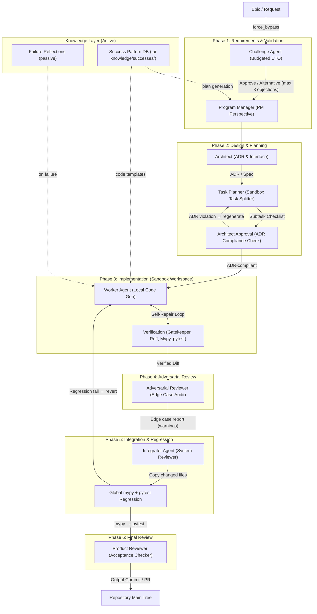
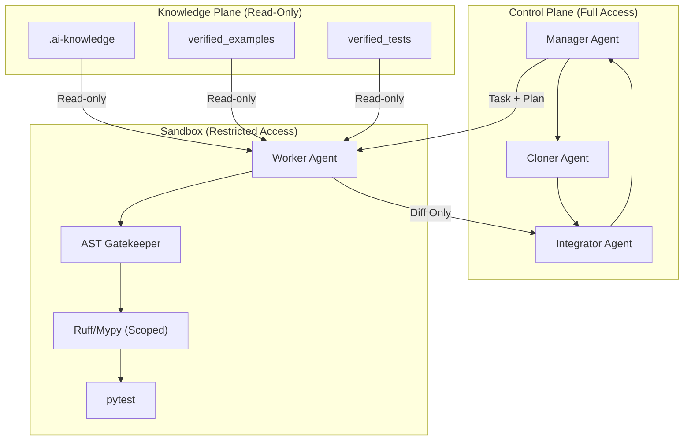

# EKP-Forge / Dependency Semantic Compiler (DSC)

**Executable Knowledge Platform** — a multi-agent orchestration framework that compiles verified, executable knowledge assets and safely delegates AI-assisted development through isolated sandbox pipelines.

[](https://www.python.org/downloads/)
[](https://github.com/astral-sh/ruff)
[](http://mypy-lang.org/)

---

## Table of Contents

1. [Overview](#1-overview)
2. [Project Structure](#2-project-structure)
3. [DSC Pipeline (Knowledge Compilation)](#3-dsc-pipeline-knowledge-compilation)
4. [EKP-Forge Multi-Agent Architecture (v4.1)](#4-ekp-forge-multi-agent-architecture-v41)
5. [Safe Factory Sandbox System](#5-safe-factory-sandbox-system)
6. [MCP Server Integration](#6-mcp-server-integration)
7. [Quick Start](#7-quick-start)
8. [Testing](#8-testing)
9. [Configuration](#9-configuration)
10. [Detailed Documentation](#10-detailed-documentation)

---

## 1. Overview

EKP-Forge addresses two fundamental problems in AI-assisted development:

1. **Hallucination in RAG**: Traditional RAG systems rely on static documentation that may be outdated or incorrect. The **Dependency Semantic Compiler (DSC)** solves this by extracting, verifying, and compiling knowledge assets directly from working code, assigning **Trust Scores** to each asset type:

   | Information Source | Trust Score | Role |
   |---|---|---|
   | Smoke Tests (`tests/`) | **1.0** | Absolute truth — prioritized interface definitions |
   | Examples (`examples/`) | **0.9** | Verified implementation templates |
   | Type/Docstring (`*.pyi`) | **0.7** | Static type constraints (no semantics) |
   | README (`*.md`) | **0.4** | Conceptual understanding only |

2. **Unsafe Code Generation**: AI coding agents can accidentally damage repositories, overwrite configuration, or introduce hallucinated dependencies. The **Safe Factory** architecture solves this by isolating code generation inside a temporary sandbox with strict verification gates before integration.

### Core Concepts

| Concept | Description |
|---------|-------------|
| **DSC Pipeline** | 5-stage compiler that extracts, traces, synthesizes, and deploys executable knowledge from verified code |
| **EKP-Forge** | Multi-agent orchestration framework with 7-phase pipeline for safe, verified AI-assisted development |
| **Safe Factory** | Sandbox isolation system that prevents Worker agents from damaging the host repository |
| **AST Gatekeeper (MVG)** | Deterministic import whitelist validation using Python AST parsing |
| **Trust Score** | Quantified reliability metric for knowledge assets, from 0.0 (untrusted) to 1.0 (verified) |

---

## 2. Project Structure

```
ekp-forge/
├── dsc/                              # Dependency Semantic Compiler (knowledge compilation)
│   ├── package_inspector.py          # Stage 1: Detect installed packages & versions
│   ├── source_miner.py               # Stage 2: Clone & extract tests/examples from repos
│   ├── smoke_tracer.py               # Stage 3: Execute minimal interface initialization tests
│   ├── asset_synthesizer.py          # Stage 4: Generate semantic graph assets
│   ├── deploy.py                     # Stage 5: Deploy assets to target projects
│   ├── config.py                     # Configuration utilities
│   └── utils.py                      # Shared utilities
│
├── ekp_forge/                        # EKP-Forge orchestration framework
│   ├── __init__.py                   # Package entry point
│   ├── orchestrator.py               # Core orchestrator: Ruff/Mypy setup, import validation, pytest runner
│   ├── orchestrator_api.py           # Public API for 3-tier development pipeline
│   ├── manager.py                    # Manager Agent: triage, validation, ADR generation
│   ├── worker.py                     # Worker Agent: Aider execution + verification loop
│   ├── mcp_server.py                 # MCP server exposing tools for AI agent delegation
│   ├── adversarial_tester.py         # Adversarial Reviewer: edge-case test generation
│   ├── rag_crawler.py                # Assumption RAG Crawler: semantic ADR conflict detection
│   ├── task_tree.py                  # TaskTree: parallel subtask execution
│   │
│   ├── sandbox/                      # Safe Factory sandbox system
│   │   ├── workspace.py              # Isolated temporary workspace (context manager)
│   │   ├── cloner.py                 # Clone/copy project into sandbox
│   │   ├── integrator.py             # Copy verified changes back + cross-module regression
│   │   ├── config_agent.py           # Safe TOML/YAML configuration modification
│   │   ├── constraints.py            # Path allow/deny rules for sandbox copying
│   │   ├── verification.py           # Sandbox-scoped Ruff + Mypy wrappers
│   │   ├── scoped_lint.py            # Git-diff-scoped linting (changed files only)
│   │   ├── architect_review.py       # Deterministic ADR compliance check (non-LLM)
│   │   └── success_patterns.py       # Success Pattern DB: reusable verified diffs
│   │
│   └── schemas/
│       └── task_schema.py            # Pydantic models: TaskSchema, HelpRequest, ErrorChunk, etc.
│
├── tests/                            # Comprehensive test suites
│   ├── conftest.py                   # Test configuration
│   ├── test_e2e.py                   # End-to-end pipeline verification
│   ├── test_manager.py               # Manager Agent tests
│   ├── test_worker.py                # Worker Agent tests
│   ├── test_orchestrator.py          # Orchestrator self-healing tests
│   ├── test_orchestrator_api.py      # Orchestrator API tests
│   ├── test_mcp_server.py            # MCP server tests
│   ├── test_sandbox_components.py    # Sandbox module tests
│   ├── test_adversarial_tester.py    # Adversarial testing tests
│   ├── test_rag_crawler.py           # RAG crawler tests
│   ├── test_task_tree.py             # Task tree tests
│   ├── test_schemas.py               # Schema validation tests
│   ├── test_asset_synthesizer.py     # DSC asset synthesis tests
│   ├── test_smoke_tracer.py          # DSC smoke tracer tests
│   ├── test_deploy.py                # DSC deployment tests
│   ├── test_calc.py                  # Calculator test utility
│   ├── step1_baseline/               # Ollama baseline communication tests
│   ├── step2_fake_api/               # Fake API reference adherence tests
│   ├── step3_stress/                 # Self-healing loop stress tests
│   └── step4_ollama_synthesizer/     # Ollama-integrated synthesizer tests
│
├── docs/
│   ├── detailed_guide.md             # Detailed MCP, Aider, configuration manual
│   └── organization_design.md        # Full v4.1 multi-agent organization design
│
├── plans/                            # Architecture & improvement plans
│   ├── safe_factory_architecture.md  # Safe Factory design document
│   └── review_driven_improvements.md # Review-driven architecture improvements (88→90+ pts)
│
├── decisions/                        # Architecture Decision Records (ADRs)
├── .ai-knowledge/                    # Local knowledge asset cache
├── api_schema.yaml                   # MVG import whitelist
├── mcp_config.json                   # MCP server configuration
├── pyproject.toml                    # Project configuration (Ruff, Mypy settings)
├── run-mcp.sh                        # MCP server launcher script
├── skills.md                         # Executable skill definitions for AI agents
├── .cursorrules                      # Workspace rules for AI coding agents
└── README.md                         # This file
```

### Global Cache Architecture

```
~/.knowledge-cache/                   # Version-isolated global knowledge cache
├── {package_name}/
│   └── {version}/
│       ├── integration_graph.md      # API dependency table by module
│       ├── workflow_graph.md         # Cross-library workflow graph with code examples
│       ├── verified_examples/        # Trust Score ≥ 0.9 code
│       └── verified_tests/           # Smoke tests (Trust Score 1.0)
```

---

## 3. DSC Pipeline (Knowledge Compilation)

The **Dependency Semantic Compiler** extracts, verifies, and packages knowledge from working code into reusable assets. It operates in 5 stages:

### Stage 1: Package Inspector
[`dsc/package_inspector.py`](dsc/package_inspector.py)

Scans the project's `.venv` to identify installed packages with exact versions and VCS source origins. Outputs a JSON manifest.

### Stage 2: Source & CI Miner
[`dsc/source_miner.py`](dsc/source_miner.py)

Clones target repositories using a tiered sparse-checkout strategy to extract `tests/` and `examples/` directories, storing them in the global cache.

### Stage 3: Smoke Tracer
[`dsc/smoke_tracer.py`](dsc/smoke_tracer.py)

Executes minimal interface initialization snippets in subprocess isolation. Skips full test suites (avoids CUDA/MPI dependency failures). Assigns Trust Scores based on execution success.

### Stage 4: Asset Synthesizer
[`dsc/asset_synthesizer.py`](dsc/asset_synthesizer.py)

Generates semantic graph assets:

- **`integration_graph.md`** — API surface tables, class dependencies, and method constraints for individual packages
- **`workflow_graph.md`** — Cross-library data flow, parameter constraints, and type conversion rules

**Modes:**
- **Offline (`--no-llm`)** — Fast, AST-based generation of API surface tables
- **LLM (`--llm`)** — Semantic enrichment via OpenRouter (default: `deepseek/deepseek-v4-flash`)
- **Ollama (`--llm-provider ollama`)** — Local LLM integration for graph synthesis

### Stage 5: Deployer
[`dsc/deploy.py`](dsc/deploy.py)

Deploys cached assets to target projects via **Hard Copy** (no symlinks):

| Global Cache | → | Project Local |
|---|---|---|
| `integration_graph.md` | → | `.ai-knowledge/{package}.md` |
| `workflow_graph.md` | → | `.ai-knowledge/workflow_graph.md` (merged) |
| `verified_examples/` | → | `verified_examples/` |
| `verified_tests/` | → | `verified_tests/` |

Automatically updates `api_schema.yaml` with package import whitelist entries, preserving user-defined entries.

---

## 4. EKP-Forge Multi-Agent Architecture (v4.1)

EKP-Forge implements a **7-phase, phase-isolated** multi-agent pipeline that transitions from monolithic agent patterns to a distributed, high-redundancy verification system. The architecture scores **88-90 points** in architectural review, with targeted improvements documented in [`plans/review_driven_improvements.md`](plans/review_driven_improvements.md).

### Pipeline Overview



### Phase-by-Phase Agent Roles

| Phase | Agent | Module | Core Perspective | Primary Output |
|---|---|---|---|---|
| **1. Requirements** | **Challenge Agent** | [`manager.py`](ekp_forge/manager.py) (`_run_challenge_agent`) | CTO / Budgeted Audit | Max 3 objections with alternatives |
| | **Program Manager** | [`manager.py`](ekp_forge/manager.py) (`ManagerAgent.triage`) | PM / Acceptance | Milestones, acceptance criteria |
| **2. Design** | **Architect** | [`manager.py`](ekp_forge/manager.py) | Architecture / Interface | ADRs, public interfaces |
| | **Task Planner** | [`manager.py`](ekp_forge/manager.py) | Execution / Scoping | Isolated subtask checklists |
| | **Architect Approval** | [`sandbox/architect_review.py`](ekp_forge/sandbox/architect_review.py) | ADR Compliance | Deterministic token-based cross-reference |
| **3. Implementation** | **Worker Agent** | [`worker.py`](ekp_forge/worker.py) | Local Implementation | Aider code gen + self-healing loop |
| | **Verification (MVG)** | [`orchestrator.py`](ekp_forge/orchestrator.py) + [`sandbox/verification.py`](ekp_forge/sandbox/verification.py) | Gatekeeper / QA | Ruff, Mypy, AST import validation, pytest |
| **4. Adversarial** | **Adversarial Reviewer** | [`adversarial_tester.py`](ekp_forge/adversarial_tester.py) | Edge Case | LLM-generated edge-case tests (warnings, not blockers) |
| **5. Integration** | **Integrator Agent** | [`sandbox/integrator.py`](ekp_forge/sandbox/integrator.py) | System Reviewer | File merge + global regression tests |
| **6. Review** | **Product Reviewer** | [`manager.py`](ekp_forge/manager.py) | Acceptance | Full validation against acceptance criteria |

### Key Components

| Component | Module | Description |
|---|---|---|
| **Manager Agent** | [`manager.py`](ekp_forge/manager.py) | Task triage, assumption validation (via RAG Crawler), ADR generation, help request handling |
| **Worker Agent** | [`worker.py`](ekp_forge/worker.py) | Executes Aider in isolated sandbox with verification loop, auto-healing, and escalation |
| **AST Gatekeeper (MVG)** | [`orchestrator.py`](ekp_forge/orchestrator.py) | Validates imports against `api_schema.yaml` whitelist using AST parsing. Blocks `eval()`/`exec()`/`compile()` |
| **RAG Crawler** | [`rag_crawler.py`](ekp_forge/rag_crawler.py) | TF-IDF semantic search over ADR `decisions/` for assumption conflict detection |
| **Task Tree** | [`task_tree.py`](ekp_forge/task_tree.py) | Thread-safe parallel executor for decomposed subtask dependency trees |
| **Adversarial Tester** | [`adversarial_tester.py`](ekp_forge/adversarial_tester.py) | LLM-driven edge-case test generation and execution after Worker verification |
| **Architect Review** | [`sandbox/architect_review.py`](ekp_forge/sandbox/architect_review.py) | Deterministic (non-LLM) ADR compliance check — prevents Task Planner from deviating from architecture decisions |
| **Success Pattern DB** | [`sandbox/success_patterns.py`](ekp_forge/sandbox/success_patterns.py) | Stores verified diffs as reusable templates for future plan generation |
| **Orchestrator API** | [`orchestrator_api.py`](ekp_forge/orchestrator_api.py) | Public API (`run_3tier_dev`) for invoking the full sandbox pipeline programmatically |

---

## 5. Safe Factory Sandbox System

The **Safe Factory** architecture prevents damage to the host repository by isolating all code generation and verification inside an ephemeral sandbox. This is the core safety mechanism of EKP-Forge.

### Architecture



### Sandbox Components

| Component | File | Description |
|---|---|---|
| **SandboxWorkspace** | [`sandbox/workspace.py`](ekp_forge/sandbox/workspace.py) | Context manager creating/cleaning temporary directory with whitelisted file copy |
| **Cloner Agent** | [`sandbox/cloner.py`](ekp_forge/sandbox/cloner.py) | Shallow git clone or fallback file copy into sandbox. Filters by `is_path_allowed` |
| **Constraints** | [`sandbox/constraints.py`](ekp_forge/sandbox/constraints.py) | Deny rules: `.venv`, `__pycache__`, `.git`, `pyproject.toml` (protected), `mcp_config.json` |
| **Config Agent** | [`sandbox/config_agent.py`](ekp_forge/sandbox/config_agent.py) | Safe TOML modification via structured `ConfigChangeRequest` — prevents regex-based corruption |
| **Verification** | [`sandbox/verification.py`](ekp_forge/sandbox/verification.py) | CWD-scoped Ruff + Mypy execution inside sandbox |
| **Scoped Lint** | [`sandbox/scoped_lint.py`](ekp_forge/sandbox/scoped_lint.py) | Git-diff-scoped linting — only checks changed files |
| **Integrator Agent** | [`sandbox/integrator.py`](ekp_forge/sandbox/integrator.py) | Copies verified files back, runs global `mypy .` + `pytest`, reverts on regression failure |

### Safety Guarantees

1. **Zero Git Capabilities**: Worker has no access to `git reset`, `git commit`, or `git rollback` on the host
2. **Scope Isolation**: Linters scan only whitelisted target files, not the entire project
3. **Configuration Protection**: `pyproject.toml` and `mcp_config.json` are excluded from sandbox copies
4. **Integrator Control**: All changes must pass through the Integrator's regression gate before reaching the host
5. **Automatic Cleanup**: Sandbox directories are deleted when the context manager exits

---

## 6. MCP Server Integration

EKP-Forge exposes an **MCP (Model Context Protocol)** server that allows AI agents (Claude Desktop, Cursor, etc.) to delegate tasks directly to the pipeline.

### Server Entry Point
[`ekp_forge/mcp_server.py`](ekp_forge/mcp_server.py)

The server is launched via [`run-mcp.sh`](run-mcp.sh), which wraps `aider-mcp` (the Aider MCP bridge). The script dynamically resolves `OPENROUTER_API_KEY` from `~/.zshrc` and passes the orchestrator path to aider-mcp.

### Exposed Tools

| Tool | Description |
|---|---|
| `execute_simple_aider` | Run Aider with a plain prompt, no static analysis or self-repair |
| `execute_strict_compile` | Full `run_3tier_dev` pipeline: sandbox → Aider → verification → integration |
| `run_managed_task` | Full managed pipeline: triage → architect → worker → verify → integrate |
| `run_epic_task` | Decompose epic into subtasks, execute in parallel via TaskTree |
| `generate_task_id` | Generate a deterministic task ID from a goal string |

### Configuration

The MCP server is configured via [`mcp_config.json`](mcp_config.json) and launched via [`run-mcp.sh`](run-mcp.sh):

```json
{
    "mcpServers": {
        "aider-orchestrator": {
            "command": "/path/to/ekp-forge/run-mcp.sh",
            "args": [],
            "env": {
                "OLLAMA_HOST": "http://127.0.0.1:11434"
            }
        }
    }
}
```

For Claude Desktop integration and detailed Aider setup, see [`docs/detailed_guide.md`](docs/detailed_guide.md).

---

## 7. Quick Start

### Prerequisites

- Python 3.13+
- [uv](https://docs.astral.sh/uv/) (recommended) or pip
- [Ollama](https://ollama.ai/) with `qwen2.5-coder:7b` (for local code generation)
- [Aider](https://aider.chat/) (for AI-assisted code editing)

### Setup

```bash
# Install dependencies
uv sync

# Or using pip
pip install -e .
```

### DSC Pipeline (Knowledge Compilation)

```bash
# Stage 1: Inspect & generate manifest
python3 dsc/package_inspector.py --project /path/to/project --target mesa --output manifest.json

# Stage 2: Mine & cache repository examples
python3 dsc/source_miner.py --manifest manifest.json

# Stage 3: Run smoke verification traces
python3 dsc/smoke_tracer.py --manifest manifest.json

# Stage 4: Synthesize semantic assets
# Offline mode (default)
python3 dsc/asset_synthesizer.py --manifest manifest.json --no-llm
# LLM mode (requires OPENROUTER_API_KEY)
python3 dsc/asset_synthesizer.py --manifest manifest.json --llm
# Ollama mode (local)
python3 dsc/asset_synthesizer.py --manifest manifest.json --llm-provider ollama

# Stage 5: Deploy to target project
python3 dsc/deploy.py --project /path/to/project --packages mesa
```

### EKP-Forge Orchestration (Programmatic API)

```python
from ekp_forge.orchestrator_api import run_3tier_dev

result = run_3tier_dev(
    prompt="Add input validation to the login function",
    target_pkg="myapp",
    target_files=["src/auth.py"],
    model="ollama/qwen2.5-coder:7b",
)
print(result)  # {"success": True, "status": "ok", ...}
```

### MCP Server (For AI Agent Delegation)

```bash
./run-mcp.sh
```

### Sandbox Pipeline (MCP Server)

```bash
./run-mcp.sh
```

---

## 8. Testing

All test suites reside in the [`tests/`](tests/) directory. Run with pytest:

```bash
pytest -v --ignore=tests/step4_ollama_synthesizer/fixtures/
```

### Test Suites

| Test Suite | File | Description |
|---|---|---|
| **End-to-End** | [`tests/test_e2e.py`](tests/test_e2e.py) | Full pipeline verification across all phases |
| **Manager Agent** | [`tests/test_manager.py`](tests/test_manager.py) | Task triage, ADR generation, challenge agent |
| **Worker Agent** | [`tests/test_worker.py`](tests/test_worker.py) | Aider execution, verification loop, auto-healing, escalation |
| **Orchestrator** | [`tests/test_orchestrator.py`](tests/test_orchestrator.py) | Self-healing loop, test runner, cleanup |
| **Orchestrator API** | [`tests/test_orchestrator_api.py`](tests/test_orchestrator_api.py) | `run_3tier_dev` public API |
| **MCP Server** | [`tests/test_mcp_server.py`](tests/test_mcp_server.py) | MCP tool endpoints |
| **Sandbox Components** | [`tests/test_sandbox_components.py`](tests/test_sandbox_components.py) | Workspace, cloner, integrator, constraints, config agent |
| **Adversarial Tester** | [`tests/test_adversarial_tester.py`](tests/test_adversarial_tester.py) | Edge case generation and execution |
| **RAG Crawler** | [`tests/test_rag_crawler.py`](tests/test_rag_crawler.py) | TF-IDF indexing, semantic search, conflict detection |
| **Task Tree** | [`tests/test_task_tree.py`](tests/test_task_tree.py) | Parallel subtask execution, dependency resolution |
| **Schemas** | [`tests/test_schemas.py`](tests/test_schemas.py) | Pydantic model validation |
| **DSC: Asset Synthesis** | [`tests/test_asset_synthesizer.py`](tests/test_asset_synthesizer.py) | Offline and LLM-based graph generation |
| **DSC: Smoke Tracer** | [`tests/test_smoke_tracer.py`](tests/test_smoke_tracer.py) | AST extraction, trace execution |
| **DSC: Deploy** | [`tests/test_deploy.py`](tests/test_deploy.py) | Asset copy, `api_schema.yaml` merge |
| **Step 1: Baseline** | [`tests/step1_baseline/`](tests/step1_baseline/) | Ollama API communication baseline |
| **Step 2: Fake API** | [`tests/step2_fake_api/`](tests/step2_fake_api/) | Knowledge reference adherence test |
| **Step 3: Stress** | [`tests/step3_stress/`](tests/step3_stress/) | Self-healing loop stress test |
| **Step 4: Synthesizer** | [`tests/step4_ollama_synthesizer/`](tests/step4_ollama_synthesizer/) | Ollama-integrated synthesizer validation |

---

## 9. Configuration

### [`pyproject.toml`](pyproject.toml)

Project-wide configuration for Ruff (linting) and Mypy (type checking):

- **Ruff**: Line length 120, comprehensive rule set (E, W, F, I, UP, B, A, C4, T20, RET, SIM, ARG, ERA, PL, RUF, C90, N, ANN, S, BLE, FBT)
- **Mypy**: Strict mode enabled, test files ignored

### [`api_schema.yaml`](api_schema.yaml)

Import whitelist for the AST Gatekeeper. Managed automatically by the deployer but can be manually edited:

```yaml
allowed_imports:
  - builtins
  - typing
```

### [`mcp_config.json`](mcp_config.json)

MCP server configuration for AI agent integration.

### Aider Configuration

See [`docs/detailed_guide.md`](docs/detailed_guide.md) for:
- `.aider.conf.yml` setup
- `.aider.model.settings.yml` role definitions with `system_prompt_prefix`
- `.aider.model.metadata.json` context window configuration
- Escalation rules preventing hallucinated API usage

---

## 10. Detailed Documentation

| Document | Path | Content |
|---|---|---|
| **Detailed Manual** | [`docs/detailed_guide.md`](docs/detailed_guide.md) | MCP configuration, Aider setup, model metadata, prompt engineering, operational procedures |
| **Organization Design** | [`docs/organization_design.md`](docs/organization_design.md) | Complete v4.1 multi-agent architecture, phase definitions, Safe Factory implementation mapping |
| **Safe Factory Architecture** | [`plans/safe_factory_architecture.md`](plans/safe_factory_architecture.md) | In-depth sandbox isolation design, component specifications, security analysis |
| **Review-Driven Improvements** | [`plans/review_driven_improvements.md`](plans/review_driven_improvements.md) | Five targeted improvements (88→90+ scoring), architect gate, success patterns, cross-module regression |
| **Skills Reference** | [`skills.md`](skills.md) | Executable skill definitions for DSC pipeline stages and agent integration |
| **Architecture Design (Japanese)** | [`architecture_design.md`](architecture_design.md) | Original detailed design document in Japanese |
| **Decision Logs** | [`decisions/`](decisions/) | Architecture Decision Records (ADRs) with assumption tracking and context |

---

*Part of the Executable Knowledge Platform (EKP) ecosystem — eliminating hallucination through verified, executable knowledge compilation.*
