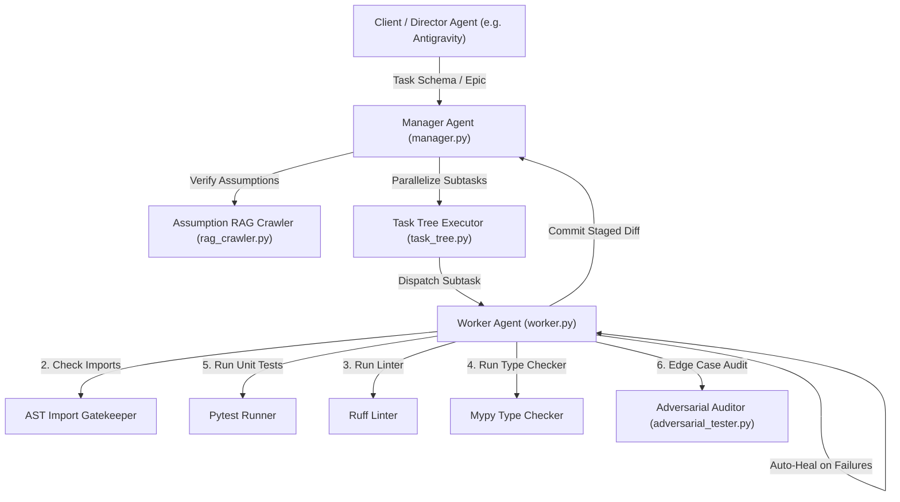

# Executable Knowledge Platform (EKP) / Dependency Semantic Compiler (DSC)

A system for compiling "executable knowledge" from verified code and execution traces, eliminating hallucination in AI-assisted development.

---

## 1. Overview

This platform addresses the problem of **hallucination in RAG (Retrieval-Augmented Generation)** by extracting, verifying, and compiling knowledge assets from working code. Instead of relying on static documentation that may be outdated or incorrect, DSC creates "executable knowledge" from:

1. **Smoke Tests** - Minimal code that initializes interfaces (Trust Score: 1.0)
2. **Examples** - Working implementation code (Trust Score: 0.9)
3. **Type Stubs** - Static type information (Trust Score: 0.7)
4. **README** - Conceptual documentation (Trust Score: 0.4)

Detailed configuration manuals (MCP, Aider setups, and parameters tuning) can be found in **[docs/detailed_guide.md](file:///home/tomo/project/000_devenv/ekp-forge/docs/detailed_guide.md)**.

---

## 2. Directory Architecture

```
~/.knowledge-cache/           # Global cache (version-isolated)
├── {package_name}/
│   └── {version}/
│       ├── integration_graph.md   # API dependency table by module
│       ├── workflow_graph.md      # Mermaid flow diagram with code examples
│       ├── verified_examples/     # Trust Score ≥ 0.9 code
│       └── verified_tests/        # Smoke tests (Trust Score 1.0)

project/
├── .venv/                   # Isolated Python environment
├── .ai-knowledge/           # Hard copy from global cache
├── verified_examples/       # Working templates for copy-paste
├── verified_tests/          # Health check tests
├── api_schema.yaml          # MVG import whitelist
└── src/
```

---

## 3. DSC Pipeline (5 Stages)

The compilation and deployment process is broken down into 5 modular stages:

1. **Stage 1: Package Inspector (`dsc/package_inspector.py`)**  
   Scans the project's `.venv` to identify installed packages with exact versions and VCS source origins.
2. **Stage 2: Source & CI Miner (`dsc/source_miner.py`)**  
   Clones repositories using a tiered sparse-checkout strategy to extract target `tests/` and `examples/`.
3. **Stage 3: Smoke Tracer (`dsc/smoke_tracer.py`)**  
   Executes minimal snippets in subprocess isolation to verify basic initializations and assigns Trust Scores.
4. **Stage 4: Asset Synthesizer (`dsc/asset_synthesizer.py`)**  
   Generates semantic graph assets (`integration_graph.md` / `workflow_graph.md`) with optional LLM integration.
5. **Stage 5: Deployer (`dsc/deploy.py`)**  
   Deploys cached assets to target projects, automatically merging and updating `api_schema.yaml`.

---

## 4. Quick Start

### Step 1: Inspect & Generate Manifest
```bash
python3 dsc/package_inspector.py --project /path/to/project --target mesa --output manifest.json
```

### Step 2: Mine & Cache Repository Examples
```bash
python3 dsc/source_miner.py --manifest manifest.json
```

### Step 3: Run Smoke Verification Traces
```bash
python3 dsc/smoke_tracer.py --manifest manifest.json
```

### Step 4: Synthesize Semantic Assets
```bash
# Offline mode (Default)
python3 dsc/asset_synthesizer.py --manifest manifest.json --no-llm

# LLM mode (requires OPENROUTER_API_KEY env)
python3 dsc/asset_synthesizer.py --manifest manifest.json --llm
```

### Step 5: Deploy to Target Project
```bash
python3 dsc/deploy.py --project /path/to/project --packages mesa
```

---

## 5. Orchestrator & Aider Integration

The system uses an AST-based **Minimal Viable Gatekeeper (MVG)** to validate imports before running code changes, preventing hallucinated libraries.

For setup guides for MCP servers, Aider prompt configurations, and parameter tuning, please refer to the detailed manual:
👉 **[EKP/DSC Detailed Manual (detailed_guide.md)](file:///home/tomo/project/000_devenv/ekp-forge/docs/detailed_guide.md)**

---

## 6. Testing

All test suites reside in the `tests/` directory:

```bash
pytest -v --ignore=tests/step4_ollama_synthesizer/fixtures/
```

- **[tests/test_e2e.py](file:///home/tomo/project/000_devenv/ekp-forge/tests/test_e2e.py)**: Full end-to-end pipeline verification.
- **[tests/test_deploy.py](file:///home/tomo/project/000_devenv/ekp-forge/tests/test_deploy.py)**: Asset copy and `api_schema.yaml` merge verification.
- **[tests/test_asset_synthesizer.py](file:///home/tomo/project/000_devenv/ekp-forge/tests/test_asset_synthesizer.py)**: Offline and LLM-based graph synthesis.
- **[tests/test_smoke_tracer.py](file:///home/tomo/project/000_devenv/ekp-forge/tests/test_smoke_tracer.py)**: Code snippet AST extraction tests.
- **[tests/test_orchestrator.py](file:///home/tomo/project/000_devenv/ekp-forge/tests/test_orchestrator.py)**: self-healing loop and cleanup test.
- **[tests/test_task_tree.py](file:///home/tomo/project/000_devenv/ekp-forge/tests/test_task_tree.py)**: Concurrent task tree decomposition and parallel execution.
- **[tests/test_rag_crawler.py](file:///home/tomo/project/000_devenv/ekp-forge/tests/test_rag_crawler.py)**: Semantic check and conflict finder for assumptions.
- **[tests/test_adversarial_tester.py](file:///home/tomo/project/000_devenv/ekp-forge/tests/test_adversarial_tester.py)**: Edge case validation testing and patch reports.

---

## 7. Organizational Design & Agent Workflow

EKP-Forge is structured around a multi-tier **Manager-Worker Organizational Design** that enables autonomous development with strict validation constraints and self-healing.



### 7.1 Agent Roles & Responsibilities

1. **Director Agent (Client/Antigravity)**
   - Responsible for high-level goal mapping, architectural plans, and epic/task schema construction.
2. **Manager Agent (`manager.py`)**
   - **Triage**: Compares task assumptions against existing ADRs using the **Assumption RAG Crawler**; rejects tasks if key-value or logical conflicts are detected.
   - **Decomposition**: Decomposes large Epic tasks into parallelizable subtasks by analyzing module dependencies (if modules $\ge 3$) or constraint size (if constraints $\ge 5$).
   - **Validation**: Inspects Worker results and ADR records to decide whether to accept or escalate outcomes.
3. **Worker Agent (`worker.py` / `orchestrator_api.py`)**
   - **Aider Self-Repairing Loop**: Runs Aider with LLM (local Ollama/Qwen or API-based Claude/GPT) to implement code modifications.
   - **Verification Pipeline**: Runs a strict verification checklist before committing code changes:
     - *AST Import Gatekeeper*: Validates imports against `api_schema.yaml`.
     - *Ruff*: Enforces code formatting and stylistic guidelines (e.g. McCabe, naming rules).
     - *Mypy*: Verifies types strictly (`strict = true`).
     - *Pytest*: Verifies code satisfies test specifications.
   - **Aggregated Auto-Healing**: If any compiler, linter, or test failures occur, the error messages are aggregated and fed back to Aider. The cycle repeats up to `max_retries` before triggering safety rollbacks and escalation.

### 7.2 Core Modules & Support Engines

- **Task Tree Executor (`task_tree.py`)**: A thread-safe parallel executor that dynamically schedules, coordinates, and executes subtasks within a dependency tree.
- **Assumption RAG Crawler (`rag_crawler.py`)**: Uses a lightweight TF-IDF and Cosine Similarity engine to perform semantic queries on markdown ADR logs in `decisions/`.
- **Adversarial Tester (`adversarial_tester.py`)**: Automatically drafts edge-case verification tests targeting modifications, runs those tests, and constructs a quality audit scorecard (Patch Report).

---

## 8. Ruff & Mypy Auto-Healing (Phase E)

The platform includes a deterministic mechanism to auto-install, strictly configure, and auto-heal static analysis and styling issues.

- **Dynamic Setup (`setup_ruff_mypy` in `orchestrator.py`)**: At startup, the orchestrator/worker checks for `ruff` and `mypy` installations, installing them via `uv` or `sys.executable -m pip` if missing, and appending strict options directly to `pyproject.toml`.
- **Feedback & Repair Loop**: Linting/typing logs are treated as first-class traceback signals alongside test outputs, which are automatically parsed and resolved by the self-healing engine.