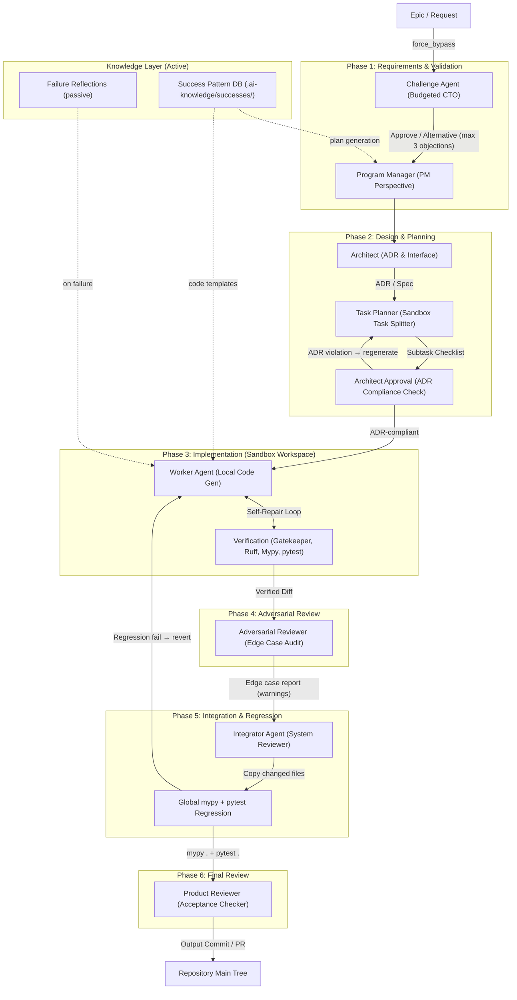

# EKP-Forge Autonomous AI Agent Organization Design (v4.1)

This document details the multi-agent organizational architecture of EKP-Forge, transitioning from a monolithic agent pattern to a distributed, phase-isolated pipeline designed for **Visual/Execution Safety** and **High-Redundancy Verification**.

The architecture is evaluated at **88-90 points** (review score), with five targeted improvements that move the system from "design-compliant organization" to "sustainably growing, collapse-resistant organization."

---

## 1. Multi-Agent Organization Architecture (v4.1)

To leverage low-cost LLM inference, EKP-Forge converts execution redundancy into structural checks. The system is designed around a **7-phase pipeline** where distinct agent roles review, plan, approve, code, adversarially test, integrate with regression, and validate.

---

## 2. Phase-by-Phase Agent Roles & Responsibilities (v4.1)

| Phase | Agent Role | Core Perspective | Primary Outputs & Responsibilities |
|---|---|---|---|
| **1. Requirements** | **Challenge Agent** | CTO / Budgeted Audit | Critiques the input Epic/Request with budget constraints: max 3 objections, each must include an alternative proposal. Cannot block if `force_accept=True`. Output: `ChallengeResult`. |
| | **Program Manager** | PM / Acceptance Criteria | Translates requirements into clear milestones, accepts/adjusts the task schema, and defines acceptance criteria. |
| **2. Design** | **Architect** | Architecture / Interface | Generates Architecture Decision Records (ADRs), defines public interfaces, and updates package-level specifications. |
| | **Task Planner** | Execution / Scoping | Decomposes ADRs and specifications into isolated, parallelizable subtasks mapped to target files. |
| | **Architect Approval** | ADR Compliance | Deterministic cross-reference between plan text tokens and ADR decision sections. If a violation is found (e.g., plan proposes "Redis" but ADR specifies `CacheProvider`), the plan is regenerated with violation context. |
| **3. Implementation** | **Worker Agent** | Local Implementation | Performs raw code modifications inside an isolated sandbox. Iterates via aider's self-healing loop. Adversarial testing removed from this phase. |
| | **Verification (MVG)** | Gatekeeper / QA | Validates code style (Ruff), type soundness (Mypy), whitelist imports (AST Gatekeeper), and behavior (pytest). |
| **4. Adversarial** | **Adversarial Reviewer** | Edge Case / Robustness | Independent gate after Worker verification. Generates edge-case tests (LLM-driven), runs them in sandbox. Failures are **warnings, not blockers**. |
| **5. Integration** | **Integrator Agent** | System Reviewer | Merges changes to main tree, then runs global `mypy .` and `pytest` for cross-module regression. If either fails, **reverts the merge** and returns error log to Worker/Planner. |
| **6. Review** | **Product Reviewer** | User / Acceptance | Runs full validation against initial PM acceptance criteria, ensuring alignment with the original request. |

---

## 3. Safe Factory Implementation Mapping

To turn this multi-agent concept into a secure codebase, EKP-Forge implements the **Safe Factory** design system.

### 3.1. The Sandbox Security Boundary
The **Worker Agent** and **Verification Pipeline** operate inside a temporary directory initialized by `SandboxWorkspace`.
* **Zero Git Capabilities**: The Worker has no access to `git reset`, `git commit`, or `git rollback`. This prevents unit tests or self-healing loops from wiping uncommitted host repository changes (Dogfooding Safety).
* **Scope Isolation**: Checkers (Ruff/Mypy) are scoped to scan only the whitelisted target files modified within the sandbox, preventing global configuration leaks or checks on legacy code.
* **Integrator Control**: Once the verification pipeline passes in the sandbox, a verified patch/diff is passed to the **Integrator Agent** which applies it to the main repository tree.

### 3.2. Config Agent (Safe Configuration Changes)
Instead of allowing the Worker to modify `pyproject.toml` or `api_schema.yaml` directly (which often causes naive regex replacements to strip custom lint configurations), EKP-Forge routes TOML edits through the **Config Agent**.
* Changes are submitted via structured metadata: `ConfigChangeRequest`.
* The Config Agent uses structured parsing (`tomllib` / TOML writers) to apply changes safely and non-destructively.

---

## 4. Key Operational Decisions & Safeguards (v4.1)

### 4.1. Challenge Agent Budget Constraints
* **Risk**: The Challenge Agent becomes smarter over time and tends toward "reject everything" behavior — an AI safety over-adaptation pattern. Without constraints, it becomes a permanent blocker.
* **Safeguard (Code-Enforced)**: `ChallengeResult` schema enforces `max_objections=3` as a **hard cap** (not prompt-based). Each objection **must** include `alternative_proposal` (raises `ValueError` if empty). The `force_accept` and `bypass_challenge_agent` flags on `TaskSchema` skip all checks.

### 4.2. Architect Approval (ADR Consistency)
* **Risk**: Task Planner receives "add caching" and concretises as "implement Redis" without consulting the ADR which specified a `CacheProvider` interface. This breaks the architecture.
* **Safeguard (Deterministic)**: The `Architect Approval` gate in `ekp_forge/sandbox/architect_review.py` cross-references plan text tokens against ADR decision sections using a keyword-based approach. This is **not LLM-based** — it's a deterministic check that prevents the review gate itself from hallucinating. If a violation is found, the plan is regenerated with violation context.

### 4.3. Adversarial Reviewer Warnings (Not Blockers)
* **Risk**: Adversarial edge-case tests can produce false positives (e.g., "crashes on 10GB CSV input" when the input domain is always <1MB).
* **Safeguard**: Adversarial failures are **warnings, not blockers**. They inform robustness but don't prevent integration. The `AdversarialReviewer` is a separate gate called **between** Worker success and Integrator merge. No self-healing loop is triggered for adversarial failures.

### 4.4. Integrator Cross-Module Regression
* **Risk**: Parallel Workers produce changes with conflicting type assumptions (Worker A: `User.id` is `int`, Worker B: `User.id` is `str`). Individual tests pass but integration fails silently.
* **Safeguard**: After file copy, the Integrator runs `mypy .` and `pytest` globally on the project root. If either fails, the merge is **reverted** via `_revert_integration()` and the error log is propagated back to the Worker/Planner.

### 4.5. Success Pattern DB (Active Knowledge)
* **Risk**: Only failure reflection logs are stored. Successful patterns cannot be reused, forcing re-derivation from scratch.
* **Safeguard**: On successful integration (all checks passed), the Integrator triggers `store_success_pattern()` in `ekp_forge/sandbox/success_patterns.py`. This stores the verified diff + ADR reference in `.ai-knowledge/successes/`. During plan generation, the Manager queries this database via TF-IDF search to provide reusable templates to Workers.
