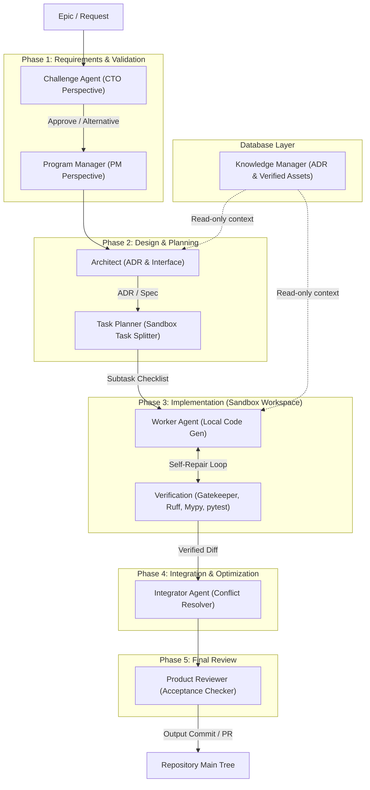

# EKP-Forge Autonomous AI Agent Organization Design

This document details the multi-agent organizational architecture of EKP-Forge, transitioning from a monolithic agent pattern to a distributed, phase-isolated pipeline designed for **Visual/Execution Safety** and **High-Redundancy Verification**.

---

## 1. Multi-Agent Organization Architecture

To leverage low-cost LLM inference, EKP-Forge converts execution redundancy into structural checks. The system is designed around a 5-phase pipeline where distinct agent roles review, plan, code, verify, and integrate changes.

---

## 2. Phase-by-Phase Agent Roles & Responsibilities

| Phase | Agent Role | Core Perspective | Primary Outputs & Responsibilities |
|---|---|---|---|
| **1. Requirements** | **Challenge Agent** | CTO / Critical Audit | Critiques the input Epic/Request, identifies missing assumptions, proposes alternatives, and prevents redundant features. |
| | **Program Manager** | PM / Acceptance Criteria | Translates requirements into clear milestones, accepts/adjusts the task schema, and defines acceptance criteria. |
| **2. Design** | **Architect** | Architecture / Interface | Generates Architecture Decision Records (ADRs), defines public interfaces, and updates package-level specifications. |
| | **Task Planner** | Execution / Scoping | Decomposes ADRs and specifications into isolated, parallelizable subtasks mapped to target files. |
| **3. Implementation** | **Worker Agent** | Local Implementation | Performs raw code modifications inside an isolated sandbox. Iterates via aider's self-healing loop. |
| | **Verification (MVG)** | Gatekeeper / QA | Validates code style (Ruff), type soundness (Mypy), whitelist imports (AST Gatekeeper), and behavior (pytest). |
| **4. Integration** | **Integrator Agent** | System Integrity | Reviews the local diff output, merges changes to the main repository tree, resolves merge conflicts, and commits. |
| **5. Review** | **Product Reviewer** | User / Acceptance | Runs full validation against initial PM acceptance criteria, ensuring alignment with the original request. |

---

## 3. Safe Factory Implementation Mapping

To turn this multi-agent concept into a secure codebase, EKP-Forge implements the **Safe Factory** design system.

### 3.1. The Sandbox Security Boundary
The **Worker Agent** and **Verification Pipeline** operate inside a temporary directory initialized by `SandboxWorkspace`.
* **Zero Git Capabilities**: The Worker has no access to `git reset`, `git commit`, or `git rollback`. This prevents unit tests or self-healing loops from wiping uncommitted host repository changes (Dogfooding Safety).
* **Scope Isolation**: Checkers (Ruff/Mypy) are scoped to scan only the whitelisted target files modified within the sandbox, preventing global configuration leaks or checks on legacy code.
* **Integrator Control**: Once the verification pipeline passes in the sandbox, a verified patch/diff is passed to the **Integrator Agent** which applies it to the main repository tree.

### 3.2. Config Agent (Safe Configuration Changes)
Instead of allowing the Worker to modify `pyproject.toml` or `api_schema.yaml` directly (which often causes naive regex replacements to strip custom lint configurations), EKP-Forge routes TOML edits through the **Config Agent**.
* Changes are submitted via structured metadata: `ConfigChangeRequest`.
* The Config Agent uses structured parsing (`tomllib` / TOML writers) to apply changes safely and non-destructively.

---

## 4. Key Operational Decisions & Safeguards

### 4.1. Challenge Agent Deadlocks
* **Risk**: The Challenge Agent might recursively reject requests, concluding a feature is "unnecessary" and causing execution deadlocks.
* **Safeguard**: Challenge Agent rejections are limited to a single pass. If the Director/User provides an explicit bypass instruction, the pipeline bypasses the Challenge Agent to force execution.

### 4.2. Passive Knowledge Manager Search
* **Risk**: High-noise RAG searches can inject unrelated files or outdated context into the Worker.
* **Safeguard**: The **Knowledge Manager** is passive. It is queried only when the Worker experiences local verification failures. It performs hybrid search (combining filename AST structure and trace log messages) to pull target-specific code templates and stubs from `.ai-knowledge/`.
