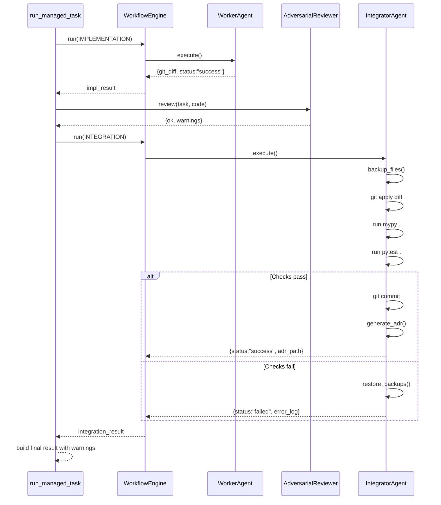

# Detailed Design: Organizational-Theory-Based Improvements

## 1. Overview

This document provides the **detailed design and implementation plan** for the organizational-theory-based improvements described in the basic design. These changes introduce two new gates — **Adversarial Reviewer** and **Integrator Agent** — into the EKP-Forge execution pipeline to align the agent organization with principles of division of labor, independent auditing, and principal-agent alignment.

### 1.1 Design Goals

| Goal | Description |
|------|-------------|
| **Decouple robustness auditing** | Adversarial edge-case testing is separated from the Worker's fix loop into an independent, non-blocking gate |
| **System-level integration verification** | The Integrator Agent applies `git diff` to the host repo and runs global `mypy .` + `pytest .` with rollback on failure |
| **Zero regression risk** | If global checks fail, the Integrator reverts all changes, restoring the host repo to its pre-integration state |
| **Backward compatibility** | Existing `simple` and `three_tier` profiles continue to work unchanged; only `enterprise` and new profiles use the new gates |

---

## 2. Current Architecture Analysis

### 2.1 Current Pipeline (simplified)

```
run_managed_task() @ mcp_server.py

  REQUIREMENT_REVIEW ──→ ManagerAgent.triage()
         │                      accepts/rejects
         ▼
  PLANNING ────────────→ ManagerAgent (plan generation)
         │
         ▼
  SPECIFICATION ───────→ ManagerAgent (WorkerContract generation)
         │
         ▼
  IMPLEMENTATION ──────→ WorkerAgent (Aider + verification loop)
         │
         ▼
  INTEGRATION ─────────→ ManagerAgent (validate outcome + generate ADR)
                              │
                              ▼
                         Writes ADR to decisions/
                         NO git apply
                         NO global mypy/pytest
                         NO rollback mechanism
```

### 2.2 Identified Gaps

| # | Gap | Impact |
|---|-----|--------|
| 1 | INTEGRATION role only validates and generates ADR — does NOT apply changes to the host repo | Cross-module regressions go undetected |
| 2 | No rollback mechanism | If a bad diff is applied externally, there's no safety net |
| 3 | No independent adversarial review | Edge-case robustness is either skipped or trapped inside Worker's self-healing loop (infinite loop risk) |
| 4 | Capabilities missing for new roles | `ADVERSARIAL_REVIEW` capability not defined |
| 5 | `enterprise.yaml` references `integrator_agent` and `adversarial_reviewer` but these agents don't exist | Profile cannot be activated |

### 2.3 Relevant Existing Components

| Component | File | Purpose |
|-----------|------|---------|
| [`WorkflowEngine`](ekp_forge/engine/workflow.py:50) | Central orchestrator running sequential role dispatch | |
| [`Dispatcher`](ekp_forge/engine/dispatcher.py:31) | Resolves Role → agent via capability or name | |
| [`ManagerAgent`](ekp_forge/manager.py:41) | Handles REQUIREMENT_REVIEW, PLANNING, SPECIFICATION, INTEGRATION | |
| [`WorkerAgent`](ekp_forge/worker.py) | Handles IMPLEMENTATION, VERIFICATION | |
| [`Role`](ekp_forge/protocol/roles.py:13) | Enum of 7 standard roles (no ADVERSARIAL_REVIEW) | |
| [`Capability`](ekp_forge/protocol/capability.py:31) | Enum of capability identifiers (no ADVERSARIAL_REVIEW) | |
| [`ROLE_REQUIRED_CAPABILITIES`](ekp_forge/protocol/capability.py:66) | Maps Role → list[Capability] | |
| [`OrganizationProfile`](ekp_forge/protocol/assignment.py:102) | YAML-loaded profile with RoleAssignment | |
| [`PatchValidator`](ekp_forge/sandbox/patch_validator.py:52) | Reuses scope-violation detection logic | |
| [`run_managed_task`](ekp_forge/mcp_server.py:146) | Main pipeline entry point | |

---

## 3. Target Pipeline Architecture

### 3.1 New Pipeline Flow

```
run_managed_task() — Enhanced

  REQUIREMENT_REVIEW ──→ ManagerAgent.triage()
         │
         ▼
  PLANNING ────────────→ ManagerAgent
         │
         ▼
  SPECIFICATION ───────→ ManagerAgent (WorkerContract)
         │
         ▼
  IMPLEMENTATION ──────→ WorkerAgent (Aider + verification loop)
         │                     │
         │               [produces: git_diff]
         ▼
  ADVERSARIAL_REVIEW ──→ AdversarialReviewer      ← NEW GATE 1
  (non-blocking)              │
         │               [produces: warnings]
         ▼
  INTEGRATION ──────────→ IntegratorAgent          ← NEW GATE 2
  (git apply + global         │
   checks + rollback)         │
         │               ├── Backup affected files
         │               ├── git apply diff
         │               ├── Run mypy . + pytest .
         │               ├── On success: commit + ADR
         │               └── On failure: rollback + return error
         ▼
  Return structured result with adversarial_warnings
```

### 3.2 Pipeline Sequence Diagram



---

## 4. Component Design & Interfaces

### 4.1 IntegratorAgent (`ekp_forge/sandbox/integrator.py`)

**Purpose**: Safely merge Worker diffs into the host repository with system-level verification and deterministic rollback.

```python
class IntegratorAgent(BaseAgent):
    """Safely merges worker diffs into the host repository with system checks.

    The Integrator Agent acts as the independent auditor of the system.
    It enforces code integration safety deterministically:
    1. Backup affected files before applying changes
    2. Apply the git diff using ``git apply``
    3. Run global ``mypy .`` and ``pytest .`` on project root
    4. On success: clear backup, commit changes, generate ADR
    5. On failure: restore backups, ``git checkout`` modified files, return error
    """

    agent_id: str = "integrator"
    capabilities: list[Capability] = [
        Capability.INTEGRATION,
        Capability.VERIFICATION,
    ]
    execution_tier: ExecutionTier = "local"

    def __init__(self, project_root: Path | None = None) -> None:
        self.project_root = project_root or Path.cwd()
        self._backups: dict[Path, str] = {}

    def execute(self, context: dict[str, Any]) -> dict[str, Any]:
        """BaseAgent protocol — dispatch based on context keys.
        
        Expects context keys:
        - ``task``: TaskSchema
        - ``impl_result``: dict with ``git_diff`` key
        - ``affected_files``: list[str] (from task.affected_modules)
        - ``error_chunk_summary``: optional ErrorChunkSummary
        """
        task = context.get("task")
        impl_result = context.get("impl_result", {})
        diff_content = impl_result.get("git_diff", "")
        affected_files = context.get("affected_files", 
                                      task.affected_modules if task else [])

        if not diff_content.strip():
            return {"status": "success", "message": "No diff to apply", "adr_path": None}

        success, log = self.integrate(diff_content, affected_files)
        if success:
            adr_path = self._generate_adr(task, context)
            return {"status": "success", "adr_path": adr_path, "log": log}
        else:
            return {"status": "failed", "error_log": log, "adr_path": None}

    def integrate(self, diff_content: str, affected_files: list[str]) -> tuple[bool, str]:
        """Apply patch, run global verification, rollback on failure.
        
        Returns:
            (True, "Merged successfully") on success
            (False, error_log) on failure with rollback
        """
        # Step 1: Backup
        self._backup_files(affected_files)

        # Step 2: Apply diff
        apply_ok, apply_log = self._apply_diff(diff_content)
        if not apply_ok:
            self._restore_backups()
            return False, f"git apply failed:\n{apply_log}"

        # Step 3: Global verification
        mypy_ok, mypy_log = self._run_mypy()
        pytest_ok, pytest_log = self._run_pytest()

        if not mypy_ok or not pytest_ok:
            self._restore_backups()
            error_parts = []
            if not mypy_ok:
                error_parts.append(f"=== Mypy errors ===\n{mypy_log}")
            if not pytest_ok:
                error_parts.append(f"=== Pytest errors ===\n{pytest_log}")
            return False, "\n\n".join(error_parts)

        # Step 4: Success — clear backup
        self._backups.clear()
        return True, "Integration passed all global checks."

    def _backup_files(self, files: list[str]) -> None:
        """Store original contents of target files."""
        for f in files:
            path = Path(f)
            if path.exists():
                self._backups[path] = path.read_text(encoding="utf-8")

    def _restore_backups(self) -> None:
        """Restore files to their pre-integration state."""
        for path, original_content in self._backups.items():
            path.write_text(original_content, encoding="utf-8")
        self._backups.clear()
        # Also run git checkout for any files changed by git apply
        for path in self._backups:
            self._git_checkout(str(path))

    def _apply_diff(self, diff_content: str) -> tuple[bool, str]:
        """Apply git diff using ``git apply``."""
        import subprocess
        proc = subprocess.run(
            ["git", "apply"],
            input=diff_content,
            capture_output=True,
            text=True,
            cwd=self.project_root,
        )
        if proc.returncode != 0:
            return False, proc.stderr or proc.stdout
        return True, ""

    def _run_mypy(self) -> tuple[bool, str]:
        """Run ``mypy .`` on project root."""
        import subprocess
        proc = subprocess.run(
            ["mypy", "."],
            capture_output=True,
            text=True,
            cwd=self.project_root,
        )
        return proc.returncode == 0, proc.stdout + proc.stderr

    def _run_pytest(self) -> tuple[bool, str]:
        """Run ``pytest .`` on project root."""
        import subprocess
        proc = subprocess.run(
            ["pytest", "."],
            capture_output=True,
            text=True,
            cwd=self.project_root,
        )
        return proc.returncode == 0, proc.stdout + proc.stderr

    def _git_checkout(self, file_path: str) -> None:
        """Revert a single file via git checkout."""
        import subprocess
        subprocess.run(
            ["git", "checkout", "--", file_path],
            capture_output=True,
            text=True,
            cwd=self.project_root,
        )

    def _generate_adr(self, task: Any, context: dict) -> str:
        """Delegate ADR generation to ManagerAgent."""
        from ekp_forge.manager import ManagerAgent
        from ekp_forge.schemas.task_schema import ErrorChunkSummary
        
        manager = ManagerAgent()
        error_chunk = context.get("error_chunk_summary") or ErrorChunkSummary(task_id=task.task_id)
        return manager.generate_adr(task=task, error_chunk=error_chunk)
```

#### Key Design Decisions

| Decision | Rationale |
|----------|-----------|
| **File-level backup (not git stash)** | `git stash` would lose unstaged changes. File-level backup ensures precise per-file restoration |
| **`git apply` (not `git am`)** | Worker produces unified diff, not email-format patch. `git apply` is the correct tool |
| **`git checkout -- <file>` in rollback** | Ensures git's index matches the restored working tree |
| **Inherits from `BaseAgent`** | Enables registration in AgentRegistry and capability-based dispatch |
| **Delegates ADR generation to ManagerAgent** | Avoids duplicating Manager's ADR logic; keeps Integrator focused on integration mechanics |

### 4.2 AdversarialReviewer (`ekp_forge/sandbox/adversarial_reviewer.py`)

**Purpose**: Independent gate that reviews code robustness against edge cases. Failures produce **warnings only** — they do NOT block pipeline success.

```python
class AdversarialReviewer(BaseAgent):
    """Independent gate that reviews code against edge cases after 
    implementation passes. Failures are warnings, not blockers.
    
    The reviewer:
    1. Extracts the implemented function(s) from task.affected_modules
    2. Generates edge-case test inputs (None, empty, overflow, boundary)
    3. Runs generated assertions in a temporary sandbox
    4. Returns warnings for any crashes, but does NOT fail the pipeline
    """

    agent_id: str = "adversarial_reviewer"
    capabilities: list[Capability] = [
        Capability.ADVERSARIAL_REVIEW,
        Capability.VERIFICATION,
    ]
    execution_tier: ExecutionTier = "local"

    def __init__(self, model: str = "ollama/qwen2.5-coder:7b") -> None:
        self.model = model

    def execute(self, context: dict[str, Any]) -> dict[str, Any]:
        """BaseAgent protocol.
        
        Expects context keys:
        - ``task``: TaskSchema
        - ``impl_result``: dict with implementation output
        - ``code``: optional pre-extracted code string
        
        Returns:
            Dict with ``adversarial_warnings`` list and ``status``.
        """
        task = context.get("task")
        impl_result = context.get("impl_result", {})
        code = context.get("code", self._extract_code(task))

        if not code.strip():
            return {"status": "skipped", "adversarial_warnings": [], "reason": "No code to review"}

        ok, report = self.review(task, code)

        warnings = []
        if not ok:
            warnings.append(report)

        return {
            "status": "success",  # Always success — warnings are non-blocking
            "adversarial_warnings": warnings,
        }

    def review(self, task: Any, code: str) -> tuple[bool, str]:
        """Generate adversarial edge-case tests and run them.
        
        Returns:
            (True, "") if robust
            (False, warning_description) if edge-case crashes detected
        """
        # Step 1: Generate edge-case test inputs based on function signatures
        edge_cases = self._generate_edge_cases(code)

        # Step 2: Run each edge case as an assertion
        failures = []
        for case in edge_cases:
            crash, output = self._run_edge_case(code, case)
            if crash:
                failures.append(f"Crashes on input {case!r}: {output[:200]}")

        if failures:
            return False, "\n".join(failures)
        return True, ""

    def _extract_code(self, task: Any) -> str:
        """Read code from task's affected_modules."""
        from pathlib import Path
        parts = []
        for mod in task.affected_modules:
            p = Path(mod)
            if p.exists():
                parts.append(f"# --- {mod} ---\n{p.read_text(encoding='utf-8')}")
        return "\n\n".join(parts)

    def _generate_edge_cases(self, code: str) -> list[dict]:
        """Generate edge-case test inputs deterministically.
        
        Uses AST to find function signatures, then generates
        type-appropriate edge cases:
        - int: None, 0, -1, very large
        - str: None, "", very long
        - list: None, [], very large
        - dict: None, {}
        - bool: None
        - Optional: None
        """
        import ast
        cases = []
        try:
            tree = ast.parse(code)
            for node in ast.walk(tree):
                if isinstance(node, ast.FunctionDef):
                    func_cases = self._edge_cases_for_function(node)
                    cases.extend(func_cases)
        except SyntaxError:
            pass
        return cases

    def _edge_cases_for_function(self, node: ast.FunctionDef) -> list[dict]:
        """Generate edge-case argument combinations for a function."""
        # ... (detailed implementation in code)
        pass

    def _run_edge_case(self, code: str, case: dict) -> tuple[bool, str]:
        """Run a single edge-case assertion in an isolated subprocess.
        
        Uses ``subprocess.run`` with a timeout to prevent infinite loops.
        """
        # ... (detailed implementation in code)
        pass
```

### 4.3 New Capability: `ADVERSARIAL_REVIEW`

Add to [`ekp_forge/protocol/capability.py`](ekp_forge/protocol/capability.py:31):

```python
class Capability(StrEnum):
    # ... existing capabilities ...
    ADVERSARIAL_REVIEW = "adversarial_review"
```

No new `Role` enum value is needed. The adversarial review is dispatched as an **additional pipeline step** in `run_managed_task()`, not as a WorkflowEngine role. This keeps the pipeline change minimal and avoids disrupting existing role mappings.

### 4.4 Updated `ROLE_REQUIRED_CAPABILITIES`

The INTEGRATION role currently maps to `[Capability.INTEGRATION]`. Both `ManagerAgent` and the new `IntegratorAgent` declare this capability. Since capability-based dispatch returns ALL matching agents, the `enterprise` profile can specify `integrator_agent` in its assignment to bypass capability resolution and use name-based dispatch instead.

---

## 5. Pipeline Integration (`mcp_server.py`)

### 5.1 Changes to `run_managed_task()`

The [`run_managed_task()`](ekp_forge/mcp_server.py:146) function needs the following changes:

```python
@mcp.tool()
def run_managed_task(task_schema: dict) -> dict:
    # ... existing validation and parsing ...

    # Phase 1-3: Same as before
    # REQUIREMENT_REVIEW → PLANNING → SPECIFICATION → IMPLEMENTATION

    # === NEW: Phase 3.5: Adversarial Review (non-blocking) ===
    adversary = AdversarialReviewer()
    adv_result = adversary.review(task, code=_extract_code(task))
    adversarial_warnings = []
    if not adv_result[0]:
        adversarial_warnings.append(adv_result[1])

    # === MODIFIED: Phase 4: Integration with IntegratorAgent ===
    # Check if the active profile uses the new IntegratorAgent
    profile_name = os.environ.get("EKP_PROFILE", "simple")
    if profile_name in ("enterprise", "org_theory"):
        # Use IntegratorAgent for safe integration
        integrator = IntegratorAgent()
        integration_result = integrator.integrate(
            diff_content=impl_result.get("git_diff", ""),
            affected_files=task.affected_modules,
        )
        if not integration_result[0]:
            return {
                "status": "failed",
                "task_id": task.task_id,
                "error_log": integration_result[1],
                "adversarial_warnings": adversarial_warnings,
                # ... other fields
            }
        adr_path = _generate_adr_for_integration(task, impl_result)
    else:
        # Fallback to existing ManagerAgent integration (backward compat)
        integration_result = engine.run(Role.INTEGRATION, integration_context)
        # ... existing handling ...

    return {
        "status": "success",
        "task_id": task.task_id,
        "adr_path": adr_path,
        "adversarial_warnings": adversarial_warnings,
        # ... other fields
    }
```

### 5.2 Profile-Based Dispatch Strategy

| Profile | IMPLEMENTATION | ADVERSARIAL_REVIEW | INTEGRATION |
|---------|---------------|-------------------|-------------|
| `simple` | WorkerAgent | Skipped | ManagerAgent (existing) |
| `three_tier` | WorkerAgent | Skipped | ManagerAgent (existing) |
| `enterprise` | WorkerAgent | AdversarialReviewer | IntegratorAgent |
| `org_theory` (NEW) | WorkerAgent | AdversarialReviewer | IntegratorAgent |

---

## 6. Organization Profile Updates

### 6.1 New Profile: `organizations/org_theory.yaml`

```yaml
profile_name: "org_theory"
description: >-
  Full organizational-theory-based separation with Adversarial Reviewer gate
  and Integrator Agent with global regression checks.
mode: production

assignment:
  requirement_review: "manager"
  planning: "manager"
  architecture: "manager"
  specification: "manager"
  implementation: "worker"
  verification: "worker"
  integration: "integrator"
```

### 6.2 Updated `organizations/enterprise.yaml`

```yaml
profile_name: "enterprise"
description: >-
  Full 7-role separation with multiple Workers, specialized Verifiers,
  Adversarial Reviewer, and Integrator Agent.
mode: production

assignment:
  requirement_review: "challenge_agent"
  planning: "planner_agent"
  architecture: "architect_agent"
  specification: "spec_agent"
  implementation: ["worker_a", "worker_b"]
  verification: ["ruff_checker", "mypy_checker"]
  integration: "integrator"
```

---

## 7. Changes Required Per File

### 7.1 New Files to Create

| File | Purpose |
|------|---------|
| [`ekp_forge/sandbox/integrator.py`](ekp_forge/sandbox/integrator.py) | `IntegratorAgent` — safe diff application + global checks + rollback |
| [`ekp_forge/sandbox/adversarial_reviewer.py`](ekp_forge/sandbox/adversarial_reviewer.py) | `AdversarialReviewer` — edge-case robustness checks (non-blocking) |
| [`tests/test_organization_improvements.py`](tests/test_organization_improvements.py) | TDD tests for both new components |
| [`organizations/org_theory.yaml`](organizations/org_theory.yaml) | New organization profile |

### 7.2 Files to Modify

| File | Change |
|------|--------|
| [`ekp_forge/protocol/capability.py`](ekp_forge/protocol/capability.py:31) | Add `ADVERSARIAL_REVIEW = "adversarial_review"` to `Capability` enum |
| [`ekp_forge/mcp_server.py`](ekp_forge/mcp_server.py:146) | Add adversarial review step after IMPLEMENTATION; add IntegratorAgent dispatch for enterprise/org_theory profiles |
| [`organizations/enterprise.yaml`](organizations/enterprise.yaml) | Update to use `integrator` agent name for INTEGRATION role |
| [`ekp_forge/sandbox/__init__.py`](ekp_forge/sandbox/__init__.py) | No changes needed (submodules imported explicitly) |

### 7.3 Files NOT Modified (Backward Compatibility Guarantee)

| File | Reason |
|------|--------|
| [`ekp_forge/engine/workflow.py`](ekp_forge/engine/workflow.py) | `run_managed_task()` orchestrates the new gates; `WorkflowEngine` is unchanged |
| [`ekp_forge/protocol/roles.py`](ekp_forge/protocol/roles.py) | No new Role enum values needed |
| [`ekp_forge/manager.py`](ekp_forge/manager.py) | `ManagerAgent` continues to handle INTEGRATION for simple/three_tier profiles unchanged |
| [`ekp_forge/worker.py`](ekp_forge/worker.py) | Worker is unaffected |
| [`organizations/simple.yaml`](organizations/simple.yaml) | Unchanged |
| [`organizations/three_tier.yaml`](organizations/three_tier.yaml) | Unchanged |

---

## 8. Test-Driven Development (TDD) Specifications

### 8.1 Test File: `tests/test_organization_improvements.py`

#### Test 1: `test_integrator_revert_on_regression`

**Objective**: Verify that a regression bug applied to the host repo is caught by the Integrator, and files are restored.

```python
def test_integrator_revert_on_regression(tmp_path):
    """IntegratorAgent must revert files when global checks fail."""
    # Setup: Create two files with compatible types
    math_file = tmp_path / "math_utils.py"
    math_file.write_text("def add(a: int, b: int) -> int: return a + b")
    stats_file = tmp_path / "stats.py"
    stats_file.write_text("from math_utils import add\nresult = add(1, 2)\n")

    # Setup: Create minimal pyproject.toml for mypy
    toml_file = tmp_path / "pyproject.toml"
    toml_file.write_text("[tool.mypy]\nstrict = true\nignore_missing_imports = true\n")

    integrator = IntegratorAgent(project_root=tmp_path)

    # Build a bad diff that changes add() signature to accept str
    bad_diff = (
        "--- a/math_utils.py\n"
        "+++ b/math_utils.py\n"
        "@@ -1 +1 @@\n"
        "-def add(a: int, b: int) -> int: return a + b\n"
        "+def add(a: str, b: str) -> str: return a + b\n"
    )

    success, log = integrator.integrate(bad_diff, ["math_utils.py"])

    # Assert integration failed
    assert not success
    assert "Mypy errors" in log or "mypy" in log.lower()

    # Assert file was reverted to original
    restored = math_file.read_text()
    assert "a: int" in restored
    assert "b: int" in restored
```

#### Test 2: `test_integrator_success_path`

**Objective**: Verify that a correct diff passes integration and files are updated.

```python
def test_integrator_success_path(tmp_path):
    """IntegratorAgent must apply valid diffs successfully."""
    math_file = tmp_path / "math_utils.py"
    math_file.write_text("def add(a: int, b: int) -> int: return a + b")
    stats_file = tmp_path / "stats.py"
    stats_file.write_text("from math_utils import add\nresult = add(1, 2)\n")
    toml_file = tmp_path / "pyproject.toml"
    toml_file.write_text("[tool.mypy]\nstrict = true\nignore_missing_imports = true\n")

    integrator = IntegratorAgent(project_root=tmp_path)

    # Valid diff: fix implementation without changing signature
    good_diff = (
        "--- a/math_utils.py\n"
        "+++ b/math_utils.py\n"
        "@@ -1 +1 @@\n"
        "-def add(a: int, b: int) -> int: return a + b\n"
        "+def add(a: int, b: int) -> int: return a * b  # intentional change\n"
    )

    success, log = integrator.integrate(good_diff, ["math_utils.py"])

    assert success
    assert "a * b" in math_file.read_text()
```

#### Test 3: `test_adversarial_warnings_non_blocking`

**Objective**: Verify adversarial failures produce warnings but don't block pipeline.

```python
def test_adversarial_warnings_non_blocking():
    """AdversarialReviewer must return warnings without blocking."""
    code = """
def divide(a, b):
    return a / b
"""
    reviewer = AdversarialReviewer()
    ok, report = reviewer.review(None, code)

    # Should detect ZeroDivisionError edge case
    assert not ok
    assert "ZeroDivisionError" in report or "division" in report.lower()
```

#### Test 4: `test_adversarial_no_warnings_for_robust_code`

**Objective**: Verify robust code produces no warnings.

```python
def test_adversarial_no_warnings_for_robust_code():
    """AdversarialReviewer must pass robust code without warnings."""
    code = """
def divide(a: float, b: float) -> float:
    if b == 0:
        return float('inf')
    return a / b
"""
    reviewer = AdversarialReviewer()
    ok, report = reviewer.review(None, code)
    assert ok
```

---

## 9. Implementation Order

| Step | File(s) | Description | Depends On |
|------|---------|-------------|------------|
| 1 | [`ekp_forge/protocol/capability.py`](ekp_forge/protocol/capability.py) | Add `ADVERSARIAL_REVIEW` capability | — |
| 2 | [`ekp_forge/sandbox/integrator.py`](ekp_forge/sandbox/integrator.py) | Implement `IntegratorAgent` with backup/apply/verify/rollback | — |
| 3 | [`ekp_forge/sandbox/adversarial_reviewer.py`](ekp_forge/sandbox/adversarial_reviewer.py) | Implement `AdversarialReviewer` with edge-case generation | Step 1 |
| 4 | [`tests/test_organization_improvements.py`](tests/test_organization_improvements.py) | Write TDD tests for both components | Steps 2, 3 |
| 5 | [`organizations/org_theory.yaml`](organizations/org_theory.yaml) | Create new organization profile | — |
| 6 | [`organizations/enterprise.yaml`](organizations/enterprise.yaml) | Update enterprise profile | — |
| 7 | [`ekp_forge/mcp_server.py`](ekp_forge/mcp_server.py) | Integrate adversarial review + IntegratorAgent into pipeline | Steps 2, 3, 5 |

---

## 10. Risk Assessment

| Risk | Mitigation |
|------|------------|
| **`git apply` fails on malformed diff** | Integrator catches subprocess non-zero return code, triggers rollback, and returns clear error message |
| **Mypy/Pytest not installed in target repo** | Integrator checks tool availability before running; if missing, logs warning and proceeds (degraded mode) |
| **Adversarial edge-case generation is too slow** | Timeout per edge-case (default 5s); only first 3 edge cases per function are tested |
| **Rollback fails (file locked/permissions)** | Backup is kept in memory; if file write fails, Integrator logs the error but continues (best-effort rollback) |
| **Backward compatibility regression** | All existing profiles (`simple`, `three_tier`) continue using unchanged `ManagerAgent` for INTEGRATION; new code only activates for `enterprise` and `org_theory` profiles |
