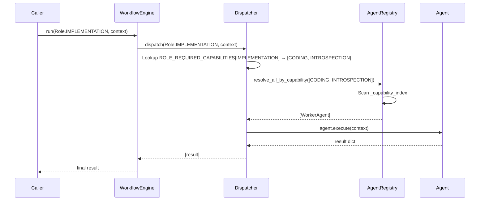
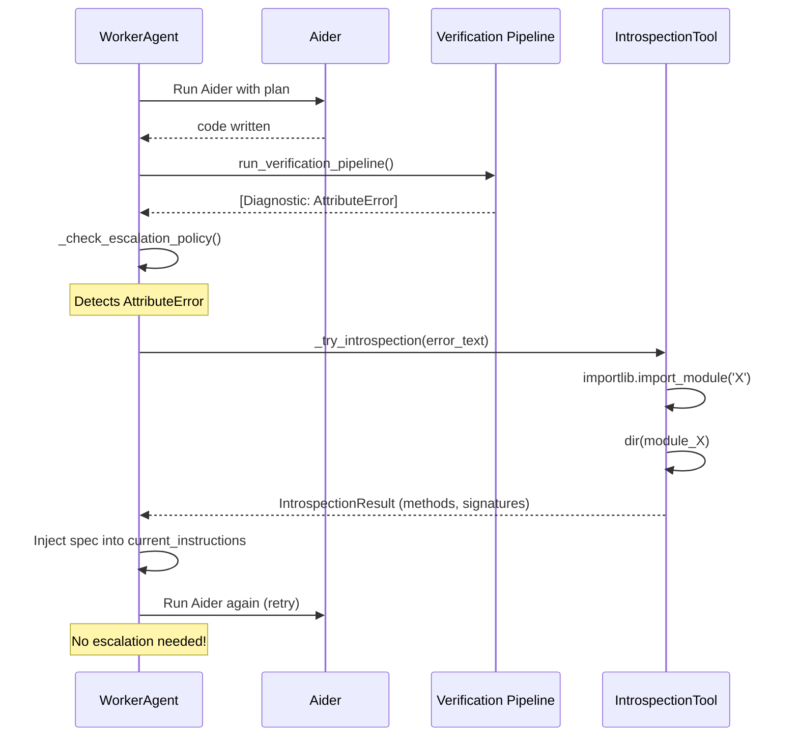
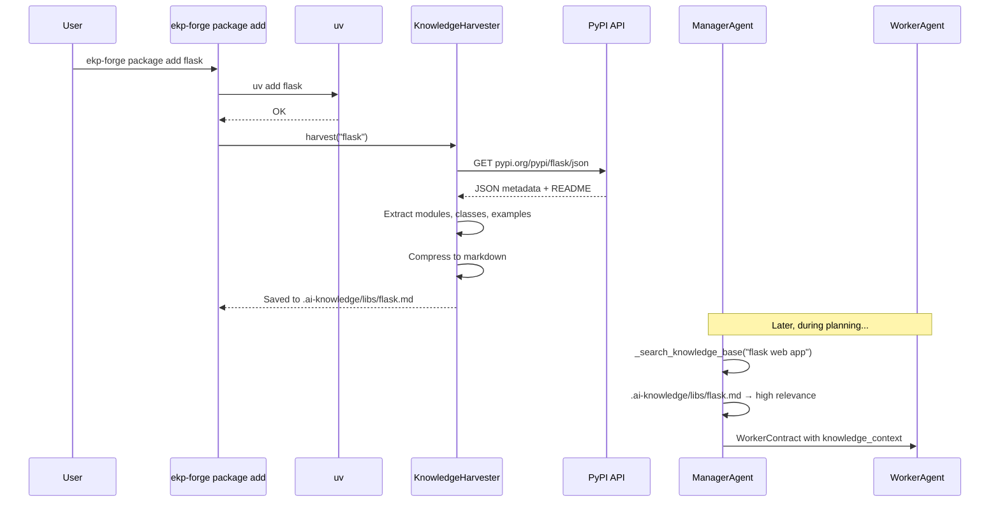

# Phase 3 Detailed Design: Capability Dispatching + Introspection + Knowledge Harvesting

## 1. Overview

Phase 3 completes the 4-layer separation model (`Role` → `Assignment` → `Agent` → `Capability`) and adds two new knowledge mechanisms to address dynamic library usage and runtime introspection.

```
┌─────────────────────────────────────────────────────┐
│                  Layer 1: Role                        │
│  (REQUIREMENT_REVIEW, PLANNING, ARCHITECTURE, ...)  │
└──────────────────────┬──────────────────────────────┘
                       │ requires
                       ▼
┌─────────────────────────────────────────────────────┐
│              Layer 2: Capability (NEW)                │
│  (PLANNING, CODING, INTROSPECTION, RAG_SEARCH, ...)  │
└──────────────────────┬──────────────────────────────┘
                       │ assigned to
                       ▼
┌─────────────────────────────────────────────────────┐
│              Layer 3: Assignment                      │
│  (Organization YAML → Role → Capability mapping)     │
└──────────────────────┬──────────────────────────────┘
                       │ fulfilled by
                       ▼
┌─────────────────────────────────────────────────────┐
│               Layer 4: Agent                          │
│  (ManagerAgent, WorkerAgent, VerifierAgent, ...)      │
│  Each declares `capabilities: list[Capability]`       │
└─────────────────────────────────────────────────────┘
```

---

## 2. Priority 1: Capability Definition & Dynamic Routing

### 2.1 Capability Enum (Replaces Stub Dataclass)

**File**: [`ekp_forge/protocol/capability.py`](ekp_forge/protocol/capability.py)

Convert `Capability` from a plain dataclass to a `StrEnum` for fixed, well-known capabilities, plus keep `CapabilityRegistry` as the matching engine.

```python
class Capability(StrEnum):
    """Standard capabilities understood by the protocol layer."""
    REQUIREMENT_REVIEW = "requirement_review"
    PLANNING = "planning"
    ARCHITECTURE_REVIEW = "architecture_review"
    SPECIFICATION = "specification"
    CODING = "coding"
    VERIFICATION = "verification"
    INTEGRATION = "integration"
    INTROSPECTION = "introspection"          # NEW: dynamic dir()/help()
    RAG_SEARCH = "rag_search"               # NEW: knowledge base search
    KNOWLEDGE_INGEST = "knowledge_ingest"   # NEW: PyPI doc ingestion
    LOCAL_EXECUTION = "local_execution"
    CLOUD_EXECUTION = "cloud_execution"
```

### 2.2 Role→Capability Mapping Table

**File**: [`ekp_forge/protocol/capability.py`](ekp_forge/protocol/capability.py)

```python
# Each Role requires one or more Capabilities
ROLE_REQUIRED_CAPABILITIES: dict[Role, list[Capability]] = {
    Role.REQUIREMENT_REVIEW: [Capability.REQUIREMENT_REVIEW],
    Role.PLANNING:           [Capability.PLANNING, Capability.RAG_SEARCH],
    Role.ARCHITECTURE:       [Capability.ARCHITECTURE_REVIEW, Capability.RAG_SEARCH],
    Role.SPECIFICATION:      [Capability.SPECIFICATION, Capability.RAG_SEARCH],
    Role.IMPLEMENTATION:     [Capability.CODING, Capability.INTROSPECTION],
    Role.VERIFICATION:       [Capability.VERIFICATION],
    Role.INTEGRATION:        [Capability.INTEGRATION],
}
```

### 2.3 AgentRegistry Extension: Capability-Based Matching

**File**: [`ekp_forge/agents/registry.py`](ekp_forge/agents/registry.py)

Add new methods to `AgentRegistry`:

```python
class AgentRegistry:
    # ... existing name-based methods ...

    def register(self, agent: BaseAgent) -> None:
        """Also index agent.capabilities for capability-based lookup."""
        # existing validation
        self._agents[agent.agent_id] = agent
        for cap in agent.capabilities:  # NEW
            if cap not in self._capability_index:
                self._capability_index[cap] = []
            self._capability_index[cap].append(agent)

    def resolve_by_capability(
        self,
        required_capabilities: list[Capability],
        preferred_model_type: str | None = None,  # "local" or "cloud"
    ) -> BaseAgent | None:
        """Find best agent matching ALL required capabilities.

        Matching logic:
        1. Filter agents that have ALL required capabilities.
        2. If preferred_model_type is provided, prefer agents matching it.
        3. If multiple agents match, prefer the one with highest total confidence.
        4. Returns None if no agent satisfies all requirements.
        """
        ...

    def resolve_all_by_capability(
        self,
        required_capabilities: list[Capability],
    ) -> list[BaseAgent]:
        """Find ALL agents matching the required capabilities."""
        ...
```

### 2.4 BaseAgent Extension: Capability Declaration + Execution Tier

**File**: [`ekp_forge/agents/base.py`](ekp_forge/agents/base.py)

```python
from typing import Literal

ExecutionTier = Literal["local", "cloud"]

class BaseAgent(ABC):
    agent_id: str
    capabilities: list[Capability] = []  # NEW: static declaration
    execution_tier: ExecutionTier = "local"  # NEW: runtime tier boundary
    
    @abstractmethod
    def execute(self, context: dict[str, Any]) -> dict[str, Any]:
        ...
    
    def has_capability(self, capability: Capability) -> bool:  # NEW
        return capability in self.capabilities
```

The `execution_tier` attribute enables the Dispatcher to enforce architectural rules:
- A 7B local model (`execution_tier="local"`) is blocked from `Role.ARCHITECTURE` tasks requiring high-context planning.
- Cloud agents (`execution_tier="cloud"`) are preferred for RAG-heavy planning roles.

### 2.5 Concrete Agent Updates

**File**: [`ekp_forge/agents/base.py`](ekp_forge/agents/base.py) (shared patterns)

```python
class ManagerAgent(BaseAgent):
    agent_id = "manager"
    capabilities = [
        Capability.REQUIREMENT_REVIEW,
        Capability.PLANNING,
        Capability.ARCHITECTURE_REVIEW,
        Capability.SPECIFICATION,
        Capability.INTEGRATION,
        Capability.RAG_SEARCH,            # NEW
    ]

class WorkerAgent(BaseAgent):
    agent_id = "worker"
    capabilities = [
        Capability.CODING,
        Capability.VERIFICATION,
        Capability.INTROSPECTION,         # NEW
    ]

class VerifierAgent(BaseAgent):
    agent_id = "verification_gate"
    capabilities = [
        Capability.VERIFICATION,
    ]
```

### 2.6 Dispatcher Overhaul: Capability-Aware Dispatch

**File**: [`ekp_forge/engine/dispatcher.py`](ekp_forge/engine/dispatcher.py)

Key changes to `Dispatcher`:

1. `resolve_agents(role)` → uses `ROLE_REQUIRED_CAPABILITIES[role]` to find capability requirements.
2. Instead of `profile.assignment.resolve(role)` (name-based), use `registry.resolve_by_capability(required_caps)` (capability-based).
3. Fallback: if capability-based resolution returns empty, fall back to name-based for backward compatibility.

```python
class Dispatcher:
    def resolve_agents(self, role: Role) -> list[BaseAgent]:
        # Phase 3: Capability-first resolution
        required_caps = ROLE_REQUIRED_CAPABILITIES.get(role)
        if required_caps:
            agents = self._registry.resolve_all_by_capability(required_caps)
            if agents:
                return agents
        
        # Fallback to name-based (Phase 1/2 backward compat)
        agent_names = self._profile.assignment.resolve(role)
        agents = self._registry.resolve_all(agent_names)
        # ... validation ...
        return agents
```

**Edge case — `execution_tier` violation**: If the resolved agent's `execution_tier` does not match the Role's minimum tier requirement (e.g., a `Role.ARCHITECTURE` task assigned to a `execution_tier="local"` agent):
1. `Dispatcher` raises a `TierViolationError` (subclass of `ValueError`) with a descriptive message.
2. `WorkflowEngine` catches `TierViolationError` and **auto-escalates** to the next available agent with matching tier, if one exists.
3. If no alternative agent can be found, the error propagates to the caller (MCP layer) as a non-recoverable configuration error.

```python
class TierViolationError(ValueError):
    """Raised when an agent's execution_tier is insufficient for the requested Role."""
    ...
```

### 2.7 Organization YAML Enhancement

**File**: [`organizations/three_tier.yaml`](organizations/three_tier.yaml)

Extend the YAML schema with an optional `capabilities` section for fine-grained control:

```yaml
profile_name: "three_tier"
description: "Classic 3-tier with capability-based routing"

assignment:
  requirement_review: "manager"
  planning: "manager"
  architecture: "manager"
  specification: "manager"
  implementation: "worker"
  verification: "verification_gate"
  integration: "manager"

# NEW: Capability-to-agent overrides (optional, for explicit pinning)
capability_bindings:
  introspection: "worker"
  rag_search: "manager"
  knowledge_ingest: "manager"
```

---

## 3. Priority 2: Worker Dynamic Introspection Tool

### 3.1 Architecture

```
Worker Fix Loop
     │
     ├── Aider execution ──── AttributeError / ModuleNotFoundError
     │                              │
     │                              ▼
     │                    ┌─────────────────────┐
     │                    │ IntrospectionTool    │
     │                    │  - dir(obj)          │
     │                    │  - help(obj)         │
     │                    │  - getattr inspection│
     │                    │  - signature extract │
     │                    └────────┬────────────┘
     │                             │
     │                    returns structured spec
     │                             │
     │                             ▼
     │                    Inject spec into prompt
     │                    (no escalation needed)
     │
     └── Verification IR ──── diagnostics remain?
                                   │ no → success
                                   │ yes → next fix iteration
```

### 3.2 IntrospectionTool

**New File**: [`ekp_forge/sandbox/introspection.py`](ekp_forge/sandbox/introspection.py)

```python
"""Worker introspection tool — safely executes dir()/help() in sandbox."""

from __future__ import annotations

import importlib
import inspect
import sys
from pathlib import Path
from typing import Any


class IntrospectionResult:
    """Structured result of an introspection operation.
    
    Attributes:
        module_name:    The module/object name that was inspected.
        attributes:     List of attribute names from dir().
        signature:      Function/class signature if applicable.
        doc_summary:    First 500 chars of docstring.
        error:          Error message if introspection failed.
        methods:        List of callable method names.
        classes:        List of class names found.
    """
    ...


class IntrospectionTool:
    """Sandbox-safe introspection tool for WorkerAgent.
    
    Usage (within sandbox only):
        tool = IntrospectionTool(workspace_path)
        result = tool.inspect_module("numpy")
        result = tool.inspect_object(some_object, "some_object")
    
    Design:
    - All execution happens via importlib in a restricted context.
    - The tool NEVER modifies global state or writes files.
    - Results are structured as IntrospectionResult for prompt injection.
    """
    
    def __init__(self, workspace: Path | None = None) -> None:
        self._workspace = workspace or Path.cwd()
    
    def inspect_module(self, module_name: str) -> IntrospectionResult:
        """Import a module and return its structure.
        
        Steps:
        1. Attempt importlib.import_module(module_name).
        2. If ModuleNotFoundError, return error result.
        3. Run dir(module) to get all attributes.
        4. Filter callables vs non-callables.
        5. Extract docstring summary (first 500 chars).
        6. Return structured IntrospectionResult.
        """
        ...
    
    def inspect_object(self, obj: Any, name: str = "") -> IntrospectionResult:
        """Inspect an already-imported object.
        
        Useful when the Worker has a reference to an object but
        doesn't know its structure (e.g., from a library).
        
        Steps:
        1. Run dir(obj) to get attributes.
        2. If callable, try inspect.signature().
        3. Filter methods vs properties.
        4. Extract docstring summary.
        """
        ...
    
    def resolve_attribute_error(
        self, 
        module_name: str, 
        attribute_name: str,
    ) -> IntrospectionResult:
        """Specifically resolve an AttributeError.
        
        Example: "module 'X' has no attribute 'Y'"
        → Imports X, runs dir(X), checks if Y exists under different name.
        """
        ...
    
    @staticmethod
    def format_for_prompt(result: IntrospectionResult) -> str:
        """Format introspection result as concise context for Worker prompt.
        
        Output is capped at ~800 tokens to prevent context bloom.
        """
        ...
```

### 3.3 Integration with WorkerAgent

**File**: [`ekp_forge/worker.py`](ekp_forge/worker.py)

Key modifications to `WorkerAgent`:

1. **Add `introspection_tool` attribute** (instantiated lazily within sandbox).
2. **Modify `_check_escalation_policy()`**: Before escalating on `AttributeError` or `ModuleNotFoundError`, try introspection first.
3. **Add `_try_introspection()` method**: Called when escalation policy detects `CONTEXT_MISSING` reason. If introspection succeeds, inject results into the error feedback and retry instead of escalating.

```python
class WorkerAgent(BaseAgent):
    # ... existing attributes ...
    
    def __init__(self, ...):
        # ... existing init ...
        self._introspection_tool: IntrospectionTool | None = None
    
    def _try_introspection(self, error_text: str) -> str | None:
        """Attempt to resolve AttributeError/ModuleNotFoundError via introspection.
        
        Returns:
            Formatted introspection result string for prompt injection,
            or None if introspection couldn't resolve the issue.
        """
        # Parse the error to extract module/attribute names
        # e.g., "AttributeError: module 'requests' has no attribute 'get'"
        module_name = self._extract_module_from_error(error_text)
        attr_name = self._extract_attribute_from_error(error_text)
        
        if not module_name:
            return None
        
        if self._introspection_tool is None:
            self._introspection_tool = IntrospectionTool(workspace=Path.cwd())
        
        if attr_name:
            result = self._introspection_tool.resolve_attribute_error(
                module_name, attr_name
            )
        else:
            result = self._introspection_tool.inspect_module(module_name)
        
        if result.error:
            return None  # Introspection also failed → escalate
        
        return IntrospectionTool.format_for_prompt(result)
    
    def _check_escalation_policy(self, ...):
        # ... existing checks ...
        
        # Phase 3: Try introspection before escalating
        if "AttributeError" in pytest_output or "ModuleNotFoundError" in pytest_output:
            introspection_context = self._try_introspection(pytest_output)
            if introspection_context:
                # Inject introspection result into current_instructions
                # and return None (don't escalate)
                self._introspection_context = introspection_context
                return None  # Suppress escalation, retry with new context
        
        # ... rest of escalation policy ...
```

### 3.4 Sandbox Safety (Subprocess Isolation)

The `IntrospectionTool` MUST follow strict sandbox isolation rules:

1. **Same workspace, segregated subprocess**: The tool runs inside the exact same sandbox workspace as Aider (so it can evaluate live state and exact `.venv` package versions), but executes in a separate **read-only Python subprocess** to prevent accidental mutation of target files.

2. **Read-only subprocess execution**:
   ```python
   import subprocess
   result = subprocess.run(
       [sys.executable, "-c", introspection_script],
       capture_output=True, text=True, timeout=10,
   )
   ```
   The introspection script is a temporary generated Python script that performs `importlib.import_module()`, `dir()`, `help()`, and `inspect.getsource()` — all read-only operations.

3. **Never executes arbitrary code strings**: Only `importlib.import_module`, `dir()`, `help()`, `inspect` — no `eval()` or `exec()`.

4. **Timeout mechanism**: Max 10 seconds per introspection call. Longer-running imports (e.g. `tensorflow`) are interrupted and return a partial result.

5. **Result validation**: All results are validated as JSON-safe structures before being returned to the Worker. Malformed or oversized results are truncated.

6. **Timeout accumulation guard**: The introspection timeout (10s per call) accumulates across fix loop iterations. With `max_iterations=5` and introspection triggered every iteration, worst-case overhead is 50s. To prevent this from starving the 300s MCP timeout:
   - A **cumulative introspection budget** of 30s is tracked on the `WorkerAgent`.
   - Once the budget is exhausted, `_try_introspection()` returns `None` (skip) for subsequent iterations.
   - This ensures introspection does not consume more than 10% of the total MCP timeout budget.

---

## 4. Priority 3: Package Knowledge Auto-Harvesting & Manager RAG

### 4.1 Architecture

```
ekp-forge package add flask  (custom orchestration command)
     │
     ├── Step 1: uv add flask (synchronous, captures exit code)
     │
     └── Step 2: KnowledgeHarvester.harvest("flask")
                      │
                      ▼
          ┌─────────────────────────────┐
          │ PyPI JSON API                │
          │ pypi.org/pypi/flask/json     │
          └──────────┬──────────────────┘
                     │
                     ▼
          ┌─────────────────────────────┐
          │ Parse README + metadata      │
          │ Extract modules, classes,    │
          │ usage examples               │
          └──────────┬──────────────────┘
                     │
                     ▼
          ┌─────────────────────────────┐
          │ Compress to structured MD    │
          │ → .ai-knowledge/libs/flask.md│
          └─────────────────────────────┘
                     │
                     ▼
          Later, during Manager PLANNING/SPECIFICATION role:
          ManagerAgent._search_knowledge_base("flask web app")
          → Deterministic keyword/BM25 search
          → Extracts signatures + samples
          → Injects into WorkerContract.knowledge_context
```

### 4.2 PyPI Knowledge Harvester

**New File**: [`ekp_forge/knowledge/harvester.py`](ekp_forge/knowledge/harvester.py)

```python
"""Knowledge Harvester — extracts and compresses PyPI package documentation.

On `uv add <package>`, this module:
1. Calls PyPI JSON API for package metadata.
2. Downloads and parses README.
3. Extracts top-level modules, classes, and usage examples.
4. Compresses into a markdown file saved to .ai-knowledge/libs/<package>.md.
"""

from __future__ import annotations

import json
import re
import urllib.request
import urllib.error
from pathlib import Path
from typing import Any


class PackageInfo:
    """Structured info about a PyPI package."""
    name: str
    version: str
    summary: str
    top_level_modules: list[str]
    classes: list[dict[str, Any]]  # [{name, doc_summary, methods}]
    functions: list[dict[str, Any]]
    usage_examples: list[str]
    raw_readme: str | None


class KnowledgeHarvester:
    """Harvests and compresses PyPI package documentation.
    
    Usage:
        harvester = KnowledgeHarvester(project_root=Path.cwd())
        info = harvester.harvest("flask")
        harvester.save(info)  # → .ai-knowledge/libs/flask.md
    """
    
    PYPI_JSON_URL = "https://pypi.org/pypi/{package}/json"
    AI_KNOWLEDGE_DIR = Path(".ai-knowledge") / "libs"
    
    def __init__(self, project_root: Path | None = None) -> None:
        self._root = project_root or Path.cwd()
        self._output_dir = self._root / self.AI_KNOWLEDGE_DIR
    
    def harvest(self, package_name: str, version: str | None = None) -> PackageInfo | None:
        """Fetch and compress package documentation from PyPI.
        
        Steps:
        1. GET pypi.org/pypi/{package}/json
        2. Extract info, summary, and README from response.
        3. Parse README (handle both reStructuredText and Markdown).
        4. Extract top-level modules via "top_level.txt" or import heuristics.
        5. Compress into PackageInfo.
        """
        ...
    
    def save(self, info: PackageInfo) -> Path:
        """Save compressed documentation as markdown.
        
        Format:
        ```markdown
        # {package_name} v{version}
        
        {summary}
        
        ## Top-Level Modules
        - module1
        - module2
        
        ## Classes
        - `ClassName`: doc summary
          - `method1(args)` → return_type
          - `method2(args)`
        
        ## Functions
        - `func_name(args)` → return_type: doc summary
        
        ## Usage Examples
        ```python
        {usage_example}
        ```
        ```
        
        Returns the path to the saved file.
        """
        ...
    
    @staticmethod
    def _fetch_pypi_json(package: str) -> dict[str, Any] | None:
        """Call PyPI JSON API."""
        ...
    
    @staticmethod
    def _extract_usage_examples(readme: str) -> list[str]:
        """Extract Python code blocks from README.
        
        Uses regex to find ```python ... ``` blocks.
        Limits to first 3 examples, each max 30 lines.
        """
        ...
    
    @staticmethod
    def _compress_readme(readme: str, max_chars: int = 5000) -> str:
        """Compress README to essential parts.
        
        - Remove HTML tags.
        - Keep only headings, lists, and code blocks.
        - Truncate to max_chars.
        """
        ...
```

### 4.3 EKP-Forge Package Add Command (Custom CLI)

**New File**: [`scripts/ekp_forge_package.py`](scripts/ekp_forge_package.py)

This is the official `ekp-forge package add` orchestration command. It intentionally does NOT intercept `uv add` via shell aliases or filesystem watchers — those patterns introduce environment-dependent failure points. Instead, it runs `uv add` synchronously first, then harvests knowledge deterministically afterward.

```python
#!/usr/bin/env python3
"""ekp-forge package add — wraps uv add with deterministic knowledge harvesting.

Usage:
    ekp-forge package add flask
    ekp-forge package add fastapi uvicorn --uv-args "--extra dev"

Design:
- Always runs `uv add <pkg>` first (synchronous, captures exit code).
- On success, calls KnowledgeHarvester for each package.
- Saves compressed docs to .ai-knowledge/libs/<pkg>.md.
- Outputs structured JSON summary for MCP/API integration.
"""

from __future__ import annotations

import argparse
import json
import subprocess
import sys
from pathlib import Path

from ekp_forge.knowledge.harvester import KnowledgeHarvester


def main() -> None:
    parser = argparse.ArgumentParser(
        description="Add Python packages with automatic knowledge harvesting"
    )
    parser.add_argument("packages", nargs="+", help="Package names to add")
    parser.add_argument(
        "--uv-args", default="",
        help="Additional arguments forwarded to uv add (e.g. '--extra dev')",
    )
    args = parser.parse_args()

    # Step 1: Run uv add
    uv_cmd = ["uv", "add", *args.packages]
    if args.uv_args:
        uv_cmd.extend(args.uv_args.split())

    result = subprocess.run(uv_cmd, capture_output=False)
    if result.returncode != 0:
        sys.exit(result.returncode)

    # Step 2: Harvest knowledge for each package
    harvester = KnowledgeHarvester(project_root=Path.cwd())
    harvest_results: list[dict[str, str | None]] = []

    for pkg in args.packages:
        info = harvester.harvest(pkg)
        if info:
            path = harvester.save(info)
            harvest_results.append({
                "package": pkg,
                "status": "harvested",
                "path": str(path),
            })
        else:
            harvest_results.append({
                "package": pkg,
                "status": "no_docs",
                "path": None,
            })

    # Output JSON summary (useful for MCP/API consumers)
    output = {"uv_exit_code": 0, "results": harvest_results}
    print(json.dumps(output, indent=2))
    sys.exit(0)


if __name__ == "__main__":
    main()
```

**New File**: [`ekp_forge/knowledge/__init__.py`](ekp_forge/knowledge/__init__.py)

```python
"""Knowledge management package for Phase 3 — PyPI doc harvesting + structured KB.
```

The `ekp-forge package add` command serves as the official hook. It ensures:
1. `uv add` runs first and succeeds.
2. Knowledge harvesting runs deterministically after, in the same process.
3. Output is always structured JSON for API/MCP integration.

### 4.4 Manager RAG Pipeline (Deterministic Keyword/BM25 Search)

**File**: [`ekp_forge/manager.py`](ekp_forge/manager.py)

Add deterministic keyword/BM25 search to `ManagerAgent`. Because harvested docs are cleanly organized by package and module name (e.g., `.ai-knowledge/libs/fastapi.md`), an error like `AttributeError: module 'fastapi' has no attribute 'X'` provides a clear deterministic search target. No embeddings, no LLM calls — just fast, local-friendly keyword matching.

```python
class ManagerAgent(BaseAgent):
    # ... existing code ...
    
    def _search_knowledge_base(self, query: str, top_k: int = 3) -> list[dict[str, Any]]:
        """Search .ai-knowledge/libs/ for relevant package documentation.

        Deterministic keyword/BM25 search — no embeddings, no LLM calls.
        Because harvested docs are cleanly organized by package/module name,
        error messages like ``AttributeError: module 'fastapi' has no attribute 'X'``
        provide clear deterministic search targets.

        Algorithm:
        1. Load all .ai-knowledge/libs/*.md files.
        2. Tokenize query and documents (simple BM25-inspired scoring).
        3. Rank by relevance score.
        4. Return top_k results with excerpts.

        Returns:
            List of dicts with keys: package, relevance, excerpt, filepath.
        """
        import math
        
        knowledge_dir = Path(".ai-knowledge") / "libs"
        if not knowledge_dir.exists():
            return []
        
        results: list[dict[str, Any]] = []
        query_tokens = query.lower().split()
        all_md_files = sorted(knowledge_dir.glob("*.md"))
        total_docs = len(all_md_files)
        
        for md_file in all_md_files:
            content = md_file.read_text(encoding="utf-8")
            first_line = content.split("\n")[0] if content else ""
            package_name = first_line.replace("# ", "").split(" v")[0]
            
            # BM25-inspired scoring: term frequency * inverse document frequency
            content_lower = content.lower()
            word_count = max(len(content_lower.split()), 1)
            score = 0.0
            for token in query_tokens:
                tf = content_lower.count(token) / word_count
                idf = max(0.0, math.log((total_docs + 1) / (1 + 1)))  # simplified IDF
                score += tf * idf
            
            if score > 0:
                sections = content.split("## ")
                excerpt = sections[1][:300] if len(sections) > 1 else content[:300]
                
                results.append({
                    "package": package_name,
                    "relevance": round(score, 4),
                    "excerpt": excerpt,
                    "filepath": str(md_file),
                })
        
        results.sort(key=lambda r: r["relevance"], reverse=True)
        return results[:top_k]
    
    def _generate_implementation_plan(self, task, extra_context=""):
        """Enhanced with RAG knowledge search."""
        # ... existing code ...
        
        # NEW: Search knowledge base for relevant packages
        knowledge_results = self._search_knowledge_base(
            task.goal + " " + " ".join(task.constraints)
        )
        if knowledge_results:
            plan_lines.append("\n## External Library Knowledge\n")
            for kr in knowledge_results:
                plan_lines.append(f"### {kr['package']} (relevance: {kr['relevance']:.2f})")
                plan_lines.append(kr["excerpt"])
                plan_lines.append("")
        
        # ... rest of existing plan generation ...
```

### 4.5 RAG Context Injection into WorkerContract

Extend [`ekp_forge/schemas/contract.py`](ekp_forge/schemas/contract.py) to hold RAG context:

```python
class WorkerContract(BaseModel):
    # ... existing fields ...
    
    # NEW Phase 3:
    knowledge_context: str = Field(
        default="",
        max_length=3000,
        description="Compressed library knowledge for Worker (from Manager RAG)."
    )
```

Then in `WorkflowEngine.run_with_fix_loop()`, pass the `knowledge_context` to the Worker:

```python
impl_context = {
    "task": task,
    "plan": plan,
    "worker_contract": contract,
    "_rag_context": contract.knowledge_context,  # Now includes library knowledge
}
```

---

## 5. File Changes Summary

| File | Action | Description |
|------|--------|-------------|
| `ekp_forge/protocol/capability.py` | **Rewrite** | Convert Capability to StrEnum; add ROLE_REQUIRED_CAPABILITIES; keep CapabilityRegistry |
| `ekp_forge/protocol/assignment.py` | **Extend** | Support optional capability_bindings in YAML |
| `ekp_forge/agents/base.py` | **Extend** | Add `capabilities: list[Capability]` field and `has_capability()` method |
| `ekp_forge/agents/registry.py` | **Extend** | Add `_capability_index`, `resolve_by_capability()`, `resolve_all_by_capability()` |
| `ekp_forge/engine/dispatcher.py` | **Modify** | Capability-first dispatch with fallback to name-based |
| `ekp_forge/engine/workflow.py` | **Minor** | Pass knowledge_context through fix loop |
| `ekp_forge/sandbox/introspection.py` | **NEW** | IntrospectionTool class |
| `ekp_forge/worker.py` | **Extend** | Integrate IntrospectionTool; modify escalation policy |
| `ekp_forge/knowledge/__init__.py` | **NEW** | Package init |
| `ekp_forge/knowledge/harvester.py` | **NEW** | KnowledgeHarvester class |
| `scripts/ekp_forge_package.py` | **NEW** | `ekp-forge package add` custom CLI with doc harvesting |
| `ekp_forge/manager.py` | **Extend** | Add `_search_knowledge_base()` RAG method |
| `ekp_forge/schemas/contract.py` | **Extend** | Add `knowledge_context` field to WorkerContract |
| `organizations/*.yaml` | **Extend** | Optional `capability_bindings` section |
| `tests/test_introspection.py` | **NEW** | Tests for IntrospectionTool |
| `tests/test_knowledge_harvester.py` | **NEW** | Tests for KnowledgeHarvester |
| `tests/test_agent_registry.py` | **Extend** | Tests for capability-based resolution |
| `tests/test_dispatcher.py` | **Extend** | Tests for capability-based dispatch |
| `tests/test_worker.py` | **Extend** | Tests for introspection integration |
| `tests/test_manager.py` | **Extend** | Tests for RAG search |

---

## 6. Data Flow Diagrams

### 6.1 Capability-Based Dispatch Flow



### 6.2 Introspection Flow (Error Recovery)



### 6.3 Knowledge Harvesting Flow



---

## 7. Test Plan

### Priority 1 Tests
- `test_capability_enum_values`: Verify Capability StrEnum has expected values.
- `test_role_required_capabilities_mapping`: Verify every Role maps to at least one Capability.
- `test_agent_capability_declaration`: Verify agent subclasses declare capabilities.
- `test_registry_capability_indexing`: Verify register() populates _capability_index.
- `test_resolve_by_capability_exact_match`: Find agent with exact capability set.
- `test_resolve_by_capability_partial_match`: No agent returned if capabilities missing.
- `test_resolve_by_capability_fallback_to_name`: Verify backward compatibility.
- `test_dispatcher_capability_resolve`: Dispatcher uses capabilities when available.
- `test_dispatcher_fallback_no_capability`: Dispatcher falls back to name-based.

### Priority 2 Tests
- `test_introspection_inspect_module`: Import known stdlib module and inspect.
- `test_introspection_inspect_object`: Inspect an object reference.
- `test_introspection_module_not_found`: Graceful error on missing module.
- `test_introspection_attribute_error_resolution`: Resolve "no attribute" error.
- `test_introspection_timeout`: Timeout after 10s on stuck import.
- `test_introspection_format_for_prompt`: Output is under 800 tokens.
- `test_worker_introspection_before_escalation`: Worker tries introspection before escalating on AttributeError.
- `test_worker_introspection_suppresses_escalation`: Successful introspection prevents escalation.
- `test_worker_introspection_failure_still_escalates`: Failed introspection still escalates.

### Priority 3 Tests
- `test_harvester_fetch_pypi_json`: Mock PyPI API and verify parsing.
- `test_harvester_extract_usage_examples`: Extract code blocks from README.
- `test_harvester_save_markdown_format`: Verify saved file format.
- `test_harvester_no_network_fallback`: Graceful degradation on network failure.
- `test_manager_rag_search`: Search .ai-knowledge/libs/ with query.
- `test_manager_rag_empty_knowledge_base`: Empty search results when no docs.
- `test_contract_knowledge_context_field`: WorkerContract accepts knowledge_context.
- `test_integration_rag_to_workflow`: Knowledge flows from search → contract → worker.

---

## 8. Resolved Design Decisions

The following decisions have been confirmed by the project lead:

### Decision 1: uv add Hook Mechanism
**Choice**: Custom orchestration command (`ekp-forge package add <pkg>`).
**Rationale**: Intercepting `uv add` via shell aliases or filesystem watchers introduces environment-dependent failure points. An explicit command ensures deterministic, synchronous knowledge harvesting.

### Decision 2: Introspection Sandbox Boundary
**Choice**: Same sandbox workspace, segregated read-only subprocess execution.
**Rationale**: The `IntrospectionTool` must evaluate the live state (dynamic variables, exact `.venv` package versions) that threw the error, but must run in a separate read-only subprocess to prevent accidental mutation of target files.

### Decision 3: Knowledge RAG Sophistication
**Choice**: Deterministic keyword/BM25 search over structured paths.
**Rationale**: Harvested docs are cleanly organized by package/module name (`.ai-knowledge/libs/fastapi.md`), so error messages like `AttributeError: module 'fastapi' has no attribute 'X'` provide clear deterministic search targets. No embeddings or LLM calls needed — eliminates latency and non-determinism.

### Decision 4: Model Type on Agents
**Choice**: Add `execution_tier: Literal["local", "cloud"]` as an explicit attribute on `BaseAgent`.
**Rationale**: While agents track models via configuration strings, they lack explicit semantic awareness of runtime tier boundaries. This attribute enables the Dispatcher to enforce architectural rules (e.g., blocking a 7B local model from `Role.ARCHITECTURE`).
