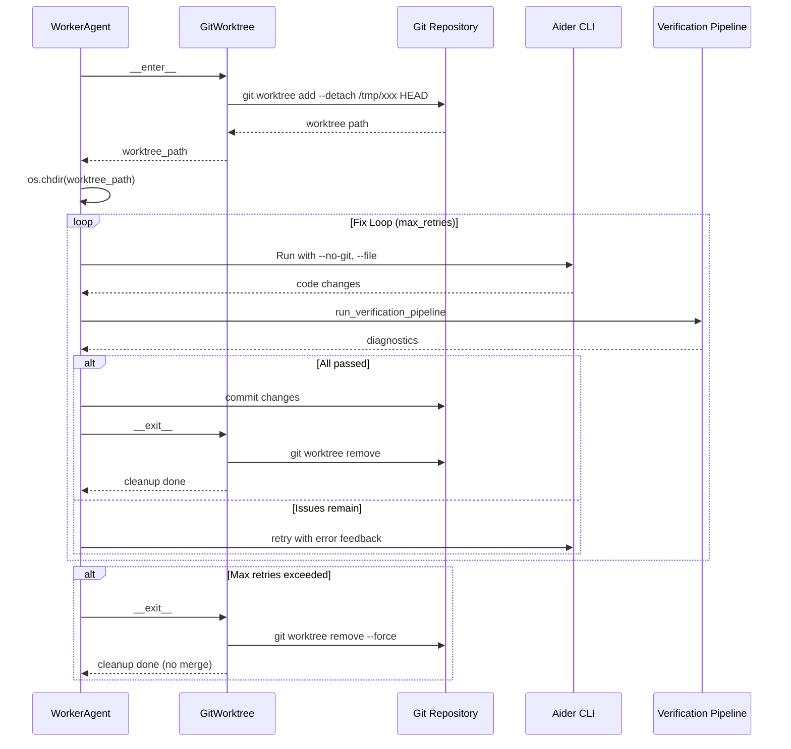

# Detailed Design: Phase 4.5 — Dual-Layer Execution (Research/Production) + Git Worktree Isolation

## 1. Overview

### 1.1 Problem Statement

Current `WorkerAgent.execute_verification_loop()` in [`worker.py`](ekp_forge/worker.py:194) uses `SandboxWorkspace` + `clone_into()` which performs a full `git clone --depth 1` on every invocation. This takes **~300 seconds** (MCP timeout limit) and is the primary bottleneck.

The tight coupling between infrastructure debugging and AI organization design experimentation has stalled model performance evaluation cycles.

### 1.2 Solution Architecture

Introduce `execution_mode` attribute at the `OrganizationProfile` level, enabling two distinct execution paths:

| Mode | Infrastructure Behavior | Target Time | Use Case |
|------|------------------------|-------------|----------|
| **`research`** | No sandbox, no git ops, direct local file manipulation | ~50s | Fast experimentation of FixTask/contract-driven repair |
| **`production`** | `git worktree` for millisecond-fast isolated workspace | ~60s | Safe production deployment with rollback capability |

---

## 2. File-by-File Change Specification

### 2.1 [`protocol/assignment.py`](ekp_forge/protocol/assignment.py) — Profile Schema Extension

**Change**: Add `mode` field to `OrganizationProfile`.

```python
from typing import Literal

class OrganizationProfile:
    def __init__(
        self,
        profile_name: str = "",
        description: str = "",
        assignment: dict[str, Any] | None = None,
        mode: Literal["research", "production"] = "production",  # NEW
    ) -> None:
        self.profile_name = profile_name
        self.description = description
        self.mode = mode  # NEW
        self.assignment = RoleAssignment(assignment or dict(_FALLBACK_ASSIGNMENT))
```

**`from_yaml()` change**: Parse `mode` from YAML data, default `"production"`.

The default is `"production"` to ensure safety by default — research mode must be explicitly opted into.

### 2.2 YAML Profile Files — Mode Field Addition

**Files**: [`organizations/simple.yaml`](organizations/simple.yaml), [`enterprise.yaml`](organizations/enterprise.yaml), [`three_tier.yaml`](organizations/three_tier.yaml)

**Change**: Add `mode: production` to all existing profiles.

```yaml
profile_name: "simple"
description: "..."
mode: production  # NEW

assignment:
  ...
```

A new profile for research mode can be created later (e.g., `organizations/research.yaml` with `mode: research`).

### 2.3 [`sandbox/git_worktree.py`](ekp_forge/sandbox/) — New File

Create a new module providing **`GitWorktree`** context manager.

```python
class GitWorktree:
    """Context manager for `git worktree`-based isolated workspace.

    Creates a temporary branch (or uses HEAD), adds a worktree at a temp
    directory, and on exit removes the worktree and cleans up.
    """

    def __init__(
        self,
        repo_root: Path | None = None,
        branch: str | None = None,  # None → use HEAD detached
    ) -> None:
        self.repo_root = Path(repo_root or Path.cwd()).resolve()
        self._branch = branch
        self._temp_dir: Path | None = None

    def __enter__(self) -> Path:
        """Create worktree and return its path."""
        self._temp_dir = Path(tempfile.mkdtemp(prefix="git_worktree_"))
        branch_arg = self._branch or "HEAD"
        result = subprocess.run(
            ["git", "worktree", "add", "--detach", str(self._temp_dir), branch_arg],
            capture_output=True, text=True, cwd=self.repo_root,
        )
        if result.returncode != 0:
            raise RuntimeError(f"git worktree add failed: {result.stderr}")
        return self._temp_dir

    def __exit__(self, *args) -> None:
        """Remove worktree and temp directory."""
        if self._temp_dir and self._temp_dir.exists():
            subprocess.run(
                ["git", "worktree", "remove", "--force", str(self._temp_dir)],
                capture_output=True, cwd=self.repo_root,
            )
            shutil.rmtree(self._temp_dir, ignore_errors=True)
            self._temp_dir = None
```

**Key Design Decisions**:
- Uses `--detach` to avoid polluting branch namespace with temporary branches.
- `--force` on removal ensures cleanup even with uncommitted changes.
- `try...finally` in the caller ensures cleanup is guaranteed.

### 2.4 [`worker.py`](ekp_forge/worker.py) — Mode-Aware Execution

**Change**: [`WorkerAgent.execute_verification_loop()`](ekp_forge/worker.py:194) — Refactor the sandbox initialization block (lines 231-244) into a mode-dispatching pattern.

#### Current Code (lines 231-244):
```python
# Step 0: Ensure sandbox workspace is set up
with SandboxWorkspace() as ws_path:
    clone_ok, clone_err = clone_into(ws_path)
    if not clone_ok:
        return {"status": "failed", ...}

    original_cwd = os.getcwd()
    os.chdir(ws_path / "repo")
    try:
        # ... Aider + verification ...
        ...
    finally:
        os.chdir(original_cwd)
```

#### New Code:
```python
# Step 0: Determine execution mode from context
from ekp_forge.protocol.assignment import OrganizationProfile
execution_mode: str = context.get("execution_mode", "production")

if execution_mode == "research":
    # === RESEARCH MODE: Direct local execution, no sandbox ===
    self._run_direct_local(task, plan, ...)
else:
    # === PRODUCTION MODE: Git worktree isolated execution ===
    self._run_with_worktree(task, plan, ...)
```

#### New method: `_run_direct_local()` (Research Mode)
```python
def _run_direct_local(
    self,
    task: Any,
    plan: str,
    worker_contract: WorkerContract | None = None,
    fix_task: FixTask | None = None,
) -> dict[str, Any]:
    """Execute Aider + verification directly on local workspace.

    - No SandboxWorkspace creation.
    - No git clone / file copy.
    - Aider runs on actual local files with --file restrictions.
    - Verification tools run on local files directly.
    """
    # Build Aider command with --file restrictions
    aider_cmd = self._build_aider_cmd(plan, worker_contract, fix_task)

    # Run Aider locally
    aider_ok, aider_msg = self._run_aider(aider_cmd, attempt=1)

    # Run verification pipeline locally
    changed_files = self._get_changed_files()
    diagnostics = run_verification_pipeline(
        changed_files=changed_files,
        run_pytest=True,
    )
    ...
```

#### New method: `_run_with_worktree()` (Production Mode)
```python
def _run_with_worktree(
    self,
    task: Any,
    plan: str,
    worker_contract: WorkerContract | None = None,
    fix_task: FixTask | None = None,
) -> dict[str, Any]:
    """Execute Aider + verification inside a git worktree-isolated directory.

    - Creates worktree in milliseconds (no file copy).
    - Worker runs inside the worktree.
    - On success: commits changes to main repo.
    - On failure: worktree is removed cleanly.
    """
    from ekp_forge.sandbox.git_worktree import GitWorktree

    with GitWorktree() as worktree_path:
        original_cwd = os.getcwd()
        os.chdir(worktree_path)
        try:
            # Ensure strict checkers in worktree
            setup_ruff_mypy()
            # ... (same Aider + verification loop as current code) ...
        finally:
            os.chdir(original_cwd)
```

**Aider `--file` restriction for Research mode**: In research mode, Aider must be explicitly restricted using `--file` arguments pointing to `FixTask.contract.target_files` to prevent uncontrolled modifications.

### 2.5 [`mcp_server.py`](ekp_forge/mcp_server.py) — Mode Propagation

**Change**: [`_get_workflow_engine()`](ekp_forge/mcp_server.py:53) — Propagate `mode` from the loaded profile to the context passed to agents.

```python
def _get_workflow_engine(profile_name: str | None = None) -> WorkflowEngine:
    ...
    profile = OrganizationLoader.load(profile_name)
    engine = WorkflowEngine(profile, registry)
    # Engine stores profile; agents can access profile.mode via context
    _ENGINE_CACHE[cache_key] = engine
    return engine
```

The `WorkflowEngine.run()` method will inject `execution_mode` into the shared context:

```python
# In WorkflowEngine.run():
merged["execution_mode"] = self._profile.mode
```

### 2.6 [`sandbox/workspace.py`](ekp_forge/sandbox/workspace.py) — No Change

`SandboxWorkspace` is retained for backward compatibility during transition, but will no longer be the primary isolation mechanism. It may be deprecated in a future phase.

### 2.7 [`sandbox/cloner.py`](ekp_forge/sandbox/cloner.py) — No Change (De Facto Deprecated)

`clone_into()` is no longer called from `worker.py` in either mode:
- Research mode: bypasses entirely.
- Production mode: uses `GitWorktree` instead.

The function remains available for legacy callers but is effectively deprecated.

---

## 3. Data Flow Diagrams

### 3.1 Mode Resolution Flow

```mermaid
flowchart TD
    A[MCP Server receives task] --> B[OrganizationLoader.load]
    B --> C[OrganizationProfile\nmode: research|production]
    C --> D[WorkflowEngine initialized with profile]
    D --> E[WorkflowEngine.run injects\nexecution_mode into context]
    E --> F[WorkerAgent.execute\nreads execution_mode]
    F --> G{execution_mode?}
    G -->|research| H[WorkerAgent._run_direct_local]
    G -->|production| I[WorkerAgent._run_with_worktree]
    H --> J[Aider runs on local files\nNo sandbox, no git ops]
    I --> K[GitWorktree context manager\ncreates worktree in <100ms]
    K --> L[Aider runs in worktree\nVerification in worktree]
    L --> M{Passed?}
    M -->|Yes| N[Commit to main repo\nRemove worktree]
    M -->|No| O[Remove worktree\nNo changes to main]
```

### 3.2 Git Worktree Lifecycle (Production Mode)



---

## 4. Implementation Priority & Milestones

### Milestone 1: [P1] Profile Mode Extension + Research Mode
**Files to modify**: 
- [`protocol/assignment.py`](ekp_forge/protocol/assignment.py)
- [`organizations/simple.yaml`](organizations/simple.yaml)
- [`organizations/enterprise.yaml`](organizations/enterprise.yaml)
- [`organizations/three_tier.yaml`](organizations/three_tier.yaml)
- [`worker.py`](ekp_forge/worker.py)
- [`mcp_server.py`](ekp_forge/mcp_server.py)

**Acceptance Criteria**:
- `OrganizationProfile.mode` field exists and defaults to `"production"`.
- YAML profiles declare `mode: production`.
- `WorkflowEngine` injects `execution_mode` into agent context.
- `WorkerAgent` reads `execution_mode` and bypasses sandbox when `"research"`.
- When `mode == "research"`, Aider runs directly on local files with `--file` restriction.
- Existing `production` behavior is unchanged (still uses `SandboxWorkspace` + `clone_into`).

### Milestone 2: [P2] Git Worktree Production Mode
**Files to create/modify**:
- [`sandbox/git_worktree.py`](ekp_forge/sandbox/git_worktree.py) — NEW
- [`worker.py`](ekp_forge/worker.py) — Update production path to use `GitWorktree`

**Acceptance Criteria**:
- `GitWorktree` context manager creates/removes worktrees reliably.
- `git worktree add --detach` succeeds in <100ms.
- `git worktree remove --force` cleans up on both success and failure paths.
- Production mode uses `GitWorktree` instead of `SandboxWorkspace` + `clone_into`.
- `clone_into` is no longer called from main code paths.

### Milestone 3: [P3] Contract-Driven Rework Integration (Post-Infrastructure)
**Note**: This milestone is listed in the requirements but is **outside the scope** of Phase 4.5. Phase 4.5 focuses strictly on the infrastructure layer (Milestones 1 and 2). P3 requires a separate Phase 5 design document.

---

## 5. Error Handling & Edge Cases

### 5.1 Research Mode
- **Aider Crash Mid-File**: Local files may be left in a partially modified state. Mitigation: Run verification immediately after Aider; if verification fails, `git reset --hard HEAD` (rollback) is called as in current code.
- **Concurrent Access**: Research mode should NOT be used with concurrent tasks on the same repo. This is a documented limitation.
- **No Sandbox Protection**: The user is responsible for ensuring the local workspace is in a clean git state before running research mode.

### 5.2 Production Mode (Git Worktree)
- **Existing Worktree Conflicts**: If a previous worktree cleanup failed, `git worktree add` may fail. Mitigation: Use unique temp directory names (via `tempfile.mkdtemp`).
- **Git Not Available**: If the CWD is not a git repository, `GitWorktree.__enter__` raises `RuntimeError` with a clear message.
- **Uncommitted Changes in Main Repo**: `git worktree add --detach HEAD` works even with uncommitted changes in the main repo (worktree shares the index). Mitigation: Document that uncommitted changes in the main repo are reflected in the worktree.
- **Cleanup Failure**: If `git worktree remove` fails (e.g., due to lock contention), `shutil.rmtree` still removes the temp directory. The `--force` flag minimizes this risk.

### 5.3 Cross-Mode Concerns
- **Mode Switching During Active Tasks**: The mode is loaded once at `WorkflowEngine` creation time. Switching YAML profiles mid-task is not supported and could cause undefined behavior.
- **Transparency**: All mode-specific logic is encapsulated within `WorkerAgent`. The `WorkflowEngine`, `FixPlanner`, and `Dispatcher` see the same `BaseAgent.execute(context)` interface regardless of mode.

---

## 6. Testing Strategy

### 6.1 Unit Tests
- **`test_organization_profile_mode`**: Verify that `OrganizationProfile.mode` defaults to `"production"` and can be set to `"research"`.
- **`test_yaml_mode_parsing`**: Verify that YAML profiles with `mode: research` are correctly parsed.
- **`test_git_worktree_context_manager`**: Verify `GitWorktree.__enter__` returns a valid path and `__exit__` cleans up.

### 6.2 Integration Tests
- **`test_worker_research_mode`**: Mock `WorkerAgent` with `execution_mode="research"` and verify `SandboxWorkspace`/`clone_into` are NOT called.
- **`test_worker_production_mode`**: Mock `WorkerAgent` with `execution_mode="production"` and verify `GitWorktree` is used instead of `SandboxWorkspace`.

### 6.3 Existing Test Files
- Current tests at [`tests/`](tests/) should continue to pass unchanged, as the `WorkerAgent` constructor signature and `execute()` interface remain identical.

---

## 7. Rollout Plan

1. **Implement Milestone 1** (Research Mode): Get the 50-second fast cycle working. This unblocks AI organization design experimentation immediately.
2. **Test Milestone 1** in isolation: Verify that `mode: research` tasks complete without timeout.
3. **Implement Milestone 2** (Git Worktree): Replace the production sandbox with the worktree approach.
4. **Test Milestone 2**: Verify that `mode: production` tasks complete with infrastructure time <1s.
5. **End-to-End Test**: Run the full `execute_strict_compile` pipeline in both modes and verify correctness.
