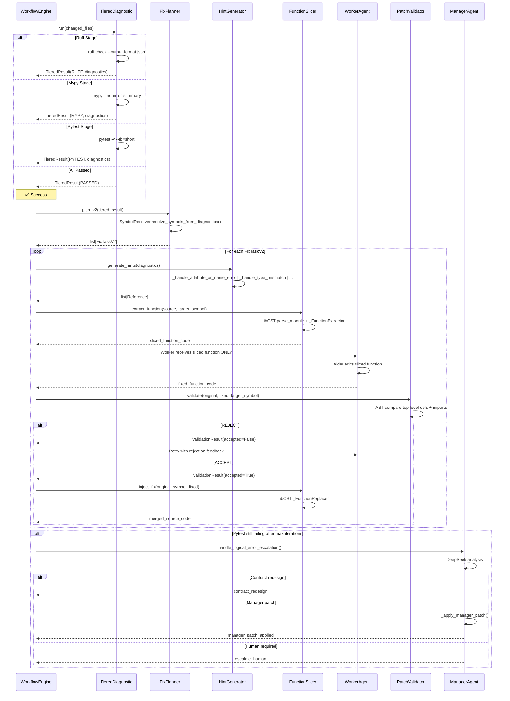

# Phase 4 Detailed Design: Contract-Driven Repair / Function-Level Isolation

## 1. Overview

Phase 4 addresses the **30% rework success rate bottleneck** identified in 2-Tier (Director/Manager=DeepSeek, Worker=Ollama 7B) verification. The root causes are:

1. **Non-structured rework instructions**: Generation uses `WorkerContract` (contract-driven), but rework falls back to ambiguous natural language ("Ruff error, please fix").
2. **Aider `whole` edit mode context loss**: 7B model receives the entire file and wrecks unchanged code blocks (collateral degradation).

The solution is a **deterministic state machine** that physically strips "design, judgment, and whole-file retention" scope from the Worker, slicing only the failing function (Symbol) and feeding it in isolation.

```
┌─────────────────────────────────────────────────────────────────────┐
│                    Phase 4 Pipeline Architecture                      │
├─────────────────────────────────────────────────────────────────────┤
│                                                                       │
│  [Worker Generated Code]                                              │
│         │                                                             │
│         ▼                                                             │
│  ┌─────────────────────────────────────────────────────────────┐     │
│  │  Phase 1: Tiered Diagnostic (Ruff → Mypy → Pytest)          │     │
│  │  - Sequential execution with early exit on errors            │     │
│  │  - No cascading false positives from downstream tools        │     │
│  └─────────────────────┬───────────────────────────────────────┘     │
│                        │ errors found                                │
│                        ▼                                             │
│  ┌─────────────────────────────────────────────────────────────┐     │
│  │  Phase 2: FixTask Builder                                    │     │
│  │  - Enhanced FixTask with target_symbol, editable_scope       │     │
│  │  - References container for structured hints                 │     │
│  └─────────────────────┬───────────────────────────────────────┘     │
│                        │                                             │
│                        ▼                                             │
│  ┌─────────────────────────────────────────────────────────────┐     │
│  │  Phase 3: Hint Generator (per error type)                    │     │
│  │  - AttributeError → dir()/help() introspection               │     │
│  │  - TypeError → function signature extraction                 │     │
│  │  - ImportError → valid module list                           │     │
│  └─────────────────────┬───────────────────────────────────────┘     │
│                        │                                             │
│                        ▼                                             │
│  ┌─────────────────────────────────────────────────────────────┐     │
│  │  Phase 4: LibCST Function-Level Isolation                    │     │
│  │  - Extract only target function from source                  │     │
│  │  - Worker sees ONLY the sliced function (no full file)       │     │
│  │  - After fix, inject back into original file                 │     │
│  └─────────────────────┬───────────────────────────────────────┘     │
│                        │                                             │
│                        ▼                                             │
│  ┌─────────────────────────────────────────────────────────────┐     │
│  │  Phase 5: Patch Validator                                    │     │
│  │  - Static check: did Worker modify outside scope?            │     │
│  │  - Reject if imports, other functions, or classes changed    │     │
│  └─────────────────────┬───────────────────────────────────────┘     │
│                        │                                             │
│              ┌─────────┴──────────┐                                   │
│              ▼                    ▼                                   │
│         [REJECT]              [ACCEPT]                                │
│         (re-queue)                │                                   │
│                                   ▼                                   │
│                          ┌────────────────────────────────────┐       │
│                          │  Phase 6: Re-verification           │       │
│                          │  - Re-run Ruff → Mypy → Pytest     │       │
│                          │  - If Pytest logic errors remain → │       │
│                          │    Manager (DeepSeek) escalation    │       │
│                          └────────────────────────────────────┘       │
└─────────────────────────────────────────────────────────────────────┘
```

---

## 2. File Layout: New & Modified Files

| File | Action | Description |
|------|--------|-------------|
| `ekp_forge/schemas/contract.py` | **Extend** | Add `Reference`, `FixTaskV2` model with `target_symbol`, `editable_scope`, `references`, `acceptance` fields |
| `ekp_forge/sandbox/slicer.py` | **NEW** | LibCST-based function extractor and injector |
| `ekp_forge/sandbox/hint_generator.py` | **NEW** | Error-type-aware structured hint generation |
| `ekp_forge/sandbox/patch_validator.py` | **NEW** | Static scope-violation detection |
| `ekp_forge/engine/tiered_diagnostic.py` | **NEW** | Sequential Ruff→Mypy→Pytest runner with early exit |
| `ekp_forge/engine/fix_planner.py` | **Modify** | Add Phase 2 enhanced FixTask building with symbol resolution |
| `ekp_forge/engine/workflow.py` | **Modify** | Replace fix loop with Phase 4 pipeline |
| `ekp_forge/worker.py` | **Modify** | Support function-slice-only Worker context |
| `ekp_forge/manager.py` | **Modify** | Add logical-error escalation handler |
| `tests/test_slicer.py` | **NEW** | Tests for LibCST extract/inject |
| `tests/test_hint_generator.py` | **NEW** | Tests for structured hints |
| `tests/test_patch_validator.py` | **NEW** | Tests for scope violation detection |
| `tests/test_tiered_diagnostic.py` | **NEW** | Tests for sequential diagnostic pipeline |
| `tests/test_fix_planner_v2.py` | **NEW** | Tests for enhanced FixTask building |

---

## 3. Phase 1 & 6: Tiered Diagnostic Pipeline

### 3.1 Design

Replace the current `run_verification_pipeline()` (which runs all tools unconditionally) with a **sequential, early-exit pipeline** that feeds only one tool's results to the next stage.

```
Run Ruff ──┬── errors found? ── YES ──▶ Emit Ruff-only diagnostics ──▶ FixTask(P1: Syntax)
           │
           NO
           │
           ▼
        Run Mypy ──┬── errors found? ── YES ──▶ Emit Mypy-only diagnostics ──▶ FixTask(P2: Type)
                    │
                    NO
                    │
                    ▼
                 Run Pytest ──┬── errors found? ── YES ──▶ Emit Pytest diagnostics ──▶ FixTask(P4: Logic)
                               │
                               NO
                               │
                               ▼
                            ✅ SUCCESS
```

### 3.2 New Module: `ekp_forge/engine/tiered_diagnostic.py`

```python
"""Sequential tiered diagnostic runner — Ruff → Mypy → Pytest with early exit.

Phase 4 replaces the flat run_verification_pipeline() with a stateful
sequential runner that exits early to prevent cascading false positives.
"""

from __future__ import annotations

from dataclasses import dataclass, field
from enum import StrEnum
from pathlib import Path
from typing import Any

from ekp_forge.sandbox.verification_ir import (
    AutoFixRunner,
    RuffParser,
    MypyParser,
    PytestParser,
    run_single_tool,
)
from ekp_forge.schemas.contract import Diagnostic


class DiagnosticStage(StrEnum):
    """Current stage in the tiered diagnostic pipeline."""
    RUFF = "ruff"
    MYPY = "mypy"
    PYTEST = "pytest"
    PASSED = "passed"


@dataclass
class TieredDiagnosticResult:
    """Result of a single stage in the tiered diagnostic pipeline.

    Attributes:
        stage:        Which stage was executed.
        diagnostics:  Diagnostics found at this stage (empty if passed).
        passed:       True if no errors at this stage.
        next_stage:   The next stage to execute, or PASSED if all clear.
    """
    stage: DiagnosticStage
    diagnostics: list[Diagnostic] = field(default_factory=list)
    passed: bool = True
    next_stage: DiagnosticStage = DiagnosticStage.PASSED


class TieredDiagnosticRunner:
    """Sequential diagnostic runner with stage-gated execution.

    Usage:
        runner = TieredDiagnosticRunner(workspace=Path.cwd())
        result = runner.run(["src/main.py"])

        if result.stage == DiagnosticStage.RUFF and not result.passed:
            # Handle Ruff errors only
            fix_tasks = planner.plan(result.diagnostics)
        elif result.stage == DiagnosticStage.MYPY and not result.passed:
            # Handle Mypy errors only
            ...
        elif result.stage == DiagnosticStage.PYTEST and not result.passed:
            # Handle test failures
            ...
    """

    def __init__(self, workspace: Path | None = None) -> None:
        self._workspace = workspace or Path.cwd()

    def run(
        self,
        changed_files: list[str] | None = None,
    ) -> TieredDiagnosticResult:
        """Execute the tiered diagnostic pipeline sequentially.

        Args:
            changed_files: Files to scope checks to.

        Returns:
            A TieredDiagnosticResult representing the first failing stage,
            or a PASSED result if all stages succeed.
        """
        resolve_cwd = self._workspace

        # Step 0: Auto-fix (always runs first)
        fixer = AutoFixRunner(workspace=resolve_cwd)
        fixer.run_all(changed_files)

        # Step 1: Ruff — Syntax/Format errors
        ruff_result = run_single_tool("ruff", changed_files, cwd=resolve_cwd)
        ruff_diags = RuffParser.parse(ruff_result.raw_output)
        non_format_diags = [d for d in ruff_diags
                            if d.category not in
                            {DiagnosticCategory.FORMATTING,
                             DiagnosticCategory.UNUSED_IMPORT}]

        if non_format_diags:
            return TieredDiagnosticResult(
                stage=DiagnosticStage.RUFF,
                diagnostics=non_format_diags,
                passed=False,
                next_stage=DiagnosticStage.MYPY,
            )

        # Step 2: Mypy — Type errors (only if Ruff passed)
        mypy_result = run_single_tool("mypy", changed_files, cwd=resolve_cwd)
        mypy_diags = MypyParser.parse(mypy_result.raw_output)

        if mypy_diags:
            return TieredDiagnosticResult(
                stage=DiagnosticStage.MYPY,
                diagnostics=mypy_diags,
                passed=False,
                next_stage=DiagnosticStage.PYTEST,
            )

        # Step 3: Pytest — Logic errors (only if Ruff and Mypy passed)
        pytest_result = run_single_tool("pytest", changed_files, cwd=resolve_cwd)
        pytest_diags = PytestParser.parse(pytest_result.raw_output)

        if pytest_diags:
            return TieredDiagnosticResult(
                stage=DiagnosticStage.PYTEST,
                diagnostics=pytest_diags,
                passed=False,
                next_stage=DiagnosticStage.PASSED,
            )

        # All passed
        return TieredDiagnosticResult(
            stage=DiagnosticStage.PASSED,
            diagnostics=[],
            passed=True,
            next_stage=DiagnosticStage.PASSED,
        )

    def run_stage(
        self,
        stage: DiagnosticStage,
        changed_files: list[str] | None = None,
    ) -> TieredDiagnosticResult:
        """Run a single diagnostic stage independently.

        Used during Phase 6 re-verification after a fix has been applied,
        to re-check only the relevant stage.

        Args:
            stage:        The stage to run.
            changed_files: Files to scope checks to.

        Returns:
            Result for that single stage.
        """
        resolve_cwd = self._workspace

        if stage == DiagnosticStage.RUFF:
            result = run_single_tool("ruff", changed_files, cwd=resolve_cwd)
            diags = RuffParser.parse(result.raw_output)
            non_format = [d for d in diags
                          if d.category not in
                          {DiagnosticCategory.FORMATTING,
                           DiagnosticCategory.UNUSED_IMPORT}]
            return TieredDiagnosticResult(
                stage=stage, diagnostics=non_format,
                passed=len(non_format) == 0,
                next_stage=DiagnosticStage.MYPY,
            )

        if stage == DiagnosticStage.MYPY:
            result = run_single_tool("mypy", changed_files, cwd=resolve_cwd)
            diags = MypyParser.parse(result.raw_output)
            return TieredDiagnosticResult(
                stage=stage, diagnostics=diags,
                passed=len(diags) == 0,
                next_stage=DiagnosticStage.PYTEST,
            )

        if stage == DiagnosticStage.PYTEST:
            result = run_single_tool("pytest", changed_files, cwd=resolve_cwd)
            diags = PytestParser.parse(result.raw_output)
            return TieredDiagnosticResult(
                stage=stage, diagnostics=diags,
                passed=len(diags) == 0,
                next_stage=DiagnosticStage.PASSED,
            )

        return TieredDiagnosticResult(
            stage=DiagnosticStage.PASSED, passed=True,
        )
```

### 3.3 Key Design Decisions

| Decision | Rationale |
|----------|-----------|
| **Auto-fix runs before every stage** | Ensures formatting/import-sorting is never delegated to LLM |
| **DiagnosticCategory filtering on Ruff** | FORMATTING and UNUSED_IMPORT are auto-fixable; only non-auto-fixable errors trigger a FixTask |
| **Early exit prevents cascade** | If Ruff has syntax errors, Mypy would produce 10x false positives; never show those to Worker |
| **`run_stage()` for re-verification** | After fixing Ruff errors, re-run only Ruff stage to confirm, not the whole pipeline |

---

## 4. Phase 2: Enhanced FixTask Contract Model

### 4.1 New Pydantic Models

Add to [`ekp_forge/schemas/contract.py`](ekp_forge/schemas/contract.py):

```python
from __future__ import annotations

from typing import Any, Literal

from pydantic import BaseModel, ConfigDict, Field


class Reference(BaseModel):
    """Structured hint material attached to a FixTask by the Hint Generator.

    Attributes:
        reference_type: Type of reference (introspection, signature, module_list, etc.).
        target:         The module/object/function the reference applies to.
        content:        The structured reference content (formatted for prompt injection).
        source_tool:    The tool that generated this reference (e.g. "introspection", "ast").
    """

    model_config = ConfigDict(strict=True, frozen=True)

    reference_type: Literal[
        "introspection_dir",
        "function_signature",
        "valid_modules",
        "expected_vs_actual",
        "source_code_context",
    ]
    target: str = Field(max_length=200)
    content: str = Field(max_length=3000, min_length=1)
    source_tool: str = Field(default="hint_generator", max_length=50)


class FixTaskV2(BaseModel):
    """Enhanced FixTask for Phase 4 contract-driven repair.

    This replaces the Phase 2 FixTask for the rework pipeline. Key additions:
    - ``target_symbol``: The specific function/class-method to fix.
    - ``editable_scope``: Whether the task targets a function or class method.
    - ``references``: Structured hints from the Hint Generator.
    - ``acceptance``: Specific verification conditions to pass.

    Attributes:
        task_id:        Unique identifier for this fix task.
        target_file:    The file containing the target symbol.
        target_symbol:  The function/class-method name to fix.
        editable_scope: Whether the scope is a function or class method.
        diagnostics:    Diagnostics from the current TieredDiagnostic stage.
        references:     Structured hints from the Hint Generator.
        acceptance:     Verification conditions to pass after fix.
    """

    model_config = ConfigDict(strict=True, frozen=False)

    task_id: str = Field(pattern=r"^FTV2-\d{14}-[a-f0-9]{6}$")
    target_file: str
    target_symbol: str = Field(max_length=200, min_length=1)
    editable_scope: Literal["function", "class_method"]
    diagnostics: list[Diagnostic] = Field(min_length=1)
    references: list[Reference] = Field(default_factory=list)
    acceptance: list[str] = Field(default_factory=list)
```

### 4.2 FixPlanner Enhancements

Modify [`ekp_forge/engine/fix_planner.py`](ekp_forge/engine/fix_planner.py) to add:

```python
import ast
from pathlib import Path


class SymbolResolver:
    """Resolves a line number to a symbol (function/class-method) name using AST."""

    @staticmethod
    def resolve_symbol(file_path: str, line_number: int) -> tuple[str, Literal["function", "class_method"]]:
        """Given a file path and line number, find the enclosing symbol name.

        Args:
            file_path:    Path to the Python source file.
            line_number:  The 1-based line number of the diagnostic.

        Returns:
            Tuple of (symbol_name, scope_type).

        Raises:
            ValueError: If the file cannot be parsed or no enclosing symbol found.
        """
        path = Path(file_path)
        if not path.exists():
            raise ValueError(f"File not found: {file_path}")

        source = path.read_text(encoding="utf-8")
        tree = ast.parse(source)

        for node in ast.iter_child_nodes(tree):
            if isinstance(node, ast.ClassDef):
                # Check class methods
                for item in ast.iter_child_nodes(node):
                    if isinstance(item, (ast.FunctionDef, ast.AsyncFunctionDef)):
                        if item.lineno <= line_number <= (item.end_lineno or item.lineno):
                            return (f"{node.name}.{item.name}", "class_method")
            elif isinstance(node, (ast.FunctionDef, ast.AsyncFunctionDef)):
                if node.lineno <= line_number <= (node.end_lineno or node.lineno):
                    return (node.name, "function")

        raise ValueError(
            f"No enclosing symbol found at {file_path}:{line_number}"
        )

    @staticmethod
    def resolve_symbols_from_diagnostics(
        diagnostics: list[Diagnostic],
    ) -> dict[str, tuple[str, str, Literal["function", "class_method"]]]:
        """Resolve file:symbol mappings from a list of diagnostics.

        Returns:
            Dict mapping "file_path:symbol_name" to (file_path, symbol_name, scope_type).
        """
        result: dict[str, tuple[str, str, Literal["function", "class_method"]]] = {}
        for d in diagnostics:
            if not d.file or d.line == 0:
                continue
            try:
                symbol, scope = SymbolResolver.resolve_symbol(d.file, d.line)
                key = f"{d.file}:{symbol}"
                if key not in result:
                    result[key] = (d.file, symbol, scope)
            except (ValueError, OSError):
                continue
        return result
```

### 4.3 Enhanced `plan_v2()` Method on FixPlanner

```python
class FixPlanner:
    # ... existing methods ...

    def plan_v2(
        self,
        tiered_result: TieredDiagnosticResult,
    ) -> list[FixTaskV2]:
        """Plan fix tasks from a tiered diagnostic result.

        Phase 4 enhancement: resolves diagnostics to symbol names and
        generates FixTaskV2 instances with target_symbol and editable_scope.

        Args:
            tiered_result: Result from TieredDiagnosticRunner.run().

        Returns:
            List of FixTaskV2 instances (one per unique symbol).
        """
        diagnostics = tiered_result.diagnostics
        if not diagnostics:
            return []

        # Resolve diagnostics to symbols
        symbol_map = SymbolResolver.resolve_symbols_from_diagnostics(diagnostics)

        if not symbol_map:
            # Fallback: if no symbols resolved, create a single task
            # targeting the first diagnostic's file
            first = diagnostics[0]
            return [
                FixTaskV2(
                    task_id=self._generate_v2_task_id(),
                    target_file=first.file,
                    target_symbol="<unknown>",
                    editable_scope="function",
                    diagnostics=diagnostics,
                    acceptance=self._build_acceptance_criteria(tiered_result.stage),
                )
            ]

        # Group diagnostics by symbol
        symbol_diagnostics: dict[str, list[Diagnostic]] = {}
        for key in symbol_map:
            symbol_diagnostics[key] = []

        for d in diagnostics:
            try:
                symbol, scope = SymbolResolver.resolve_symbol(d.file, d.line)
                key = f"{d.file}:{symbol}"
                if key in symbol_diagnostics:
                    symbol_diagnostics[key].append(d)
                else:
                    # Add to first available symbol in the same file
                    for skey in symbol_diagnostics:
                        if skey.startswith(d.file):
                            symbol_diagnostics[skey].append(d)
                            break
            except (ValueError, OSError):
                # Append to first symbol in same file
                for skey in symbol_diagnostics:
                    if skey.startswith(d.file):
                        symbol_diagnostics[skey].append(d)
                        break

        # Generate one FixTaskV2 per unique symbol
        tasks: list[FixTaskV2] = []
        for key, sym_diags in symbol_diagnostics.items():
            file_path, symbol_name, scope_type = symbol_map[key]
            tasks.append(
                FixTaskV2(
                    task_id=self._generate_v2_task_id(),
                    target_file=file_path,
                    target_symbol=symbol_name,
                    editable_scope=scope_type,
                    diagnostics=sym_diags,
                    acceptance=self._build_acceptance_criteria(tiered_result.stage),
                )
            )

        return tasks

    def _generate_v2_task_id(self) -> str:
        """Generate a FixTaskV2 ID."""
        timestamp = datetime.now(UTC).strftime("%Y%m%d%H%M%S")
        hash_input = f"ftv2-{timestamp}-{datetime.now(UTC).microsecond}"
        task_hash = hashlib.sha256(hash_input.encode()).hexdigest()[:6]
        return f"FTV2-{timestamp}-{task_hash}"

    @staticmethod
    def _build_acceptance_criteria(stage: DiagnosticStage) -> list[str]:
        """Build acceptance criteria based on the current diagnostic stage."""
        criteria = []
        if stage in (DiagnosticStage.RUFF, DiagnosticStage.MYPY):
            criteria.append(f"No {stage.value} errors after fix")
        if stage == DiagnosticStage.MYPY:
            criteria.append("Type-correct with strict mypy")
        if stage == DiagnosticStage.PYTEST:
            criteria.append("All tests pass")
        return criteria
```

---

## 5. Phase 3: Structured Hint Generator

### 5.1 Design

The Hint Generator creates precise `Reference` objects based on error type, using deterministic tools (not LLM calls) to provide the Worker with exactly the information needed to fix the error.

```
Diagnostic
    │
    ├── AttributeError ──▶ IntrospectionTool.dir(module) ──▶ Reference(type="introspection_dir")
    │
    ├── TypeError ──────▶ AST.parse() to extract signature ──▶ Reference(type="function_signature")
    │
    ├── ImportError ────▶ Project module scanner ──────────▶ Reference(type="valid_modules")
    │
    └── AssertionError ──▶ Expected/Actual extraction ─────▶ Reference(type="expected_vs_actual")
```

### 5.2 New Module: `ekp_forge/sandbox/hint_generator.py`

```python
"""Structured hint generator — creates Reference objects based on diagnostic types.

Phase 4, Priority 4.

The Hint Generator creates precise, deterministic `Reference` objects
based on error type. No LLM calls — all hints are generated via static
analysis or sandboxed introspection.
"""

from __future__ import annotations

import ast
import os
from pathlib import Path
from typing import Any

from ekp_forge.sandbox.introspection import IntrospectionTool
from ekp_forge.schemas.contract import (
    Diagnostic,
    DiagnosticCategory,
    Reference,
)


class HintGenerator:
    """Generates structured hints (Reference objects) per diagnostic type.

    Usage:
        generator = HintGenerator(workspace=Path.cwd())
        refs = generator.generate_hints(diagnostics)
        # refs is a list[Reference] to attach to FixTaskV2
    """

    def __init__(self, workspace: Path | None = None) -> None:
        self._workspace = workspace or Path.cwd()
        self._introspection = IntrospectionTool(workspace=self._workspace)

    def generate_hints(self, diagnostics: list[Diagnostic]) -> list[Reference]:
        """Generate structured hints for a list of diagnostics.

        Each diagnostic type triggers a different hint generation strategy.
        Returns an empty list if no hints could be generated.

        Args:
            diagnostics: The diagnostics to generate hints for.

        Returns:
            List of Reference objects.
        """
        references: list[Reference] = []

        for diag in diagnostics:
            ref = self._generate_for_diagnostic(diag)
            if ref is not None:
                references.append(ref)

        return references

    def _generate_for_diagnostic(self, diag: Diagnostic) -> Reference | None:
        """Route diagnostic to the appropriate hint generator."""
        # Ruff/mypy AttributeError → introspect module
        if (
            diag.category == DiagnosticCategory.UNDEFINED_NAME
            or "has no attribute" in diag.message.lower()
            or "module" in diag.message.lower() and "not defined" in diag.message.lower()
        ):
            return self._handle_attribute_or_name_error(diag)

        # Mypy type mismatch → extract function signature
        if diag.category == DiagnosticCategory.TYPE_MISMATCH:
            return self._handle_type_mismatch(diag)

        # Import errors → scan valid modules
        if diag.category == DiagnosticCategory.IMPORT:
            return self._handle_import_error(diag)

        # Wrong return value (Pytest assertion) → expected vs actual
        if diag.category == DiagnosticCategory.WRONG_RETURN_VALUE:
            return self._handle_assertion_error(diag)

        return None

    # ------------------------------------------------------------------
    # Strategy 1: AttributeError / Undefined Name → Introspection
    # ------------------------------------------------------------------

    def _handle_attribute_or_name_error(self, diag: Diagnostic) -> Reference | None:
        """Use IntrospectionTool to resolve AttributeError/undefined name.

        Extracts module name from the diagnostic message, runs dir()/help()
        in a sandboxed subprocess, and returns a structured Reference.
        """
        module_name = self._extract_module_name(diag.message)
        if not module_name:
            return None

        result = self._introspection.inspect_module(module_name)
        if result.error and not result.attributes:
            return None

        formatted = IntrospectionTool.format_for_prompt(result)

        return Reference(
            reference_type="introspection_dir",
            target=module_name,
            content=formatted,
            source_tool="hint_generator",
        )

    @staticmethod
    def _extract_module_name(message: str) -> str | None:
        """Extract module name from error messages.

        Patterns:
        - "module 'X' has no attribute 'Y'"
        - "name 'X' is not defined"
        - "'X' object has no attribute 'Y'"
        """
        import re

        # Pattern 1: module 'X' has no attribute 'Y'
        m = re.search(r"module\s+'([^']+)'", message)
        if m:
            return m.group(1)

        # Pattern 2: name 'X' is not defined
        m = re.search(r"name\s+'([^']+)'\s+is not defined", message)
        if m:
            return m.group(1)

        # Pattern 3: 'X' object has no attribute
        m = re.search(r"'([^']+)'\s+object has no attribute", message)
        if m:
            return m.group(1)

        return None

    # ------------------------------------------------------------------
    # Strategy 2: Type Mismatch → Function Signature
    # ------------------------------------------------------------------

    def _handle_type_mismatch(self, diag: Diagnostic) -> Reference | None:
        """Extract function signature from source using AST.

        For mypy arg-type errors, extract the function signature and
        expected/actual type annotations.
        """
        file_path = Path(self._workspace) / diag.file
        if not file_path.exists():
            return None

        source = file_path.read_text(encoding="utf-8")
        try:
            tree = ast.parse(source)
        except SyntaxError:
            return None

        # Find function at the diagnostic's line
        for node in ast.walk(tree):
            if isinstance(node, (ast.FunctionDef, ast.AsyncFunctionDef)):
                if node.lineno <= diag.line <= (node.end_lineno or node.lineno):
                    # Extract function signature
                    args = []
                    for arg in node.args.args:
                        arg_annotation = ""
                        if arg.annotation:
                            arg_annotation = ast.unparse(arg.annotation)
                        args.append(f"{arg.arg}: {arg_annotation}" if arg_annotation else arg.arg)

                    returns = ""
                    if node.returns:
                        returns = f" -> {ast.unparse(node.returns)}"

                    signature = f"def {node.name}({', '.join(args)}){returns}:"

                    return Reference(
                        reference_type="function_signature",
                        target=f"{diag.file}:{node.name}",
                        content=(
                            f"Function signature:\n{signature}\n\n"
                            f"Error: {diag.message}\n"
                            f"Line {diag.line}"
                        ),
                        source_tool="hint_generator",
                    )

        return None

    # ------------------------------------------------------------------
    # Strategy 3: Import Error → Valid Module List
    # ------------------------------------------------------------------

    def _handle_import_error(self, diag: Diagnostic) -> Reference | None:
        """Scan project for valid importable modules.

        Returns a list of available top-level packages/modules in the
        project's virtual environment and standard library.
        """
        valid_modules = self._scan_available_modules()
        if not valid_modules:
            return None

        # Extract the failing import name from the message
        import_name = self._extract_import_name(diag.message)
        suggestions = ""
        if import_name:
            # Find similar module names
            similar = [m for m in valid_modules
                       if import_name.lower() in m.lower()
                       or m.lower().startswith(import_name.lower()[:3])]
            if similar:
                suggestions = f"Did you mean: {', '.join(similar[:10])}?"

        content = (
            f"Available modules in project environment:\n"
            f"{', '.join(sorted(valid_modules)[:30])}\n"
            f"{'... and more' if len(valid_modules) > 30 else ''}\n"
        )
        if suggestions:
            content += f"\n{suggestions}"

        return Reference(
            reference_type="valid_modules",
            target=import_name or "unknown",
            content=content,
            source_tool="hint_generator",
        )

    def _scan_available_modules(self) -> list[str]:
        """Scan the project environment for importable modules.

        Checks .venv site-packages and stdlib modules.
        """
        modules: set[str] = set()

        # Check .venv site-packages
        venv_paths = [
            self._workspace / ".venv" / "lib",
        ]
        for base in venv_paths:
            if base.exists():
                # Find site-packages directories
                for site_pkg in base.rglob("site-packages"):
                    if site_pkg.is_dir():
                        for p in site_pkg.iterdir():
                            if p.is_dir() and not p.name.startswith("_"):
                                modules.add(p.name)
                            elif p.is_file() and p.suffix == ".py" and not p.name.startswith("_"):
                                modules.add(p.stem)

        # Add common stdlib modules (curated list)
        stdlib = {
            "os", "sys", "json", "re", "math", "datetime", "pathlib",
            "typing", "collections", "functools", "itertools", "subprocess",
            "hashlib", "base64", "abc", "enum", "dataclasses", "inspect",
            "ast", "importlib", "threading", "multiprocessing", "io",
            "textwrap", "string", "random", "statistics", "uuid",
            "copy", "pprint", "logging", "warnings", "contextlib",
        }
        modules.update(stdlib)

        return sorted(modules)

    @staticmethod
    def _extract_import_name(message: str) -> str | None:
        """Extract the import name from an import error message."""
        import re

        m = re.search(r"No module named '([^']+)'", message)
        if m:
            return m.group(1)

        m = re.search(r"cannot import name '([^']+)'", message)
        if m:
            return m.group(1)

        m = re.search(r"import\s+(\w+)", message)
        if m:
            return m.group(1)

        return None

    # ------------------------------------------------------------------
    # Strategy 4: Assertion Error → Expected vs Actual
    # ------------------------------------------------------------------

    def _handle_assertion_error(self, diag: Diagnostic) -> Reference | None:
        """Format expected vs actual values from a test failure diagnostic."""
        content_parts: list[str] = ["Assertion failure details:"]

        if diag.expected:
            content_parts.append(f"  Expected: {diag.expected}")
        if diag.actual:
            content_parts.append(f"  Actual:   {diag.actual}")

        if diag.message:
            content_parts.append(f"  Message:  {diag.message}")

        if len(content_parts) <= 1:
            return None

        return Reference(
            reference_type="expected_vs_actual",
            target=diag.file,
            content="\n".join(content_parts),
            source_tool="hint_generator",
        )
```

---

## 6. Phase 4: LibCST Function-Level Isolation (Slicer)

### 6.1 Design

The Slicer is the core isolation mechanism. It uses **LibCST** (not AST) because:

1. **LibCST preserves comments, whitespace, and formatting** — AST loses these.
2. **LibCST guarantees round-trip fidelity** — what goes in is byte-identical to what comes out (unless modified).
3. **LibCST provides precise node manipulation** — extract/replace at the `FunctionDef` node level.

```
┌─────────────────────────────────────────┐
│  Original Source File                    │
│                                          │
│  import os                               │
│  import sys                              │
│                                          │
│  def helper():                           │
│      return 42                           │
│                                          │
│  def target_func(x):       ◀── slice     │
│      return x + helper()                 │
│                                          │
│  class MyClass:                          │
│      def method(self):                   │
│          pass                            │
└────────────────────┬────────────────────┘
                     │ LibCST.extract()
                     ▼
┌─────────────────────────────────────────┐
│  Sliced Function (Worker sees only this) │
│                                          │
│  def target_func(x):                     │
│      return x + helper()                 │
│                                          │
│  # Context: helper() returns int         │
└────────────────────┬────────────────────┘
                     │ Worker modifies it
                     ▼
┌─────────────────────────────────────────┐
│  Fixed Sliced Function                   │
│                                          │
│  def target_func(x):                     │
│      return x + helper() + 1             │
└────────────────────┬────────────────────┘
                     │ LibCST.inject()
                     ▼
┌─────────────────────────────────────────┐
│  Original Source File (with fix applied) │
│                                          │
│  import os                               │
│  import sys                              │
│                                          │
│  def helper():                           │
│      return 42                           │
│                                          │
│  def target_func(x):       ◀── replaced  │
│      return x + helper() + 1             │
│                                          │
│  class MyClass:                          │
│      def method(self):                   │
│          pass                            │
└─────────────────────────────────────────┘
```

### 6.2 New Module: `ekp_forge/sandbox/slicer.py`

```python
"""LibCST-based function-level slicer — extract/inject individual functions.

Phase 4, Priority 2.

The Slicer provides two operations:
1. ``extract_function(source, symbol_name)`` → returns the function source code.
2. ``inject_fix(original_source, symbol_name, fixed_source)`` → returns the
   merged source with only the target function replaced.

Uses LibCST for full comment/whitespace/formatting preservation.
"""

from __future__ import annotations

import libcst as cst
from libcst import FunctionDef, ClassDef, Module, CSTNode
from libcst.metadata import MetadataWrapper, PositionProvider


class _FunctionExtractor(cst.CSTVisitor):
    """CST visitor that extracts a specific function definition.

    Usage:
        wrapper = MetadataWrapper(module)
        extractor = _FunctionExtractor(target_name)
        wrapper.visit(extractor)
        extracted_code = extractor.extracted_code
    """

    def __init__(self, target_name: str) -> None:
        self.target_name = target_name
        self.extracted_node: FunctionDef | None = None
        self._current_class: str | None = None

    def visit_FunctionDef(self, node: FunctionDef) -> bool | None:
        name = node.name.value
        full_name = f"{self._current_class}.{name}" if self._current_class else name
        if full_name == self.target_name:
            self.extracted_node = node
            return False  # Stop traversal once found
        return True

    def visit_ClassDef(self, node: ClassDef) -> bool | None:
        old_class = self._current_class
        self._current_class = node.name.value
        # Visit children (methods)
        result = self.visit_FunctionDef_children(node)
        self._current_class = old_class
        return False

    def visit_FunctionDef_children(self, node: ClassDef) -> bool | None:
        for child in node.body.body:
            if isinstance(child, FunctionDef):
                name = child.name.value
                full_name = f"{self._current_class}.{name}"
                if full_name == self.target_name:
                    self.extracted_node = child
                    return False
        return None  # Continue default traversal


class _FunctionReplacer(cst.CSTTransformer):
    """CST transformer that replaces a specific function definition.

    Usage:
        transformer = _FunctionReplacer(target_name, new_code)
        modified_module = module.visit(transformer)
    """

    def __init__(self, target_name: str, new_code: str) -> None:
        self.target_name = target_name
        self.new_code = new_code
        self._current_class: str | None = None
        self._replaced = False

    def visit_FunctionDef(self, node: FunctionDef) -> bool | None:
        name = node.name.value
        full_name = f"{self._current_class}.{name}" if self._current_class else name
        if full_name == self.target_name:
            return False  # We'll replace this node
        return True

    def leave_FunctionDef(
        self, original_node: FunctionDef, updated_node: FunctionDef
    ) -> FunctionDef | CSTNode:
        name = original_node.name.value
        full_name = f"{self._current_class}.{name}" if self._current_class else name
        if full_name == self.target_name and not self._replaced:
            self._replaced = True
            # Parse the new code and return the new FunctionDef node
            try:
                new_module = cst.parse_module(self.new_code)
                # Extract the first function definition from the new code
                for statement in new_module.body:
                    if isinstance(statement, FunctionDef):
                        return statement
            except Exception:
                pass
            # Fallback: return original (no replacement)
        return updated_node

    def visit_ClassDef(self, node: ClassDef) -> bool | None:
        self._current_class = node.name.value
        return True

    def leave_ClassDef(
        self, original_node: ClassDef, updated_node: ClassDef
    ) -> ClassDef | CSTNode:
        self._current_class = None
        return updated_node


class FunctionSlicer:
    """LibCST-based function extractor and injector.

    Usage:
        slicer = FunctionSlicer()

        # Extract a function for isolated fixing
        extracted = slicer.extract_function(
            source_code="def foo(): pass",
            symbol_name="foo",
        )
        # extracted == "def foo(): pass"

        # Inject a fixed function back
        merged = slicer.inject_fix(
            original_source="def foo(): return 1\\ndef bar(): return 2",
            symbol_name="foo",
            fixed_source="def foo(): return 42",
        )
        # merged == "def foo(): return 42\\ndef bar(): return 2"
    """

    # ------------------------------------------------------------------
    # Public API
    # ------------------------------------------------------------------

    def extract_function(
        self,
        source_code: str,
        symbol_name: str,
    ) -> str | None:
        """Extract a single function definition from source code.

        Args:
            source_code: The full source code of the file.
            symbol_name: The function name (or "ClassName.method_name" for methods).

        Returns:
            The source code of the extracted function, or None if not found.
        """
        try:
            module = cst.parse_module(source_code)
        except Exception:
            return None

        wrapper = MetadataWrapper(module)
        extractor = _FunctionExtractor(symbol_name)
        wrapper.visit(extractor)

        if extractor.extracted_node is None:
            return None

        # Get the source code of the extracted node
        start_pos = extractor.extracted_node.get_start_position()
        end_pos = extractor.extracted_node.get_end_position()

        if start_pos and end_pos:
            lines = source_code.splitlines(keepends=True)
            # extract lines from start_pos.line-1 to end_pos.line
            extracted_lines = lines[start_pos.line - 1:end_pos.line]
            return "".join(extracted_lines).rstrip("\n")

        # Fallback: use LibCST codegen
        return module.code_for_node(extractor.extracted_node)

    def inject_fix(
        self,
        original_source: str,
        symbol_name: str,
        fixed_source: str,
    ) -> str | None:
        """Replace a specific function in the original source with fixed code.

        Args:
            original_source: The original full source code.
            symbol_name:     The function name to replace.
            fixed_source:    The new source code for the function.

        Returns:
            The merged source code, or None if the symbol was not found.
        """
        try:
            module = cst.parse_module(original_source)
        except Exception:
            return None

        transformer = _FunctionReplacer(symbol_name, fixed_source)
        modified_module = module.visit(transformer)

        if not transformer._replaced:
            return None

        return modified_module.code

    # ------------------------------------------------------------------
    # File-level convenience methods
    # ------------------------------------------------------------------

    def extract_function_from_file(
        self,
        file_path: str,
        symbol_name: str,
    ) -> str | None:
        """Extract a function from a file on disk.

        Args:
            file_path:  Path to the Python source file.
            symbol_name: The function name to extract.

        Returns:
            The extracted function source code, or None.
        """
        from pathlib import Path

        path = Path(file_path)
        if not path.exists():
            return None

        source = path.read_text(encoding="utf-8")
        return self.extract_function(source, symbol_name)

    def inject_fix_to_file(
        self,
        file_path: str,
        symbol_name: str,
        fixed_source: str,
    ) -> bool:
        """Replace a function in a file on disk with fixed code.

        Args:
            file_path:    Path to the Python source file.
            symbol_name:  The function name to replace.
            fixed_source: The new source code for the function.

        Returns:
            True if the file was modified, False if symbol not found.
        """
        from pathlib import Path

        path = Path(file_path)
        if not path.exists():
            return False

        original = path.read_text(encoding="utf-8")
        merged = self.inject_fix(original, symbol_name, fixed_source)

        if merged is None:
            return False

        path.write_text(merged, encoding="utf-8")
        return True
```

### 6.3 Temp Workspace Isolation

When sending a sliced function to the Worker (Aider), the system:

1. Creates a temporary directory (using existing [`SandboxWorkspace`](ekp_forge/sandbox/workspace.py))
2. Writes ONLY the sliced function code into a temporary `.py` file
3. The file is named to match the original file's basename so the Worker sees familiar context
4. Attaches a minimal context comment at the top showing:
   - The original file path
   - The symbol name being fixed
   - Any related type signatures (from Hint Generator)
5. Worker edits the temporary file
6. After Worker returns, reads the fixed code from the temp file
7. Uses `FunctionSlicer.inject_fix()` to merge back into the original file

---

## 7. Phase 5: Patch Validator

### 7.1 Design

After the Worker returns a fixed function, the Patch Validator performs static analysis to ensure the Worker did NOT modify anything outside the specified `FixTaskV2.target_symbol`.

```
Worker returns fixed function code
                │
                ▼
    ┌─────────────────────────────┐
    │ PatchValidator.validate()    │
    │                              │
    │ 1. Parse fixed code via AST │
    │ 2. Extract all top-level     │
    │    definitions (functions,   │
    │    classes, imports)         │
    │ 3. Compare against original  │
    │    sliced function           │
    │ 4. Check:                   │
    │    - No new top-level defs   │
    │    - No removed defs         │
    │    - No import changes       │
    │    - Only target_symbol body │
    │      may differ              │
    └──────────┬──────────────────┘
               │
    ┌──────────┴──────────┐
    ▼                     ▼
  [REJECT]              [ACCEPT]
  (return to             (proceed to
   Worker with            injection +
   rejection msg)        re-verification)
```

### 7.2 New Module: `ekp_forge/sandbox/patch_validator.py`

```python
"""Patch Validator — static scope-violation detection for Worker fixes.

Phase 4, Priority 3.

The Patch Validator checks that a Worker's fix does not modify anything
outside the FixTaskV2-specified scope. If it does, the patch is REJECTED
and the Worker must retry.
"""

from __future__ import annotations

import ast
from dataclasses import dataclass, field
from typing import Any


@dataclass
class ValidationResult:
    """Result of a patch validation.

    Attributes:
        accepted:  True if the patch is within scope.
        reasons:   List of rejection reasons (empty if accepted).
        details:   Additional diagnostic details about what changed.
    """
    accepted: bool = True
    reasons: list[str] = field(default_factory=list)
    details: str = ""


class PatchValidator:
    """Validates that a Worker's fix only modifies the target symbol.

    Usage:
        validator = PatchValidator()

        # Validate a fix
        result = validator.validate(
            original_source="def foo(): return 1\\ndef bar(): return 2",
            fixed_source="def foo(): return 42\\ndef bar(): return 2",
            target_symbol="foo",
        )

        if not result.accepted:
            print("REJECTED:", result.reasons)
    """

    # ------------------------------------------------------------------
    # Public API
    # ------------------------------------------------------------------

    def validate(
        self,
        original_source: str,
        fixed_source: str,
        target_symbol: str,
    ) -> ValidationResult:
        """Validate that a fix only modified the target symbol.

        Checks:
        1. No new top-level functions/classes added.
        2. No top-level functions/classes removed.
        3. No import statements modified.
        4. Only the target symbol's body may differ.
        5. For class methods (e.g. "MyClass.method"), check that the
           parent class still has the same methods (except target).

        Args:
            original_source: The original source code (full file).
            fixed_source:    The Worker's fixed source code (full file).
            target_symbol:   The symbol that was allowed to change.

        Returns:
            ValidationResult with acceptance status and rejection reasons.
        """
        reasons: list[str] = []

        try:
            original_tree = ast.parse(original_source)
            fixed_tree = ast.parse(fixed_source)
        except SyntaxError as e:
            return ValidationResult(
                accepted=False,
                reasons=[f"Syntax error in fixed source: {e}"],
                details=f"Parse error: {e}",
            )

        # Check 1: Top-level definitions
        orig_defs = self._extract_top_level_defs(original_tree)
        fixed_defs = self._extract_top_level_defs(fixed_tree)

        # Check for removed definitions (excluding target)
        for name, node_type in orig_defs.items():
            if name not in fixed_defs and name != target_symbol:
                reasons.append(
                    f"Top-level {node_type} '{name}' was removed by the fix. "
                    f"Only '{target_symbol}' was allowed to change."
                )

        # Check for added definitions
        for name, node_type in fixed_defs.items():
            if name not in orig_defs:
                reasons.append(
                    f"New top-level {node_type} '{name}' was added by the fix. "
                    f"Only '{target_symbol}' was allowed to change."
                )

        # Check 2: Import statements unchanged
        orig_imports = self._extract_imports(original_tree)
        fixed_imports = self._extract_imports(fixed_tree)

        if orig_imports != fixed_imports:
            reasons.append(
                f"Import statements were modified. "
                f"Original: {orig_imports}, Fixed: {fixed_imports}. "
                f"Imports must remain unchanged."
            )

        # Check 3: For class methods, check class structure
        if "." in target_symbol:
            class_name, method_name = target_symbol.split(".", 1)
            class_reasons = self._validate_class_method(
                original_tree, fixed_tree, class_name, method_name
            )
            reasons.extend(class_reasons)

        if reasons:
            details = ";\n".join(reasons)
            return ValidationResult(
                accepted=False,
                reasons=reasons,
                details=f"Patch validation rejected:\n{details}",
            )

        return ValidationResult(accepted=True, details="Patch validation passed.")

    # ------------------------------------------------------------------
    # Internal helpers
    # ------------------------------------------------------------------

    @staticmethod
    def _extract_top_level_defs(tree: ast.Module) -> dict[str, str]:
        """Extract top-level function and class definitions.

        Returns:
            Dict mapping definition name → type ("function" or "class").
        """
        defs: dict[str, str] = {}
        for node in ast.iter_child_nodes(tree):
            if isinstance(node, ast.FunctionDef):
                defs[node.name] = "function"
            elif isinstance(node, ast.AsyncFunctionDef):
                defs[node.name] = "async_function"
            elif isinstance(node, ast.ClassDef):
                defs[node.name] = "class"
        return defs

    @staticmethod
    def _extract_imports(tree: ast.Module) -> set[str]:
        """Extract import statements as a canonical set of strings."""
        imports: set[str] = set()
        for node in ast.iter_child_nodes(tree):
            if isinstance(node, ast.Import):
                for alias in node.names:
                    imports.add(f"import {alias.name}")
            elif isinstance(node, ast.ImportFrom):
                module = node.module or ""
                names = [alias.name for alias in node.names]
                imports.add(f"from {module} import {', '.join(names)}")
        return imports

    @staticmethod
    def _validate_class_method(
        original_tree: ast.Module,
        fixed_tree: ast.Module,
        class_name: str,
        method_name: str,
    ) -> list[str]:
        """Validate that a class method fix didn't break class structure.

        Checks that the parent class still has the same method set
        (except the target method which may have changed) and that
        no new methods were added.
        """
        reasons: list[str] = []

        orig_methods = _extract_class_methods(original_tree, class_name)
        fixed_methods = _extract_class_methods(fixed_tree, class_name)

        if orig_methods is None:
            reasons.append(f"Class '{class_name}' not found in original source.")
            return reasons

        if fixed_methods is None:
            reasons.append(f"Class '{class_name}' was removed from the fixed source.")
            return reasons

        # Check removed methods
        for method in orig_methods:
            if method not in fixed_methods and method != method_name:
                reasons.append(
                    f"Method '{class_name}.{method}' was removed. "
                    f"Only '{class_name}.{method_name}' was allowed to change."
                )

        # Check added methods
        for method in fixed_methods:
            if method not in orig_methods:
                reasons.append(
                    f"New method '{class_name}.{method}' was added. "
                    f"Only '{class_name}.{method_name}' was allowed to change."
                )

        return reasons


def _extract_class_methods(tree: ast.Module, class_name: str) -> list[str] | None:
    """Extract method names from a class definition."""
    for node in ast.iter_child_nodes(tree):
        if isinstance(node, ast.ClassDef) and node.name == class_name:
            methods: list[str] = []
            for item in ast.iter_child_nodes(node):
                if isinstance(item, (ast.FunctionDef, ast.AsyncFunctionDef)):
                    methods.append(item.name)
            return methods
    return None
```

---

## 8. Phase 6: Manager Escalation for Logical Errors

### 8.1 Design

When the Tiered Diagnostic pipeline reaches Pytest and finds assertion errors (logical errors), and the fix loop has exhausted its retries, the system escalates to the Manager (DeepSeek).

```
Pytest Failure (AssertionError) after max retries
                    │
                    ▼
    ┌───────────────────────────────┐
    │  WorkflowEngine                │
    │  - Detects Pytest stage failure│
    │  - Checks max_retries exceeded │
    │  - Calls Manager escalate()    │
    └──────────────┬────────────────┘
                   │
                   ▼
    ┌───────────────────────────────┐
    │  ManagerAgent                  │
    │  - Receives escalation context │
    │  - Analyzes: is Contract       │
    │    design wrong or Worker      │
    │    implementation wrong?       │
    │  - If Contract wrong:          │
    │    redesign WorkerContract     │
    │  - If Worker wrong:            │
    │    use apply_diff directly     │
    └──────────────┬────────────────┘
                   │
        ┌──────────┴──────────┐
        ▼                     ▼
  Redesign Contract     apply_diff fix
  (re-queue Worker)    (Manager patches)
```

### 8.2 Manager Escalation Handler

Add to [`ekp_forge/manager.py`](ekp_forge/manager.py):

```python
class ManagerAgent(BaseAgent):
    # ... existing code ...

    def handle_logical_error_escalation(
        self,
        task: Any,
        fix_task: FixTaskV2,
        original_source: str,
        worker_fixed_source: str | None,
        diagnostics: list[Diagnostic],
        iteration_count: int,
    ) -> dict[str, Any]:
        """Handle escalation when Pytest logical errors remain after fix loop.

        This is the Phase 6 escalation boundary. The Manager (DeepSeek)
        analyzes whether the Contract design is wrong or the Worker
        implementation is wrong.

        Args:
            task:                The TaskSchema.
            fix_task:            The FixTaskV2 that the Worker couldn't resolve.
            original_source:     The original source code before any fix attempts.
            worker_fixed_source: The Worker's last fix attempt (if any).
            diagnostics:         Remaining Pytest diagnostics.
            iteration_count:     Number of fix iterations attempted.

        Returns:
            Dict with status:
            - "contract_redesign": Manager will redesign the WorkerContract.
            - "manager_patch": Manager will apply a direct fix via apply_diff.
            - "escalate_human": Cannot resolve — escalate to human.
        """
        # Build escalation context
        context = self._build_logical_error_context(
            task, fix_task, original_source,
            worker_fixed_source, diagnostics, iteration_count,
        )

        # Call DeepSeek (Manager) for analysis
        analysis = self._analyze_logical_error(context)

        if analysis.get("verdict") == "contract_design":
            return {
                "status": "contract_redesign",
                "analysis": analysis,
                "message": "Contract design error detected. Redesigning contract.",
            }

        if analysis.get("verdict") == "worker_implementation":
            # Manager applies direct fix
            patch_result = self._apply_manager_patch(
                fix_task.target_file,
                fix_task.target_symbol,
                analysis.get("patch", ""),
            )
            if patch_result:
                return {
                    "status": "manager_patch_applied",
                    "analysis": analysis,
                    "message": "Manager applied direct patch.",
                }
            return {
                "status": "escalate_human",
                "analysis": analysis,
                "message": "Manager patch failed — requires human intervention.",
            }

        return {
            "status": "escalate_human",
            "analysis": analysis,
            "message": "Manager could not determine root cause — requires human intervention.",
        }

    def _build_logical_error_context(
        self,
        task: Any,
        fix_task: FixTaskV2,
        original_source: str,
        worker_fixed_source: str | None,
        diagnostics: list[Diagnostic],
        iteration_count: int,
    ) -> str:
        """Build a structured context string for DeepSeek analysis."""
        lines = [
            "# Logical Error Escalation",
            f"## Task: {task.task_id}",
            f"Goal: {task.goal}",
            f"Target: {fix_task.target_file}:{fix_task.target_symbol}",
            f"Fix iterations attempted: {iteration_count}",
            "",
            "## Original Source",
            f"```python\n{original_source}\n```",
        ]

        if worker_fixed_source:
            lines.extend([
                "",
                "## Worker's Last Fix Attempt",
                f"```python\n{worker_fixed_source}\n```",
            ])

        lines.extend([
            "",
            "## Remaining Diagnostics (Pytest)",
        ])
        for d in diagnostics:
            lines.append(f"- {d.tool}: {d.message}")

        lines.extend([
            "",
            "## Question",
            "Is this a CONTRACT DESIGN error (the specification/contract is wrong)",
            "or a WORKER IMPLEMENTATION error (the Worker failed to implement correctly)?",
            "",
            "Respond in JSON format:",
            """{"verdict": "contract_design" | "worker_implementation", "reasoning": "...", "patch": "..."}""",
        ])

        return "\n".join(lines)

    def _analyze_logical_error(self, context: str) -> dict[str, Any]:
        """Call DeepSeek to analyze the logical error.

        Returns a dict with verdict, reasoning, and optional patch.
        """
        response = self._call_deepseek(context)
        if response is None:
            return {"verdict": "unknown", "reasoning": "Failed to call DeepSeek"}

        # Try to parse JSON from response
        import json
        import re

        json_match = re.search(r"\{[^}]+\}", response, re.DOTALL)
        if json_match:
            try:
                return json.loads(json_match.group(0))
            except json.JSONDecodeError:
                pass

        return {
            "verdict": "unknown",
            "reasoning": f"Could not parse DeepSeek response: {response[:500]}",
        }

    def _apply_manager_patch(
        self,
        file_path: str,
        symbol_name: str,
        patch_source: str,
    ) -> bool:
        """Apply a direct patch from the Manager.

        Uses the FunctionSlicer to inject the Manager's fix into the file.
        """
        from ekp_forge.sandbox.slicer import FunctionSlicer

        slicer = FunctionSlicer()
        return slicer.inject_fix_to_file(file_path, symbol_name, patch_source)
```

---

## 9. Workflow Integration

### 9.1 Enhanced `run_with_fix_loop_v2()`

Modify [`ekp_forge/engine/workflow.py`](ekp_forge/engine/workflow.py) to add:

```python
class WorkflowEngine:
    # ... existing code ...

    def run_with_fix_loop_v2(
        self,
        task: Any,
        contract: WorkerContract,
        plan: str,
        max_iterations: int = 5,
        max_escalations: int = 2,
    ) -> dict[str, Any]:
        """Phase 4: Contract-driven repair with function-level isolation.

        This method implements the full Phase 4 pipeline:
        1. Initial implementation (standard).
        2. Tiered Diagnostic (Ruff → Mypy → Pytest with early exit).
        3. FixTaskV2 building with symbol resolution.
        4. Hint Generation per error type.
        5. Function-level isolation via LibCST slicer.
        6. Patch validation against scope.
        7. Re-verification.
        8. Manager escalation for logical errors.

        Args:
            task:             The TaskSchema instance.
            contract:         The WorkerContract constraining scope.
            plan:             The implementation plan text.
            max_iterations:   Maximum fix loop iterations.
            max_escalations:  Maximum Manager escalations before human escalation.

        Returns:
            Result dict with detailed per-stage status.
        """
        from ekp_forge.engine.tiered_diagnostic import (
            DiagnosticStage,
            TieredDiagnosticRunner,
        )
        from ekp_forge.sandbox.hint_generator import HintGenerator
        from ekp_forge.sandbox.slicer import FunctionSlicer
        from ekp_forge.sandbox.patch_validator import PatchValidator
        from ekp_forge.schemas.contract import FixTaskV2

        planner = FixPlanner(contract)
        diagnostic_runner = TieredDiagnosticRunner()
        hint_generator = HintGenerator()
        slicer = FunctionSlicer()
        patch_validator = PatchValidator()

        completed_task_ids: list[str] = []
        escalation_count = 0

        # Step 1: Initial implementation
        impl_result = self._run_initial_implementation(task, contract, plan)
        if impl_result.get("status") in ("failed", "escalated"):
            return self._build_result("failed", completed_task_ids, impl_result=impl_result)

        # Step 2-6: Fix loop with Phase 4 pipeline
        for iteration in range(1, max_iterations + 1):
            # Step 2: Tiered Diagnostic
            tiered_result = diagnostic_runner.run(
                changed_files=task.affected_modules,
            )

            if tiered_result.passed:
                return self._build_result("success", completed_task_ids, impl_result=impl_result)

            # Step 3: Build FixTaskV2 from tiered result
            fix_tasks = planner.plan_v2(tiered_result)
            if not fix_tasks:
                # Only auto-fixable items remain
                return self._build_result("success", completed_task_ids, impl_result=impl_result)

            for fix_task in fix_tasks:
                completed_task_ids.append(fix_task.task_id)

                # Step 4: Generate hints
                hints = hint_generator.generate_hints(fix_task.diagnostics)
                fix_task.references = hints

                # Step 5: Function-level isolation
                original_source = self._read_file(fix_task.target_file)
                if original_source is None:
                    return self._build_result(
                        "failed", completed_task_ids,
                        error=f"Cannot read {fix_task.target_file}",
                    )

                sliced_function = slicer.extract_function(
                    original_source, fix_task.target_symbol,
                )
                if sliced_function is None:
                    # Fallback: run fix without isolation
                    slice_context = None
                else:
                    slice_context = sliced_function

                # Dispatch to Worker with slice context
                worker_result = self._run_worker_fix(
                    task, fix_task, slice_context, contract,
                )

                if worker_result.get("status") == "failed":
                    continue

                # Read Worker's fixed code (if slice was used)
                worker_fixed_source = None
                if slice_context:
                    worker_fixed_source = self._read_worker_fix_output(
                        fix_task.target_file,
                    )

                # Step 6: Patch Validation
                if worker_fixed_source and slice_context:
                    validation = patch_validator.validate(
                        original_source=original_source,
                        fixed_source=worker_fixed_source,
                        target_symbol=fix_task.target_symbol,
                    )

                    if not validation.accepted:
                        # REJECT: return to Worker with rejection feedback
                        self._reject_and_retry(
                            fix_task, validation.details,
                        )
                        continue

                # Inject fixed function back into original file
                if worker_fixed_source:
                    inject_ok = slicer.inject_fix_to_file(
                        fix_task.target_file,
                        fix_task.target_symbol,
                        worker_fixed_source,
                    )
                    if not inject_ok:
                        return self._build_result(
                            "failed", completed_task_ids,
                            error=f"Failed to inject fix for {fix_task.target_symbol}",
                        )

            # Re-verify after all fix tasks
            recheck = diagnostic_runner.run(
                changed_files=task.affected_modules,
            )

            if recheck.passed:
                return self._build_result("success", completed_task_ids, impl_result=impl_result)

            # If Pytest stage fails and we've exhausted iterations → escalate
            if recheck.stage == DiagnosticStage.PYTEST and iteration >= max_iterations - 1:
                if escalation_count < max_escalations:
                    escalation_count += 1
                    manager_result = self._escalate_to_manager(
                        task, fix_tasks[-1],
                        original_source, worker_fixed_source,
                        recheck.diagnostics, iteration,
                    )

                    if manager_result.get("status") == "manager_patch_applied":
                        # Manager fixed it — re-verify
                        continue
                    elif manager_result.get("status") == "contract_redesign":
                        # Contract needs redesign — break out
                        return self._build_result(
                            "contract_redesign", completed_task_ids,
                            manager_result=manager_result,
                        )
                    else:
                        return self._build_result(
                            "escalate_human", completed_task_ids,
                            manager_result=manager_result,
                        )

        return self._build_result("failed", completed_task_ids, impl_result=impl_result)
```

---

## 10. Complete Workflow Diagram



---

## 11. Test Plan

| Priority | Test Name | Description |
|----------|-----------|-------------|
| **P1** | `test_tiered_ruff_early_exit` | Ruff errors stop pipeline before Mypy runs |
| **P1** | `test_tiered_mypy_only_after_ruff_pass` | Mypy runs only if Ruff passes |
| **P1** | `test_tiered_pytest_only_after_mypy_pass` | Pytest runs only if Mypy passes |
| **P1** | `test_tiered_all_pass` | All stages pass → result.passed=True |
| **P1** | `test_tiered_run_stage_independent` | run_stage() runs a single stage |
| **P2** | `test_symbol_resolver_function` | Resolve line number to function name via AST |
| **P2** | `test_symbol_resolver_class_method` | Resolve line number to ClassName.method_name |
| **P2** | `test_symbol_resolver_file_not_found` | Graceful error on missing file |
| **P2** | `test_fix_task_v2_creation` | FixTaskV2 created with correct fields |
| **P2** | `test_fix_task_v2_symbol_resolution` | plan_v2() resolves symbols from diagnostics |
| **P3** | `test_hint_attribute_error` | AttributeError generates introspection_dir Reference |
| **P3** | `test_hint_type_mismatch` | Type mismatch generates function_signature Reference |
| **P3** | `test_hint_import_error` | Import error generates valid_modules Reference |
| **P3** | `test_hint_assertion_error` | AssertionError generates expected_vs_actual Reference |
| **P3** | `test_hint_unknown_category` | Unknown category returns None (no hints) |
| **P4** | `test_slicer_extract_top_level_function` | Extract a top-level function via LibCST |
| **P4** | `test_slicer_extract_class_method` | Extract ClassName.method_name via LibCST |
| **P4** | `test_slicer_extract_not_found` | Return None for non-existent symbol |
| **P4** | `test_slicer_inject_replace_function` | Replace function body while preserving rest |
| **P4** | `test_slicer_inject_preserves_comments` | Comments outside target are preserved |
| **P4** | `test_slicer_inject_preserves_imports` | Import statements are unchanged |
| **P4** | `test_slicer_inject_symbol_not_found` | Return None if symbol not in file |
| **P4** | `test_slicer_extract_from_file` | extract_function_from_file reads and slices |
| **P4** | `test_slicer_inject_to_file` | inject_fix_to_file writes merged code |
| **P5** | `test_validator_accept_same_scope` | Same code → accepted=True |
| **P5** | `test_validator_reject_new_function` | New function added → rejected |
| **P5** | `test_validator_reject_removed_function` | Function removed → rejected |
| **P5** | `test_validator_reject_import_change` | Import modified → rejected |
| **P5** | `test_validator_accept_method_change` | Only target method body changed → accepted |
| **P5** | `test_validator_reject_class_method_added` | New method added to class → rejected |
| **P5** | `test_validator_syntax_error_in_fixed` | Malformed fixed source → rejected |
| **P6** | `test_manager_escalation_contract_design` | Manager detects contract design error |
| **P6** | `test_manager_escalation_worker_impl` | Manager detects Worker implementation error |
| **P6** | `test_manager_apply_patch` | Manager applies direct patch via slicer |
| **P6** | `test_workflow_full_phase4_pipeline` | End-to-end: tiered diagnostic → slicer → validator |

---

## 12. Resolved Design Decisions

### Decision 1: LibCST over AST for slicing
**Choice**: LibCST (Concrete Syntax Tree) instead of AST (Abstract Syntax Tree).
**Rationale**: LibCST preserves comments, whitespace, and formatting byte-for-byte. AST loses all of these and `ast.unparse()` does not guarantee identical output. Since the requirement states "formatting must be completely preserved", LibCST is the only viable choice.

### Decision 2: Single-function slicing vs multi-function slicing
**Choice**: Slice exactly ONE function per FixTaskV2.
**Rationale**: The requirement specifies "only tens of lines around the function". Multiple co-located errors in the same file are rare at the 7B level; when they occur, they're handled by successive iterations of the fix loop. Single-function slicing maximizes isolation and minimizes context for the Worker.

### Decision 3: AST for Patch Validation vs LibCST
**Choice**: AST (stdlib) for Patch Validation, LibCST for slicing.
**Rationale**: Patch Validation only needs to compare definition names and import statements — it doesn't need to preserve formatting. AST is faster, has no external dependency, and is sufficient for structural comparison. Using AST avoids coupling PatchValidator to the `libcst` package.

### Decision 4: Temp workspace for sliced functions
**Choice**: Use existing `SandboxWorkspace` + `ClonerAgent` with a single .py file.
**Rationale**: The existing sandbox infrastructure already provides isolated temp directories. Adding one file with the sliced function is trivial. The Worker (Aider) operates on this temp file with no access to the rest of the project.

### Decision 5: Manager escalation threshold
**Choice**: Escalate to Manager only when Pytest (logical) errors remain after max fix iterations.
**Rationale**: Ruff and Mypy errors are mechanical — they can and should be resolved by the Hint Generator + Worker loop. Pytest assertion errors indicate logical bugs that may require contract redesign. The Manager (DeepSeek) has broader context to determine whether the contract or the implementation is wrong.

### Decision 6: DeepSeek-only for Manager escalation
**Choice**: Manager escalation always calls DeepSeek, never Ollama 7B.
**Rationale**: Logical error analysis requires understanding the full contract, implementation, and test expectations. The 7B model has already failed to fix the issue — asking it to analyze why would waste tokens. DeepSeek provides the necessary reasoning capacity for root cause analysis.

### Decision 7: No LLM calls in Hint Generator
**Choice**: All hints are generated via deterministic tools (AST, introspection subprocess, filesystem scan).
**Rationale**: The requirement explicitly states that hints must be "pinpoint structured data" generated by the system, not by an LLM. Deterministic hints are faster (no API calls), cheaper (no token costs), and more reliable (no hallucination risk).

---

## 13. Identified Edge Cases for Phase 5+

The following edge cases were identified during implementation review and are **deliberately deferred** to keep Phase 4's scope bounded. They are documented here as design requirements for future phases.

### Edge Case 1: Nested Context Preservation

**Problem**: When ``FunctionSlicer`` extracts a single function, the Worker loses visibility of:
- Module-level constants and variables the function references.
- Class-level attributes (for methods).
- Decorator definitions applied to the function.
- Import statements that the function's body depends on.

**Current behavior**: The sliced function is passed as raw source code. The Worker relies on its own training data to infer context. If the function references a module-level ``API_KEY = os.getenv("API_KEY")``, the Worker won't see that definition.

**Recommended Phase 5+ approach**:
1. **Static dependency scanner**: Before slicing, use AST to collect all **external references** (module-level names, class attributes, imported symbols) that the function uses.
2. **Context header injection**: Prepend a comment block to the sliced function listing those dependencies:
   ```python
   # Context: module-level constant API_KEY (str)
   # Context: imports: os, requests
   # Context: class attribute self.base_url (defined in __init__)
   ```
3. **Limit to 20 lines or 1000 chars** of context to prevent context window pressure.

### Edge Case 2: Import Modification Rejection Deadlock

**Problem**: ``PatchValidator`` rejects any import modification. However, a legitimate fix may require adding a standard library import (e.g., adding ``from typing import cast`` to fix a mypy type error). The Worker would be stuck — PatchValidator rejects the fix, and the Worker has no way to request import changes.

**Current behavior**: The Worker's fix with import changes is rejected, the rejection is logged to ``_patch_rejections.log``, and the Worker retries. But without a mechanism to add imports, the retry will produce the same rejection infinitely.

**Recommended Phase 5+ approach**:
1. **Allowed import whitelist**: Add an ``allowed_imports`` field to ``FixTaskV2`` that lists standard library modules the Worker may add (e.g., ``typing``, ``dataclasses``, ``enum``). This can be derived from the ``api_schema.yaml`` allowed_imports.
2. **Import escalation channel**: If a required import is outside the whitelist, the Worker escalates to the Manager, which evaluates whether the import is acceptable and either approves it or rejects the approach.
3. **PatchValidator softening**: Change the import check from "hard reject" to "tag and escalate" when the import is in the whitelist.

### Edge Case 3: Multi-Error Hint Priority & Prompt Budget

**Problem**: When multiple diagnostics exist simultaneously (e.g., 3 Ruff errors + 2 Mypy errors), ``HintGenerator.generate_hints()`` currently creates a Reference for EVERY diagnostic that matches a known pattern. This can bloat the prompt and cause "Lost in the Middle" degradation for the 7B Worker.

**Current behavior**: Each hint is appended to ``fix_task.references`` without prioritisation or budgeting. The Worker receives all hints at once.

**Recommended Phase 5+ approach**:
1. **Hint budget**: Cap the total character length of all references to 1500 chars (or ~400 tokens). If hints exceed this, truncate lowest-priority hints first.
2. **Hint priority ordering**:
   - Priority 1: ``function_signature`` (smallest, highest value)
   - Priority 2: ``expected_vs_actual`` (test failures)
   - Priority 3: ``introspection_dir`` (largest, variable value)
   - Priority 4: ``valid_modules`` (largest, lowest value)
3. **Deduplication**: If two diagnostics reference the same module/function, merge their hints instead of creating duplicate References.
