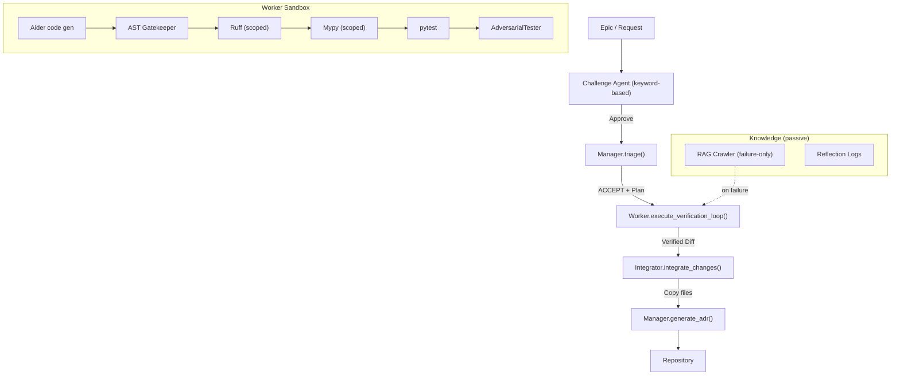
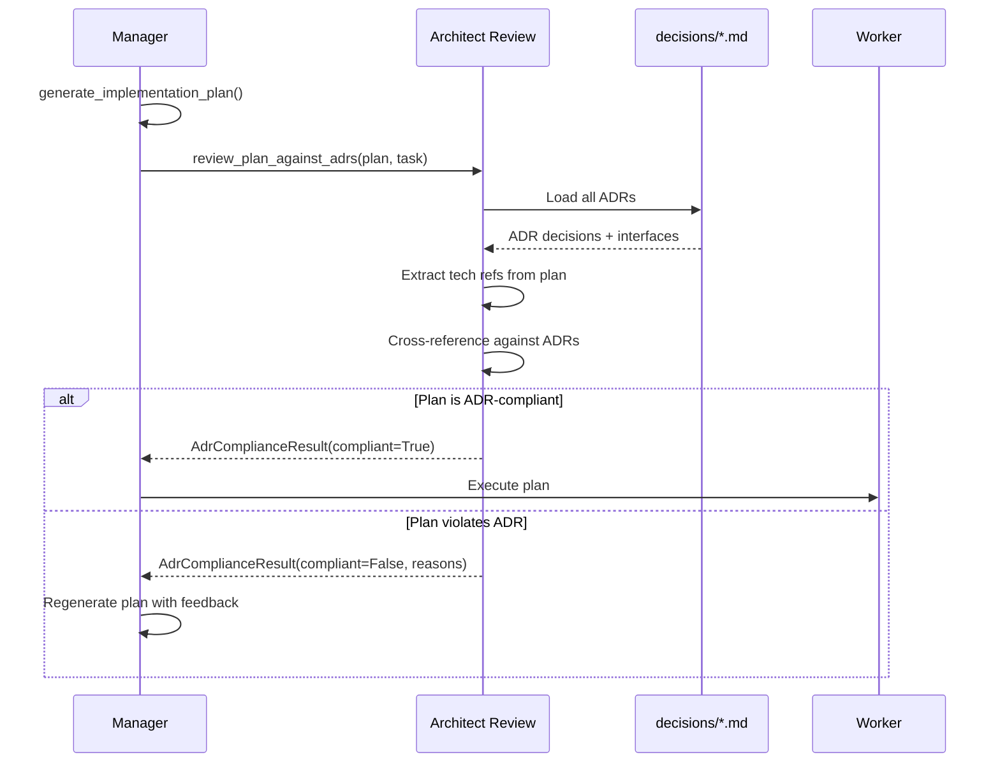
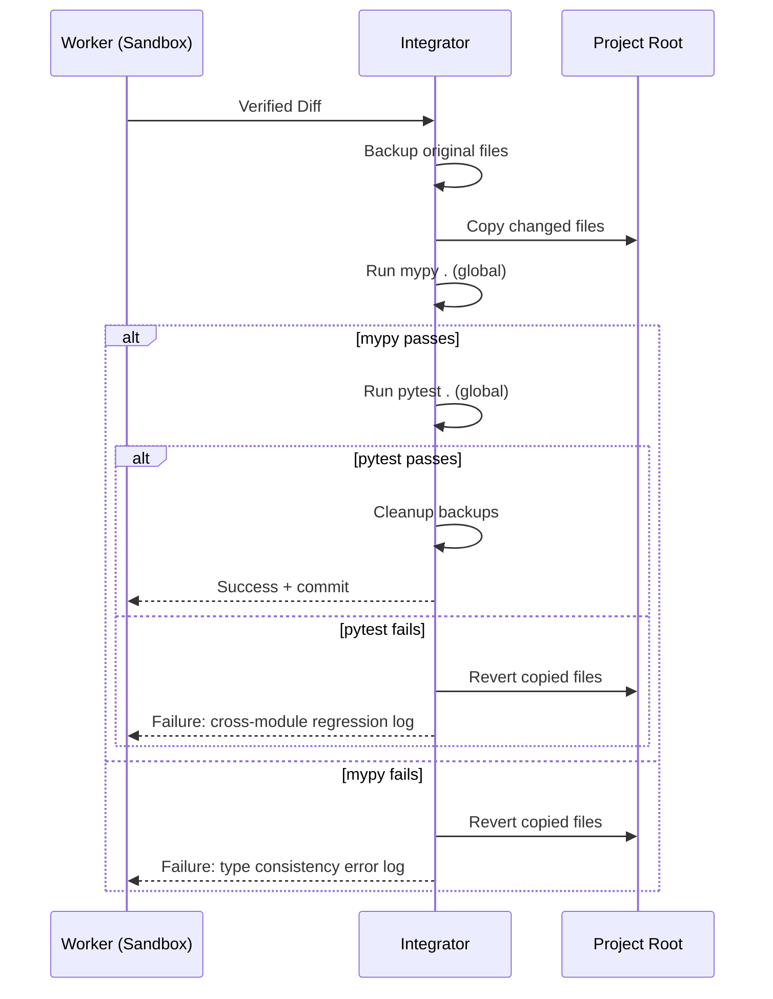
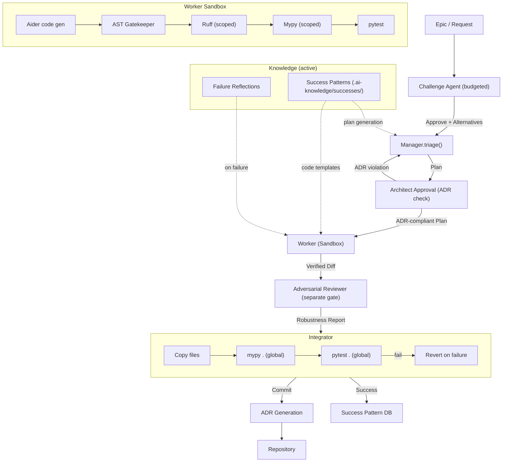
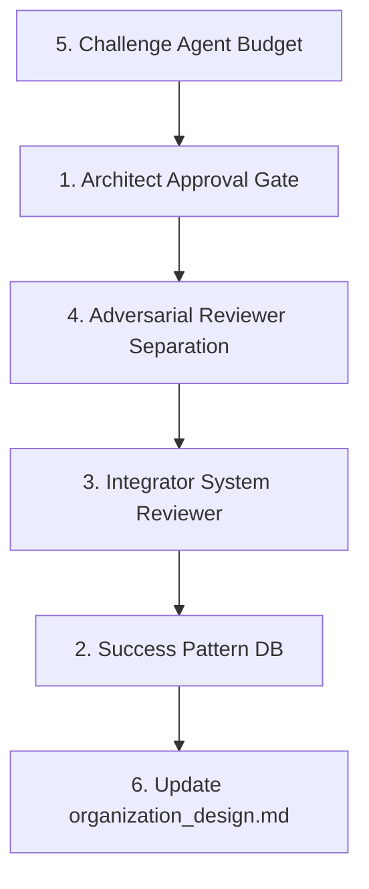

# EKP-Forge Review-Driven Architecture Improvements

> Based on the architectural review scoring EKP-Forge at 88-90 points.
> Five concrete improvements identified to move from "design-compliant organization" to "sustainably growing, collapse-resistant organization."

---

## Current Architecture (Baseline)



### Identified Gaps (from review)

| # | Gap | Current State | Target |
|---|-----|---------------|--------|
| 1 | No Architect Approval gate | Plan → Worker directly | Plan → Architect Review → Worker |
| 2 | Knowledge Manager is failure-only | Passively queried on errors | Success Pattern DB for reuse |
| 3 | Integrator has no cross-module testing | Only copy files | Global mypy + pytest regression |
| 4 | Adversarial Tester embedded in Worker | Inside verification loop | Independent gate before Integrator |
| 5 | Challenge Agent has no budget | Simple keyword check | Budgeted objections with alternatives |

---

## Improvement 1: Architect Approval Gate

### Problem
Task Planner receives abstract instruction like "add caching" and concretizes it as "implement Redis" without consulting the Architect's ADR (which specified a `CacheProvider` interface). This breaks the Architecture Decision Record.

### Solution: ADR Consistency Verification Pydantic Schema

**New Schema**: `ekp_forge/schemas/task_schema.py` — add `AdrComplianceResult`

```python
class AdrComplianceResult(BaseModel):
    """Output of Architect's ADR compliance check on a Task Planner output."""
    task_id: str
    compliant: bool
    violated_adrs: list[str] = Field(default_factory=list)
    violation_reasons: list[str] = Field(default_factory=list)
    requires_regeneration: bool = False
```

**New Module**: `ekp_forge/sandbox/architect_review.py`

```python
def review_plan_against_adrs(
    plan: str,
    task: TaskSchema,
    decisions_dir: Path,
) -> AdrComplianceResult:
    """
    1. Extract all ADRs from decisions/
    2. Extract interface/technology references from the plan text
    3. Check each reference against ADR decisions
    4. Return AdrComplianceResult
    """
```

**Modified Flow** in `ekp_forge/manager.py`:
- After `_generate_implementation_plan()`, call `review_plan_against_adrs()`
- If `compliant=False` and `requires_regeneration=True`: regenerate plan with violation context
- If `compliant=False` and `requires_regeneration=False`: escalate to human

**Flow Diagram**:



**Key Design Decision**: The Architect Review is NOT an LLM call. It's a deterministic cross-reference between plan text tokens and ADR decision sections. This prevents LLM hallucination in the review gate itself.

---

## Improvement 2: Knowledge Manager Success Pattern DB

### Problem
Current Knowledge Manager only stores failure reflection logs and ADRs. When a similar task succeeds, the system cannot reuse the successful diff pattern, forcing re-derivation from scratch.

### Solution: Success Pattern Storage on Integration

**New Module**: `ekp_forge/sandbox/success_patterns.py`

```python
class SuccessPattern(BaseModel):
    """A verified, integrated change that can be reused."""
    pattern_id: str
    task_goal: str
    adr_file: str  # Reference to the ADR that authorized this
    unified_diff: str
    affected_modules: list[str]
    constraint_keywords: list[str]  # For semantic search
    timestamp: str

def store_success_pattern(
    task: TaskSchema,
    diff: str,
    adr_path: str,
    knowledge_dir: Path = Path(".ai-knowledge"),
) -> str:
    """Store a verified diff as a success pattern in .ai-knowledge/successes/"""

def search_success_patterns(
    query: str,
    knowledge_dir: Path = Path(".ai-knowledge"),
    top_k: int = 3,
) -> list[SuccessPattern]:
    """TF-IDF search over stored success patterns for reuse."""
```

**Storage Structure**:
```
.ai-knowledge/
├── successes/
│   ├── T-20240623120000-abc123.json  # SuccessPattern JSON
│   └── T-20240623130000-def456.json
├── reflections/
│   └── ...
└── *.md  # integration graphs
```

**Modified Flow**:
- In `ekp_forge/manager.py::_generate_implementation_plan()`: before generating plan, search `success_patterns` for similar past successes
- In `ekp_forge/sandbox/integrator.py::integrate_changes()`: after successful integration, call `store_success_pattern()`
- Workers receive success patterns as `--read` context via `.ai-knowledge/successes/`

**Hook Point**: The `Integrator` is the single chokepoint where success is confirmed. This is the ideal place to trigger success pattern storage.

---

## Improvement 3: Integrator as System Reviewer

### Problem
Current Integrator only copies files from sandbox to project root. When parallel Workers produce changes with conflicting type assumptions (Worker A: `User.id` is `int`, Worker B: `User.id` is `str`), individual tests pass but integration fails silently.

### Solution: Cross-Module Regression Testing

**Modified File**: `ekp_forge/sandbox/integrator.py`

```python
def integrate_changes(
    project_root: Path,
    sandbox_path: Path | None = None,
    run_cross_module_checks: bool = True,  # NEW
) -> tuple[bool, str, dict | None]:  # Changed return type
    """
    1. Identify modified files (existing)
    2. Copy files to project root (existing)
    3. NEW: Run global mypy . on project root
    4. NEW: Run global pytest on project root
    5. NEW: If either fails, REVERT the copy and return failure with error log
    """
```

**New responsibilities for Integrator**:
```python
INTEGRATOR_RESPONSIBILITIES = [
    "merge",                    # Existing
    "architecture_consistency", # NEW - mypy .
    "cross_module_regression",  # NEW - pytest .
]
```

**Revert mechanism**:
```python
def _revert_integration(project_root: Path, backed_up_files: dict[str, str]) -> None:
    """Restore original files from backup when cross-module checks fail."""
```

**Flow Diagram**:



---

## Improvement 4: Adversarial Reviewer Phase Separation

### Problem
Currently `AdversarialTester` is embedded inside `Worker.execute_verification_loop()`. This means:
1. Adversarial testing happens in the same sandbox context as normal testing
2. The Worker's self-healing loop includes adversarial failures, which is wrong (adversarial tests test robustness, not correctness)
3. No independent adversarial prompt/model can be used

### Solution: Separate Adversarial Gate

**Modified**: Extract adversarial testing from `Worker.execute_verification_loop()` into standalone gate.

**New execution order**:
```
Worker (sandbox) → Verification (ruff/mypy/pytest) → Adversarial Reviewer (separate gate) → Integrator
```

**Modified File**: `ekp_forge/adversarial_tester.py` — upgrade to standalone gate

```python
class AdversarialReviewer:
    """Independent adversarial testing gate — runs AFTER Worker verification passes."""

    def __init__(self, model: str = "ollama/qwen2.5-coder:7b"):
        self.model = model

    def review(
        self,
        task: TaskSchema,
        git_diff: str,
        sandbox_path: Path,
    ) -> tuple[bool, str, dict]:
        """
        1. Generate adversarial edge-case tests (LLM-driven)
        2. Execute them in the sandbox
        3. Return pass/fail + edge case report
        Does NOT trigger self-healing — failures are reported, not fixed.
        """
```

**Modified File**: `ekp_forge/worker.py` — remove adversarial testing from verification loop

The `run_adversarial` parameter and the adversarial test block (lines 230-249) are removed from Worker. The adversarial phase becomes an external gate called by the orchestrator between Worker success and Integrator.

**New Orchestrator Flow** (in `ekp_forge/orchestrator.py` or a new orchestrator method):
```python
# After Worker success:
if worker_result["status"] == "success":
    adv_reviewer = AdversarialReviewer()
    adv_ok, adv_output, adv_report = adv_reviewer.review(task, diff, sandbox_path)
    if not adv_ok:
        # Adversarial edge cases found — report but don't block
        # (adversarial failures are warnings, not blockers)
        worker_result["adversarial_warnings"] = adv_output
```

**Key Design Decision**: Adversarial failures are **warnings**, not blockers. They inform but don't prevent integration. This is because adversarial tests find robustness issues (e.g., "crashes on 10GB CSV input"), not correctness issues.

---

## Improvement 5: Challenge Agent Budget Constraints

### Problem
As the Challenge Agent becomes smarter, it tends toward "reject everything" behavior — a known AI safety over-adaptation pattern. Without constraints, it becomes a permanent blocker.

### Solution: Structured Output Schema with Budget

**New Schema**: `ekp_forge/schemas/task_schema.py` — add `ChallengeResult`

```python
class ChallengeObjection(BaseModel):
    """A single objection raised by the Challenge Agent."""
    objection_id: int
    category: str  # "over_engineering", "missing_assumption", "redundant_feature"
    description: str
    alternative_proposal: str  # MANDATORY — cannot object without proposing alternative

class ChallengeResult(BaseModel):
    """Structured output of the Challenge Agent."""
    task_id: str
    objections: list[ChallengeObjection] = Field(default_factory=list)
    max_objections: int = 3  # Hard cap
    blocked: bool = False
    force_bypass_applied: bool = False
```

**Modified File**: `ekp_forge/manager.py` — `triage()` method

```python
def triage(self, task: TaskSchema) -> tuple[str, str]:
    # NEW: Check force_bypass first
    if task.force_accept or task.bypass_challenge_agent:
        # Skip Challenge Agent entirely
        return self._accept_task(task)

    # NEW: Challenge Agent with budget
    challenge_result = self._run_challenge_agent(task)
    if challenge_result.blocked:
        return ("REJECT", self._format_challenge_rejection(challenge_result))

    return self._accept_task(task)

def _run_challenge_agent(self, task: TaskSchema) -> ChallengeResult:
    """
    Run Challenge Agent with budget constraints:
    - max 3 objections
    - each objection MUST include alternative_proposal
    - cannot block if user sets force_accept=True
    """
```

**Key constraints enforced in code** (not just prompt):
```python
# Hard enforcement — not prompt-based
if len(result.objections) > result.max_objections:
    result.objections = result.objections[:result.max_objections]

for obj in result.objections:
    if not obj.alternative_proposal.strip():
        raise ValueError(f"Objection {obj.objection_id} missing alternative_proposal")
```

---

## Target Architecture (After All Improvements)



---

## Implementation Order (Dependency Graph)



**Rationale**:
1. **Challenge Agent Budget** (I5) is self-contained — only modifies `manager.py` + `task_schema.py`
2. **Architect Approval** (I1) depends on I5 because Challenge Agent budget is its logical predecessor in the pipeline
3. **Adversarial Separation** (I4) modifies Worker, which is downstream of I1
4. **Integrator Reviewer** (I3) is downstream of I4 (receives adversarial report)
5. **Success Pattern DB** (I2) hooks into Integrator, so depends on I3
6. **Documentation update** (I6) is last

---

## Files to Create

| File | Purpose |
|------|---------|
| `ekp_forge/sandbox/architect_review.py` | ADR compliance checker (I1) |
| `ekp_forge/sandbox/success_patterns.py` | Success pattern storage + search (I2) |

## Files to Modify

| File | Changes |
|------|---------|
| `ekp_forge/schemas/task_schema.py` | Add `AdrComplianceResult`, `ChallengeResult`, `ChallengeObjection`, `SuccessPattern` |
| `ekp_forge/manager.py` | Add Architect Approval call in triage; add Challenge budget enforcement; search success patterns in plan generation |
| `ekp_forge/worker.py` | Remove adversarial testing block (lines 230-249); remove `run_adversarial` parameter |
| `ekp_forge/adversarial_tester.py` | Upgrade to `AdversarialReviewer` class with independent gate interface |
| `ekp_forge/sandbox/integrator.py` | Add cross-module regression (mypy ., pytest .) + revert on failure |
| `ekp_forge/orchestrator.py` | Wire new gates into main pipeline |
| `ekp_forge/task_tree.py` | Pass adversarial and integrator review results through execution pipeline |
| `docs/organization_design.md` | Update architecture diagram and agent role descriptions |

## Test Files to Create/Modify

| File | Purpose |
|------|---------|
| `tests/test_architect_review.py` | Test ADR compliance checking |
| `tests/test_success_patterns.py` | Test pattern storage + search |
| `tests/test_integrator_review.py` | Test cross-module regression + revert |
| `tests/test_adversarial_reviewer.py` | Test separated adversarial gate |
| `tests/test_challenge_budget.py` | Test objection limits + alternative enforcement |
