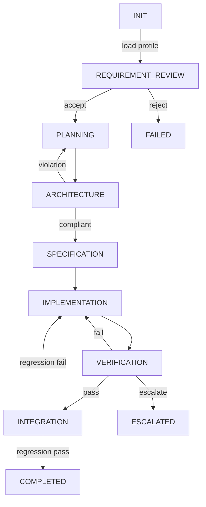
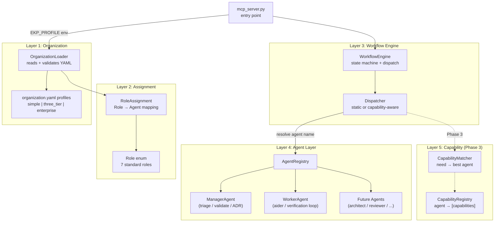

# Role-based Protocol Architecture — Detailed Design Plan

## 1. Gap Analysis: Requirements Spec vs Current Implementation

### 1.1 Current Architecture Overview

The current [`ekp-forge`](ekp_forge/) codebase follows a **2-tier Manager-Worker pattern** with a separate Orchestrator utility layer:

```
┌─────────────────────────────────────────────────────────────┐
│  mcp_server.py (Entry Point)                                │
│  ┌──────────────────────────────────────────────────────┐   │
│  │  ManagerAgent (manager.py)                           │   │
│  │  - triage() → Challenge + Arch + Plan gen            │   │
│  │  - validate_outcome() → static + LLM review          │   │
│  │  - generate_adr() → ADR persistence                  │   │
│  │  - handle_help_request() → escalation handler        │   │
│  │  - decompose_epic() → epic splitter                  │   │
│  └──────────────────────────────────────────────────────┘   │
│                          │直接呼び出し                         │
│                          ▼                                   │
│  ┌──────────────────────────────────────────────────────┐   │
│  │  WorkerAgent (worker.py)                             │   │
│  │  - execute_verification_loop() → Aider + QA loop     │   │
│  │  - escalation policy → cyclic/missing/confidence     │   │
│  │  - reflection log → global + project persistence     │   │
│  └──────────────────────────────────────────────────────┘   │
│                          │                                    │
│                          ▼                                    │
│  ┌──────────────────────────────────────────────────────┐   │
│  │  orchestrator.py (Utility layer)                     │   │
│  │  - run_ruff, run_mypy, run_tests, validate_imports   │   │
│  │  - setup_ruff_mypy, run_cleanup                       │   │
│  └──────────────────────────────────────────────────────┘   │
└─────────────────────────────────────────────────────────────┘
```

Also available:
- [`orchestrator_api.py`](ekp_forge/orchestrator_api.py): `run_3tier_dev()` — standalone Aider + self-healing pipeline (bypasses Manager/Worker)
- [`adversarial_tester.py`](ekp_forge/adversarial_tester.py): `AdversarialReviewer` — edge case audit gate
- [`sandbox/`](ekp_forge/sandbox/): Workspace isolation, cloner, integrator, scoped lint, config agent, architect review

### 1.2 Gaps Identified

| # | Requirement Spec Item | Current State | Gap |
|---|---|---|---|
| **G1** | 7 Role definitions (RequirementReview, Planning, Architecture, Specification, Implementation, Verification, Integration) as standard protocol | Responsibilities split between [`ManagerAgent`](ekp_forge/manager.py) (triage, validation, ADR) and [`WorkerAgent`](ekp_forge/worker.py) (implementation + verification). No formal role protocol. | No `Role` enum/protocol. No separation of concerns for each role. |
| **G2** | [`RoleAssignment`](ekp_forge/schemas/task_schema.py) Pydantic schema | No such schema exists. Only [`TaskSchema`](ekp_forge/schemas/task_schema.py:17) with flat structure. | Missing schema + loading mechanism. |
| **G3** | `organization.yaml` profile-based dynamic binding | No config files or profile system. Agent selection is hardcoded in [`mcp_server.py:116-117`](ekp_forge/mcp_server.py:116). | No `organizations/` directory, no YAML loading. |
| **G4** | [`WorkflowEngine`](ekp_forge/orchestrator.py) with role-based dispatch | Execution flow is procedural in [`mcp_server.py:119-200`](ekp_forge/mcp_server.py:119). All method calls are direct. | No dispatch/routing abstraction. |
| **G5** | 4-layer separation (Organization, Assignment, Agent, Capability) | Only Manager + Worker classes. No layering. | Missing entire abstraction stack. |
| **G6** | Capability-based routing (Phase 2) | No capability registry. No `capabilities: ["coding", "local_debug"]` concept. | Missing registry + matching logic. |
| **G7** | Profile switching (simple.yaml, three_tier.yaml, enterprise.yaml) | No profiles. Only one hardcoded wiring. | No multi-profile support. |
| **G8** | Loose coupling / AgentHot-swap | [`WorkerAgent`](ekp_forge/worker.py) directly calls [`orchestrator.run_mypy`](ekp_forge/worker.py:15), [`orchestrator.run_ruff`](ekp_forge/worker.py:15). [`mcp_server.py`](ekp_forge/mcp_server.py) directly imports [`ManagerAgent`](ekp_forge/mcp_server.py:32) and [`WorkerAgent`](ekp_forge/mcp_server.py:36). | Tight import coupling throughout. |

---

## 2. Target Architecture

### 2.1 4-Layer Separation Model

```
┌──────────────────────────────────────────────────────────────────┐
│   ORGANIZATION (組織) Layer                                      │
│   organization.yaml profiles                                    │
│   "誰が何をするか"の抽象ワークフロー定義                            │
│   simple  │  three_tier  │  enterprise                          │
├──────────────────────────────────────────────────────────────────┤
│   ASSIGNMENT (人事) Layer                                       │
│   RoleAssignment schema + resolver                              │
│   特定のRoleを「どのAgent実体」に任せるかのマッピング               │
├──────────────────────────────────────────────────────────────────┤
│   AGENT (人材) Layer                                            │
│   AgentRegistry + AgentWrapper                                  │
│   実際のLLMモデルや自動化ツールのラッパー                          │
│   Qwen2.5  │  GPT-4o  │  Ruff/Mypy  │  Custom Script          │
├──────────────────────────────────────────────────────────────────┤
│   CAPABILITY (能力) Layer                                       │
│   CapabilityRegistry + CapabilityMatcher                        │
│   各Agentが持つcapabilitiesの登録・検索・マッチング               │
└──────────────────────────────────────────────────────────────────┘
```

### 2.2 New Module Structure

```
ekp_forge/
├── __init__.py
├── mcp_server.py              # ← Minimal changes (use WorkflowEngine instead of direct calls)
├── manager.py                 # ← Refactored: ManagerAgent becomes one of many Role implementors
├── worker.py                  # ← Refactored: WorkerAgent becomes one of many Role implementors
├── orchestrator.py            # ← Keep utility functions as is (run_ruff, run_mypy, etc.)
├── orchestrator_api.py        # ← Unchanged (standalone pipeline)
├── adversarial_tester.py      # ← Unchanged
│
├── protocol/                  # ★ NEW: Protocol/Role layer
│   ├── __init__.py
│   ├── roles.py               # Role enum (7 standard roles)
│   ├── assignment.py          # RoleAssignment schema + YAML loader
│   └── capability.py          # CapabilityRegistry + Capability schema
│
├── engine/                    # ★ NEW: WorkflowEngine layer
│   ├── __init__.py
│   ├── workflow.py            # WorkflowEngine class
│   └── dispatcher.py          # Role → Agent routing/dispatch logic
│
├── agents/                    # ★ NEW: Agent abstraction + implementations
│   ├── __init__.py
│   ├── base.py                # Abstract BaseAgent
│   ├── registry.py            # AgentRegistry
│   ├── manager_agent.py       # ManagerAgent → extracted from manager.py
│   ├── worker_agent.py        # WorkerAgent → extracted from worker.py
│   └── ...                    # Future: architect_agent, reviewer_agent, etc.
│
├── schemas/
│   └── task_schema.py         # ← Unchanged (task, help_request, error_chunk, etc.)
│
└── sandbox/                   # ← Unchanged
    ├── __init__.py
    ├── workspace.py
    ├── cloner.py
    ├── integrator.py
    ├── scoped_lint.py
    ├── verification.py
    ├── constraints.py
    ├── config_agent.py
    ├── architect_review.py
    └── success_patterns.py

organizations/                 # ★ NEW: Organization profile directory
├── simple.yaml
├── three_tier.yaml
└── enterprise.yaml
```

---

## 3. Phase 1: Protocol & Assignment Separation (MUST DO)

### 3.1 Role Enum Definition

Create [`ekp_forge/protocol/roles.py`](ekp_forge/protocol/roles.py) with the 7 standard roles:

```python
from enum import StrEnum

class Role(StrEnum):
    REQUIREMENT_REVIEW = "RequirementReview"
    PLANNING = "Planning"
    ARCHITECTURE = "Architecture"
    SPECIFICATION = "Specification"
    IMPLEMENTATION = "Implementation"
    VERIFICATION = "Verification"
    INTEGRATION = "Integration"
```

### 3.2 RoleAssignment Pydantic Schema

Create [`ekp_forge/protocol/assignment.py`](ekp_forge/protocol/assignment.py):

```python
from pydantic import BaseModel
from ekp_forge.protocol.roles import Role

class RoleAssignment(BaseModel):
    """Maps each Role to one or more agent identifiers."""
    
    requirement_review: str          # Agent name
    planning: str
    architecture: str
    specification: str
    implementation: str | list[str]  # Can be multiple workers
    verification: str | list[str]    # Can be multiple checkers
    integration: str
    
    def resolve(self, role: Role) -> list[str]:
        """Resolve a Role into agent name(s)."""
        mapping = {
            Role.REQUIREMENT_REVIEW: self.requirement_review,
            Role.PLANNING: self.planning,
            Role.ARCHITECTURE: self.architecture,
            Role.SPECIFICATION: self.specification,
            Role.IMPLEMENTATION: self.implementation,
            Role.VERIFICATION: self.verification,
            Role.INTEGRATION: self.integration,
        }
        value = mapping[role]
        if isinstance(value, str):
            return [value]
        return value


class OrganizationProfile(BaseModel):
    """Top-level organization profile loaded from YAML."""
    
    profile_name: str
    description: str = ""
    assignment: RoleAssignment
```

### 3.3 Organization YAML Profiles

Create [`organizations/simple.yaml`](organizations/simple.yaml):

```yaml
profile_name: "simple"
description: "Single Worker handles everything except manager oversight"

assignment:
  requirement_review: "manager"
  planning: "manager"
  architecture: "manager"
  specification: "manager"
  implementation: "worker"
  verification: "worker"
  integration: "worker"
```

Create [`organizations/three_tier.yaml`](organizations/three_tier.yaml):

```yaml
profile_name: "three_tier"
description: "Classic 3-tier: Manager plans, Worker implements, Verification gate"

assignment:
  requirement_review: "manager"
  planning: "manager"
  architecture: "manager"
  specification: "manager"
  implementation: "worker"
  verification: "verification_gate"
  integration: "manager"
```

Create [`organizations/enterprise.yaml`](organizations/enterprise.yaml):

```yaml
profile_name: "enterprise"
description: "Full 7-role separation with multiple workers and specialized verifiers"

assignment:
  requirement_review: "challenge_agent"
  planning: "planner_agent"
  architecture: "architect_agent"
  specification: "spec_agent"
  implementation: ["worker_a", "worker_b"]
  verification: ["ruff_checker", "mypy_checker", "adversarial_reviewer"]
  integration: "integrator_agent"
```

### 3.4 Organization Profile Loader

```python
# In ekp_forge/protocol/assignment.py

class OrganizationLoader:
    """Loads OrganizationProfile from YAML files in organizations/ directory."""
    
    PROFILES_DIR = Path("organizations")
    
    @classmethod
    def list_profiles(cls) -> list[str]:
        """List available profile names."""
        if not cls.PROFILES_DIR.exists():
            return []
        return sorted(
            f.stem for f in cls.PROFILES_DIR.glob("*.yaml")
        )
    
    @classmethod
    def load(cls, profile_name: str = "simple") -> OrganizationProfile:
        """Load a profile by name. Falls back to 'simple' if not found."""
        path = cls.PROFILES_DIR / f"{profile_name}.yaml"
        if not path.exists():
            # Fallback: return simple inline profile
            return OrganizationProfile(
                profile_name="simple",
                assignment=RoleAssignment(
                    requirement_review="manager",
                    planning="manager",
                    architecture="manager",
                    specification="manager",
                    implementation="worker",
                    verification="worker",
                    integration="worker",
                )
            )
        with open(path) as f:
            data = yaml.safe_load(f)
        return OrganizationProfile(**data)

**Path Resolution Strategy:**
The `organizations/` directory is resolved via `Path(__file__).parent.parent.parent / "organizations"` (relative to the module file), with fallback to CWD-relative lookup and `EKP_ORG_DIR` env var override. This ensures the loader works regardless of the runtime working directory.
```

### 3.5 AgentRegistry + Abstract BaseAgent

Create [`ekp_forge/agents/base.py`](ekp_forge/agents/base.py):

```python
from abc import ABC, abstractmethod
from typing import Any

class BaseAgent(ABC):
    """Abstract interface for all agents in the registry.
    
    CRITICAL DESIGN RULE:
    Exceptions MUST propagate transparently through execute().
    Do NOT catch-and-wrap exceptions here — let AiderExecutionError,
    Pydantic ValidationError, etc. bubble up to WorkflowEngine
    and mcp_server.py so escalation policies work correctly.
    """
    
    agent_id: str
    
    @abstractmethod
    def execute(self, context: dict[str, Any]) -> dict[str, Any]:
        """Execute this agent's role with given context.
        
        Args:
            context: Role-specific context dict.
                Contract: each role defines its expected context keys.
                Examples:
                - Role.REQUIREMENT_REVIEW: {"task": TaskSchema}
                - Role.IMPLEMENTATION: {"task": TaskSchema, "plan": str}
                - Role.VERIFICATION: {"task": TaskSchema, "impl_result": dict}
        
        Returns:
            Role-specific result dict.
        
        Raises:
            Propagates all underlying exceptions transparently.
            No exception swallowing inside execute().
        """
        ...
```

Create [`ekp_forge/agents/registry.py`](ekp_forge/agents/registry.py):

```python
from typing import Any
from ekp_forge.agents.base import BaseAgent

class AgentRegistry:
    """Central registry of all available agents."""
    
    def __init__(self):
        self._agents: dict[str, BaseAgent] = {}
    
    def register(self, agent: BaseAgent) -> None:
        self._agents[agent.agent_id] = agent
    
    def resolve(self, agent_name: str) -> BaseAgent | None:
        return self._agents.get(agent_name)
    
    def resolve_all(self, agent_names: list[str]) -> list[BaseAgent]:
        return [self._agents[name] for name in agent_names if name in self._agents]
```

### 3.6 Refactored ManagerAgent & WorkerAgent as BaseAgent Implementors

**ManagerAgent** ([`ekp_forge/manager.py`](ekp_forge/manager.py)):
- Keep existing class but **also** make it implement [`BaseAgent`](ekp_forge/agents/base.py)
- The `execute()` method receives context dict and dispatches to `triage()` / `validate_outcome()` / `generate_adr()` / `handle_help_request()` based on role context
- Register in AgentRegistry as `"manager"`

**WorkerAgent** ([`ekp_forge/worker.py`](ekp_forge/worker.py)):
- Keep existing class but implement [`BaseAgent`](ekp_forge/agents/base.py)
- The `execute()` method calls `execute_verification_loop()` based on context
- Register in AgentRegistry as `"worker"`

### 3.7 WorkflowEngine — Minimal Version

Create [`ekp_forge/engine/workflow.py`](ekp_forge/engine/workflow.py):

```python
from ekp_forge.protocol.assignment import OrganizationProfile, RoleAssignment
from ekp_forge.protocol.roles import Role
from ekp_forge.agents.registry import AgentRegistry

class WorkflowEngine:
    """Central workflow orchestrator that routes roles to agents."""
    
    def __init__(self, profile: OrganizationProfile, registry: AgentRegistry):
        self.profile = profile
        self.registry = registry
        self._context: dict = {}
    
    def run(self, role: Role, context: dict | None = None) -> dict:
        """Execute the given role by dispatching to the assigned agent(s).
        
        DESIGN:
        - No exception wrapping. All agent exceptions propagate as-is.
        - The shared _context dict enables state accumulation across
          sequential role executions.
        - Agent.execute() receives merged context = _context + role_context.
        """
        agent_names = self.profile.assignment.resolve(role)
        results = []
        for name in agent_names:
            agent = self.registry.resolve(name)
            if agent is None:
                raise ValueError(f"Agent '{name}' not registered for role {role}")
            merged_context = {**self._context, **(context or {})}
            merged_context["_role"] = role
            # Exceptions propagate transparently — no try/except here
            result = agent.execute(merged_context)
            results.append(result)
            self._context.update(result)
        return results[0] if len(results) == 1 else results
```

### 3.8 Integration into mcp_server.py

The [`run_managed_task`](ekp_forge/mcp_server.py:85) function changes from:

```python
manager = ManagerAgent(manager_id=task.manager_id)
worker = WorkerAgent()
# Direct procedural calls...
```

To:

```python
# Setup
registry = AgentRegistry()
registry.register(ManagerAgent(agent_id="manager", manager_id=task.manager_id))
registry.register(WorkerAgent(agent_id="worker"))
profile = OrganizationLoader.load(os.environ.get("EKP_PROFILE", "simple"))
engine = WorkflowEngine(profile, registry)

# Phase 1: Triage (RequirementReview + Planning)
triage_result = engine.run(Role.REQUIREMENT_REVIEW, {"task": task})
if triage_result.get("status") == "REJECT":
    return rejected_response(...)
plan = engine.run(Role.PLANNING, {"task": task, "triage": triage_result})

# Phase 2: Implementation + Verification
impl_result = engine.run(Role.IMPLEMENTATION, {"task": task, "plan": plan})
verification_result = engine.run(Role.VERIFICATION, {"task": task, "impl": impl_result})

# Phase 3: Integration & ADR
integration_result = engine.run(Role.INTEGRATION, {"task": task, "verification": verification_result})
```

---

## 4. Phase 2: WorkflowEngine Full Implementation (NEXT)

### 4.1 State-Managed Workflow

```python
from enum import StrEnum

class WorkflowState(StrEnum):
    INIT = "init"
    REQUIREMENT_REVIEW = "requirement_review"
    PLANNING = "planning"
    ARCHITECTURE = "architecture"
    SPECIFICATION = "specification"
    IMPLEMENTATION = "implementation"
    VERIFICATION = "verification"
    INTEGRATION = "integration"
    COMPLETED = "completed"
    FAILED = "failed"
    ESCALATED = "escalated"

class StatefulWorkflowEngine(WorkflowEngine):
    """Extended engine with state machine and retry/recovery logic."""
    
    def __init__(self, profile, registry):
        super().__init__(profile, registry)
        self.state = WorkflowState.INIT
        self.history: list[tuple[WorkflowState, dict]] = []
    
    def execute_managed_task(self, task: TaskSchema) -> dict:
        """Full state-managed workflow execution."""
        # ... state machine implementation
```

### 4.2 State Transition Diagram



---

## 5. Phase 3: Capability-Based Routing (FUTURE)

### 5.1 Capability Schema

Create [`ekp_forge/protocol/capability.py`](ekp_forge/protocol/capability.py):

```python
from pydantic import BaseModel

class Capability(BaseModel):
    """A capability that an agent can provide."""
    name: str
    description: str = ""
    required_tools: list[str] = []
    confidence: float = 1.0  # 0.0 to 1.0

class CapabilityRegistry:
    """Maps agents to their capabilities."""
    
    def __init__(self):
        self._agent_capabilities: dict[str, list[Capability]] = {}
    
    def register(self, agent_id: str, capabilities: list[Capability]) -> None:
        self._agent_capabilities[agent_id] = capabilities
    
    def find_agents_for(self, needed_capability: str) -> list[str]:
        """Find all agents that provide a specific capability."""
        result = []
        for agent_id, caps in self._agent_capabilities.items():
            for cap in caps:
                if cap.name == needed_capability:
                    result.append(agent_id)
        return result
```

### 5.2 Dispatch Rule Enhancement

WorkflowEngine's `run()` method enhanced to use capability matching:

```python
class CapabilityAwareDispatcher:
    """Dispatches role execution based on capability matching."""
    
    def dispatch(self, required_capability: str, context: dict) -> str:
        """Select best agent for the required capability."""
        candidates = registry.find_agents_for(required_capability)
        if not candidates:
            raise NoSuitableAgentError(required_capability)
        # Select best candidate (highest confidence, load-balancing, etc.)
        return candidates[0]
```

---

## 6. File Change Summary

### 6.1 Files to CREATE

| File | Purpose |
|---|---|
| [`ekp_forge/protocol/__init__.py`](ekp_forge/protocol/__init__.py) | Package init |
| [`ekp_forge/protocol/roles.py`](ekp_forge/protocol/roles.py) | `Role` enum (7 roles) |
| [`ekp_forge/protocol/assignment.py`](ekp_forge/protocol/assignment.py) | `RoleAssignment`, `OrganizationProfile`, `OrganizationLoader` |
| [`ekp_forge/protocol/capability.py`](ekp_forge/protocol/capability.py) | `Capability`, `CapabilityRegistry` (Phase 3) |
| [`ekp_forge/agents/__init__.py`](ekp_forge/agents/__init__.py) | Package init |
| [`ekp_forge/agents/base.py`](ekp_forge/agents/base.py) | `BaseAgent` abstract class |
| [`ekp_forge/agents/registry.py`](ekp_forge/agents/registry.py) | `AgentRegistry` |
| [`ekp_forge/engine/__init__.py`](ekp_forge/engine/__init__.py) | Package init |
| [`ekp_forge/engine/workflow.py`](ekp_forge/engine/workflow.py) | `WorkflowEngine` (Phase 1 minimal + Phase 2 stateful) |
| [`ekp_forge/engine/dispatcher.py`](ekp_forge/engine/dispatcher.py) | `Dispatcher` (Phase 1 static + Phase 3 capability-aware) |
| [`organizations/simple.yaml`](organizations/simple.yaml) | Simple profile |
| [`organizations/three_tier.yaml`](organizations/three_tier.yaml) | Three-tier profile |
| [`organizations/enterprise.yaml`](organizations/enterprise.yaml) | Enterprise profile (stub for Phase 2+) |

### 6.2 Files to MODIFY

| File | Change |
|---|---|
| [`ekp_forge/manager.py`](ekp_forge/manager.py) | Add `BaseAgent` implementation; wrap existing methods in `execute()` |
| [`ekp_forge/worker.py`](ekp_forge/worker.py) | Add `BaseAgent` implementation; wrap existing methods in `execute()` |
| [`ekp_forge/mcp_server.py`](ekp_forge/mcp_server.py) | Replace direct Manager/Worker instantiation with `WorkflowEngine` + `AgentRegistry` |
| [`ekp_forge/schemas/__init__.py`](ekp_forge/schemas/__init__.py) | No changes needed |
| [`ekp_forge/__init__.py`](ekp_forge/__init__.py) | No changes needed |
| [`pyproject.toml`](pyproject.toml) | No changes needed (Pydantic already available via `task_schema.py`) |

### 6.3 Files to UPDATE (Tests)

| File | Change |
|---|---|
| [`tests/test_manager.py`](tests/test_manager.py) | Add tests for `BaseAgent` compliance + role-based dispatch |
| [`tests/test_worker.py`](tests/test_worker.py) | Add tests for `BaseAgent` compliance |
| New: `tests/test_protocol_roles.py` | Test `Role` enum, `RoleAssignment` schema, `OrganizationLoader` |
| New: `tests/test_agent_registry.py` | Test `AgentRegistry` registration + resolution |
| New: `tests/test_workflow_engine.py` | Test `WorkflowEngine` dispatch logic with mock profiles |
| New: `tests/organizations/test_simple.yaml` | Test fixture for simple profile |
| New: `tests/organizations/test_three_tier.yaml` | Test fixture for three-tier profile |

---

## 7. Implementation Order (Priority Sequence)

### Step 1: Protocol Foundation
1. Create [`ekp_forge/protocol/`](ekp_forge/protocol/) package
2. Create [`ekp_forge/protocol/roles.py`](ekp_forge/protocol/roles.py) with `Role` enum
3. Create [`ekp_forge/protocol/assignment.py`](ekp_forge/protocol/assignment.py) with `RoleAssignment`, `OrganizationProfile`, `OrganizationLoader`
4. Create test: `tests/test_protocol_roles.py`

### Step 2: Agent Abstraction
5. Create [`ekp_forge/agents/`](ekp_forge/agents/) package
6. Create [`ekp_forge/agents/base.py`](ekp_forge/agents/base.py) with `BaseAgent` ABC
7. Create [`ekp_forge/agents/registry.py`](ekp_forge/agents/registry.py) with `AgentRegistry`
8. Refactor [`ekp_forge/manager.py`](ekp_forge/manager.py): `ManagerAgent` → implement `BaseAgent`
9. Refactor [`ekp_forge/worker.py`](ekp_forge/worker.py): `WorkerAgent` → implement `BaseAgent`
10. Create test: `tests/test_agent_registry.py`

### Step 3: WorkflowEngine (Minimal)
11. Create [`ekp_forge/engine/`](ekp_forge/engine/) package
12. Create [`ekp_forge/engine/workflow.py`](ekp_forge/engine/workflow.py) with basic `WorkflowEngine`
13. Create [`ekp_forge/engine/dispatcher.py`](ekp_forge/engine/dispatcher.py) with static `Dispatcher`
14. Create test: `tests/test_workflow_engine.py`

### Step 4: Organization Profiles
15. Create [`organizations/simple.yaml`](organizations/simple.yaml)
16. Create [`organizations/three_tier.yaml`](organizations/three_tier.yaml)
17. Create [`organizations/enterprise.yaml`](organizations/enterprise.yaml)
18. Create test fixtures in `tests/organizations/`

### Step 5: Integration into mcp_server.py
19. Rewrite [`run_managed_task`](ekp_forge/mcp_server.py:85) to use `WorkflowEngine` + `AgentRegistry`
20. Update existing tests in `tests/test_manager.py`, `tests/test_worker.py` for backward compatibility
21. Run full test suite to verify no regressions

### Step 6: Documentation & Verification
22. Update [`docs/organization_design.md`](docs/organization_design.md) with new architecture
23. Run `pytest`, `ruff`, `mypy` on all changed files

---

## 8. Key Design Decisions

### 8.1 Backward Compatibility
- [`ManagerAgent`](ekp_forge/manager.py) and [`WorkerAgent`](ekp_forge/worker.py) keep all existing public methods
- The `BaseAgent.execute()` method acts as a **thin adapter** that dispatches to existing methods based on role context
- All existing tests should pass without modification
- The `EKP_PROFILE` environment variable (default `"simple"`) selects the active profile

### 8.2 Profile Resolution
- If `organizations/` directory doesn't exist or requested profile not found, fall back to hardcoded `simple` profile
- This ensures zero-config operation for existing users

### 8.3 Gradual Adoption
- Phase 1 (this plan): Organization + Assignment layers, static dispatch
- Phase 2 (next): Stateful WorkflowEngine with retry/recovery
- Phase 3 (future): Capability-based dynamic routing

### 8.4 No Changes to Sandbox Layer
- The [`ekp_forge/sandbox/`](ekp_forge/sandbox/) package is deliberately unchanged
- It operates independently of the protocol/engine layers
- The verification gates (Ruff, Mypy, Pytest) remain as-is

---

## 9. Mermaid: Target Architecture Diagram



---

## 10. Risk Assessment

| Risk | Impact | Mitigation |
|---|---|---|
| Existing tests break due to refactoring | High | Keep all public methods; `execute()` is additive |
| Circular imports between protocol/agents/engine | Medium | Strict import layering: protocol → agents → engine (never reverse) |
| YAML loading fails in CI/CD | Low | Fallback to hardcoded simple profile |
| Performance overhead from dispatch layer | Low | Dispatch is dict lookup + method call; negligible overhead |
| Developer confusion about new layers | Medium | Comprehensive docstrings + updated organization_design.md |
