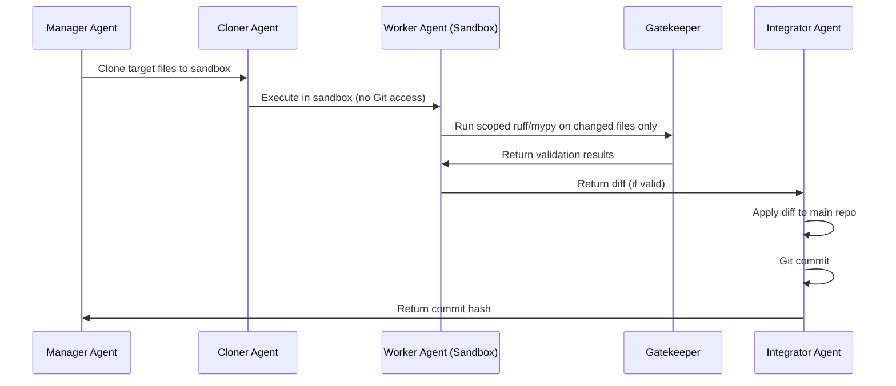
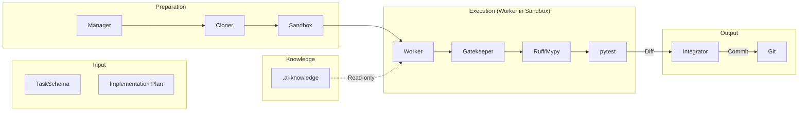

# EKP-Forge Safe Factory Architecture Design

## 1. Executive Summary

The "Safe Factory" architecture transforms EKP-Forge from a monolithic agent system into a **multi-agent pipeline with strict security boundaries**. The core principle: **isolate the worker in a sandbox, remove all destructive capabilities, and delegate Git operations to a dedicated integrator agent.**

## 2. Current Architecture Problems (from challenges_log.md)

### 2.1 Dogfooding Collisions
- **Git Rollback Workspace Wipeout**: Worker's `_git_rollback()` runs on host repository during self-testing
- **Global Checker Scope Leakage**: `run_ruff()` and `run_mypy()` scan entire project including legacy code
- **Self-Overwriting Configuration**: `setup_ruff_mypy()` modifies host `pyproject.toml` during testing

### 2.2 Core Codebase Logic Errors
- **Destructive pyproject.toml Parsing**: Regex-based replacement can delete subsequent settings blocks
- **Hardcoded Path Dependencies**: `.venv/bin/pip` assumptions fail on different platforms
- **Mypy Method-Assign Violations**: Direct method mocking in tests violates strict typing
- **Stylistic Linter Violations**: Production code has style issues

## 3. Safe Factory Architecture Overview

```mermaid
flowchart TD
    subgraph "Control Plane (Full Access)"
        A[Manager Agent] --> B[Cloner Agent]
        B --> C[Integrator Agent]
        C --> A
    end

    subgraph "Sandbox (Restricted Access)"
        D[Worker Agent] --> E[Gatekeeper]
        E --> F[Ruff/Mypy (Scoped)]
        F --> G[pytest]
    end

    subgraph "Knowledge Plane"
        H[.ai-knowledge]
        I[verified_examples]
        J[verified_tests]
    end

    A -->|Task + Plan| D
    D -->|Diff Only| C
    H -->|Read-only| D
    I -->|Read-only| D
    J -->|Read-only| D
```

## 4. Component Design

### 4.1 Sandbox Workspace Module

**Purpose**: Create an isolated working directory for Worker operations.

**File**: `sandbox/workspace.py`

```python
class SandboxWorkspace:
    """Manages isolated working directory for Worker operations."""

    def __init__(self, project_root: Path, sandbox_dir: Path | None = None):
        self.project_root = project_root
        self.sandbox_dir = sandbox_dir or project_root / ".sandbox"
        self._original_cwd: str | None = None

    def setup(self, files_to_copy: list[str]) -> None:
        """Create sandbox and copy only specified files."""
        self.sandbox_dir.mkdir(parents=True, exist_ok=True)
        for file_path in files_to_copy:
            src = self.project_root / file_path
            dst = self.sandbox_dir / file_path
            if src.exists():
                dst.parent.mkdir(parents=True, exist_ok=True)
                shutil.copy2(src, dst)

    def enter(self) -> None:
        """Change working directory to sandbox."""
        self._original_cwd = os.getcwd()
        os.chdir(self.sandbox_dir)

    def exit(self) -> None:
        """Restore original working directory."""
        if self._original_cwd:
            os.chdir(self._original_cwd)

    def get_diff(self) -> str:
        """Get diff between sandbox and original files."""
        # Use git diff or manual comparison
        pass

    def cleanup(self) -> None:
        """Remove sandbox directory."""
        shutil.rmtree(self.sandbox_dir, ignore_errors=True)
```

### 4.2 Cloner Agent

**Purpose**: Clone target repository to sandbox before Worker operations.

**File**: `agents/cloner.py`

```python
class ClonerAgent:
    """Clones target repository to isolated sandbox workspace."""

    def __init__(self, target_repo: Path, sandbox_path: Path):
        self.target_repo = target_repo
        self.sandbox_path = sandbox_path

    def clone(self, files_to_include: list[str]) -> Path:
        """Create isolated copy of target files in sandbox."""
        # 1. Create sandbox directory
        # 2. Copy only specified files (not entire repo)
        # 3. Return sandbox path for Worker
        pass

    def get_sandbox_context(self) -> dict:
        """Return context info for Worker to operate in sandbox."""
        return {
            "sandbox_path": str(self.sandbox_path),
            "allowed_files": self.files_to_include,
            "max_files_modified": 3,  # Hard limit
        }
```

### 4.3 Integrator Agent

**Purpose**: Apply diffs and manage Git operations (the only agent with Git access).

**File**: `agents/integrator.py`

```python
class IntegratorAgent:
    """Applies verified diffs to main repository and manages Git operations."""

    def __init__(self, project_root: Path):
        self.project_root = project_root

    def apply_diff(self, diff_content: str) -> bool:
        """Apply a verified diff to the main repository."""
        # 1. Validate diff format
        # 2. Apply patch
        # 3. Return success/failure

    def commit_changes(self, task_id: str, message: str) -> str:
        """Commit applied changes with proper message."""
        # 1. git add changed files
        # 2. git commit with message
        # 3. Return commit hash

    def rollback(self) -> None:
        """Rollback changes if validation fails."""
        # Only called on main repository, never on sandbox
        subprocess.run(["git", "reset", "--hard", "HEAD"], check=False)
        subprocess.run(["git", "clean", "-fdx", "--exclude=.venv"], check=False)
```

### 4.4 Config Agent

**Purpose**: Safely manage configuration file changes via metadata requests.

**File**: `agents/config_agent.py`

```python
class ConfigChangeRequest(BaseModel):
    """Metadata request for configuration changes."""
    request_id: str
    task_id: str
    changes: list[dict[str, Any]]  # List of TOML changes
    reason: str

class ConfigAgent:
    """Manages pyproject.toml and other config files safely."""

    def __init__(self, project_root: Path):
        self.project_root = project_root

    def process_request(self, request: ConfigChangeRequest) -> bool:
        """Apply config changes using tomllib for safe parsing."""
        # 1. Parse existing TOML
        # 2. Apply changes atomically
        # 3. Validate result
        pass

    def generate_request(self, task: TaskSchema, needed_changes: list[str]) -> ConfigChangeRequest:
        """Generate config change request from Worker's needs."""
        # Called when Worker detects need for dependency/config changes
        pass
```

## 5. Workflow: Safe Factory Execution



## 6. Security Boundaries

### 6.1 Worker Agent Restrictions

| Capability | Current | Safe Factory |
|------------|---------|--------------|
| File Write | Full project | Sandbox only |
| Git Operations | Yes (`--no-git` flag) | **No** (complete removal) |
| pyproject.toml | Can modify | **No** (Config Agent only) |
| File Read | All files | Whitelisted + sandbox |
| Max Files Modified | Unlimited | **3 files max** |

### 6.2 File Operation Constraints

```python
# sandbox/constraints.py
ALLOWED_SANDBOX_PATHS = {
    "src/",
    "tests/",
    ".ai-knowledge/",
    "verified_examples/",
    "verified_tests/",
}

FORBIDDEN_OPERATIONS = {
    "git reset",
    "git clean",
    "pyproject.toml write",
    "api_schema.yaml write",
    "decisions/",
}
```

## 7. Scoped Linter/Typing Functions

### 7.1 Current Problem
```python
# orchestrator.py - runs on entire project
def run_ruff() -> tuple[bool, str]:
    cmd = ["ruff", "check", "."]  # Scans everything!
```

### 7.2 Safe Factory Solution
```python
# sandbox/verification.py
def run_ruff_scoped(changed_files: list[str]) -> tuple[bool, str]:
    """Run ruff only on changed files."""
    if not changed_files:
        return True, "No files to check"
    cmd = ["ruff", "check"] + changed_files
    # ...

def run_mypy_scoped(changed_files: list[str]) -> tuple[bool, str]:
    """Run mypy only on changed files."""
    if not changed_files:
        return True, "No files to check"
    cmd = ["mypy"] + changed_files
    # ...
```

## 8. Implementation Roadmap

### Phase 1: Sandbox Foundation (Week 1)
- [ ] Create `sandbox/workspace.py` module
- [ ] Create `agents/cloner.py` module
- [ ] Modify Worker to use sandbox context
- [ ] Add `--no-git` enforcement (already present, verify)

### Phase 2: Integrator & Config (Week 2)
- [ ] Create `agents/integrator.py` module
- [ ] Create `agents/config_agent.py` module
- [ ] Refactor `setup_ruff_mypy` to use tomllib
- [ ] Add `ConfigChangeRequest` schema

### Phase 3: Verification & Testing (Week 3)
- [ ] Implement scoped ruff/mypy functions
- [ ] Add `max_files_modified` constraint
- [ ] Update test suite for sandbox isolation
- [ ] Remove dogfooding collision points

## 9. Data Flow Architecture



## 10. Key Design Decisions

### 10.1 Why Sandbox First?
- **Root Cause**: Worker has too much power (Git + file system)
- **Solution**: Remove power, add isolation
- **Benefit**: Model capability becomes irrelevant; system is robust

### 10.2 Why Separate Integrator?
- **Single Responsibility**: Worker creates, Integrator applies
- **Security**: Git operations centralized in one trusted component
- **Audit Trail**: All commits go through Integrator with logging

### 10.3 Why Config Agent?
- **pyproject.toml is factory configuration**, not product code
- **Worker should not modify factory rules**
- **Metadata-based requests** allow safe, auditable changes

## 11. Migration Path

### 11.1 Backward Compatibility
- Existing `WorkerAgent` will be refactored, not replaced
- New `SandboxWorkerAgent` extends `WorkerAgent` with constraints
- Manager orchestrates the new flow transparently

### 11.2 Testing Strategy
- Unit tests for each new module
- Integration tests for sandbox isolation
- Dogfooding tests in separate directory
- Chaos tests for boundary violations
